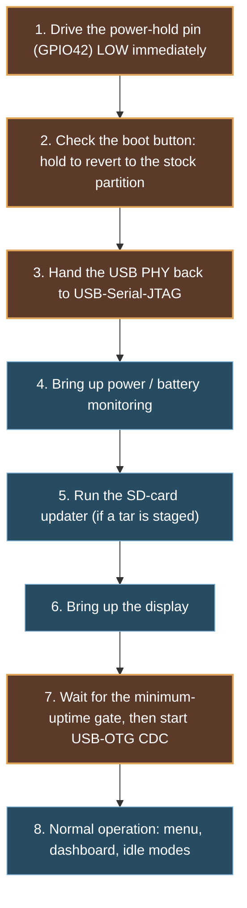

# Architecture

This is the system-level picture of the BYOK v2.1 hardware and of the replacement firmware this
project builds for it: the two microcontrollers, the buses that connect them, the power tree, and
which subsystem belongs to which chip. It is assembled from photographic inspection of the opened
case, from disassembling the stock firmware images, and — for a handful of facts that only a
running device can settle — from read-only USB captures taken during development. No trace has
ever been followed on the PCB itself and no signal has been probed with an instrument; nothing
here rests on a schematic, because no schematic exists publicly for this board.

Every claim below carries one of four evidence labels, defined in [SAFETY.md](../SAFETY.md):
**CONFIRMED** (directly observed or read off the device), **STRONGLY INDICATED** (strong
circumstantial evidence, not directly verified), **POSSIBLE** (plausible, weakly supported), or
**UNKNOWN** (not established). A label attached to a firmware string means "this code exists in
the image" — it does not by itself prove the code runs on this exact unit, or that a peripheral it
configures is physically fitted. Component-level detail (markings, packages, connectors) lives in
[hardware.md](hardware.md); the full GPIO and I²C map lives in [pinout.md](pinout.md); this page is
the map of how the pieces fit together.

---

## 1. The two processors

The board carries two Espressif modules, and the split between what each one does is the single
most load-bearing fact in this whole project — almost everything else follows from it.

| | ESP32-S3-WROOM-1 ("S3") | ESP32-PICO-MINI-02 ("PICO") |
|---|---|---|
| Board silkscreen | `RESET S3` (switch `S1`), pad group `J6` labelled `S3` | `RESET PICO` (switch `S3`), pad group `J7` labelled `PICO` |
| Module marking | `ESP32-S3-WROOM-1`, variant `MCN16R2` — CONFIRMED | `ESP32-PICO-MINI-02`, variant `MGN8R2` — CONFIRMED |
| Flash / PSRAM | **16 MiB flash / 2 MiB PSRAM — CONFIRMED**, read electrically (`esptool flash_id` JEDEC `46 40 18`; boot log `Found 2MB PSRAM device`, memory test passes) | 8 MiB flash / 2 MiB PSRAM — POSSIBLE (naming-convention decode of `MGN8R2` only; never probed, no known download-mode route) |
| Cores | Dual Xtensa LX7, 160 MHz observed (240 MHz is the ceiling, not the running clock) | Dual Xtensa LX6 (ESP32-PICO-V3) |
| Native USB | **Yes** — USB-OTG, full-speed only | No |
| Wi-Fi | 2.4 GHz b/g/n | 2.4 GHz b/g/n |
| Bluetooth | BLE only | **Classic BR/EDR + BLE** |
| Antenna | Integrated PCB meander, on the module's pad-less edge, pointed at the board's bottom edge | Integrated inside the module package (no board-level antenna trace) |

The two capability asymmetries in that table decide almost every "which chip owns this"
question below: only the S3 has native USB, and only the PICO has Bluetooth Classic. Everything
that needs a USB port or a display bus has to be on the S3; everything that needs to pair with an
ordinary Classic-BT accessory has to go through the PICO.

The whole-board wiring picture — both modules, the seven-wire link between them, and every
peripheral each one drives, with a confidence grade on every block and edge — is drawn in
[`diagrams/system-block-diagram.md`](diagrams/system-block-diagram.md)
([SVG](diagrams/system-block-diagram.svg)).

**What settled this, and how firmly.** Photographic identification (module markings, package
outlines) established the parts. Disassembling the stock firmware then settled *function*: the
S3 image (`BYOK.bin`) contains every display, USB-host-HID, USB-device-MSC, SDMMC, Wi-Fi and
cloud/OTA string and **zero** Bluetooth strings; the PICO image (`BYOK-Pico.bin`) contains the
**entire** Bluetooth stack (Classic BR/EDR and BLE HID host) and **zero** display, USB, SD or
Wi-Fi strings. A later read-only boot-log capture confirmed this at runtime — the S3's own log
shows it loading the UI, mounting the SD card, and driving the display, all before either radio is
touched.

---

## 2. System block diagram

```mermaid
flowchart TB
    BATT["LiPo 3.7 V, 2600 mAh<br/>2-wire, connector J2 (VBAT)"]
    USBC["USB-C receptacle (J1)"]
    PWR["Power block<br/>two switching stages (L1, L2 inductors)<br/>test points: VBUS · CHRG · SW · 3V3 · 5V"]

    BATT -->|red/black pair| PWR
    USBC -->|VBUS| PWR

    subgraph S3["ESP32-S3-WROOM-1 (N16R2)<br/>16 MiB flash / 2 MiB PSRAM"]
        direction TB
        S3note["USB-OTG (device: Disk Mode MSC;<br/>host: wired keyboard)<br/>owns: display, SD, buttons,<br/>backlight, battery ADC, status LED"]
    end

    subgraph PICO["ESP32-PICO-MINI-02 (MGN8R2)"]
        direction TB
        PICOnote["Bluetooth Classic + BLE<br/>HID keyboard host only"]
    end

    PWR -->|3V3| S3
    PWR -->|3V3| PICO
    USBC <-->|native USB, GPIO19/20 (D-/D+)| S3

    S3 <-->|UART1, 921600 8N1<br/>TX36 / RX37 + 4 handshake GPIOs| PICO
    PICO -.->|Bluetooth Classic / BLE| KBD["Bluetooth keyboard"]

    S3 -->|I2C0, 1 MHz, addr 0x38 / 0x39| DISPLAY["240x80, 1 bpp FSTN panel<br/>UC1611-class controller (POSSIBLE)"]
    S3 -->|I2C1, 400 kHz| SENSORS["addr 0x60: TUSB320 (USB-C CC)<br/>addr 0x51: PCF8563 (RTC)"]
    S3 -->|SDMMC, 1-bit, 40 MHz| SD["microSD (J3)"]
    S3 -->|5 GPIOs, polled| BUTTONS["5 buttons"]
    S3 -->|RMT, GPIO14| LED["WS2812 status LED"]
    S3 -->|ADC1, GPIO1| BATTADC["battery voltage sense"]
```

The one edge this diagram cannot show with confidence is the physical routing from connector `J5`
(the display FPC) to the S3 — no trace has been followed from that connector to either module. It
is included here as an S3 edge because the firmware evidence for it (see §5) is unambiguous, not
because a copper trace was ever seen. A second, still-unidentified 2-pin connector (`J4`, wired the
same way as `J2` — red/black pair, silkscreened `+`/`−`) exists on the board; its function is
UNKNOWN and it is deliberately left off this diagram rather than guessed at (see
[hardware.md](hardware.md) §5).

---

## 3. Buses and links

| Bus | Role | Pins (S3 side) | Speed | Notes |
|---|---|---|---|---|
| I²C bus 0 | Display only | SDA GPIO18, SCL GPIO10 | 1 MHz | Two device addresses on the same bus: `0x38` (command) and `0x39` (data) — the low bit of the address is the controller's command/data select, folded into the I²C slave address rather than a separate pin. One byte per I²C transaction; there is no bulk-write path anywhere in the stock image. |
| I²C bus 1 | Sensors | SDA GPIO8, SCL GPIO9 | 400 kHz | Two devices: `0x60` (TUSB320 USB-C CC controller) and `0x51` (PCF8563 real-time clock). Neither bus has its internal pull-up enabled in the stock firmware — both rely on external pull-up resistors on the board. |
| UART1 | Inter-MCU link (S3 → PICO is the initiator) | TX GPIO36, RX GPIO37 | 921600 8N1, no flow control | Plus four dedicated handshake GPIOs — see §4. Carries an ASCII, pipe-delimited, bracket-framed protocol (`>CMD\|...<` from the S3, `>EVT\|...<` / `>FAIL\|...<` from the PICO) and is also the PICO's own firmware-update channel. |
| UART0 | Console | TX GPIO43, RX GPIO44 (IDF defaults, never re-pinned) | — | Mirrors every log line to both `/dev/uart/0` and, in normal operation for roughly the first 4 seconds after reset, the on-die USB-Serial-JTAG peripheral — see §6. |
| SDMMC | microSD | CLK GPIO5, CMD GPIO3, D0 GPIO4 | 40 MHz, 1-bit bus | Card-detect is a separate polled GPIO (40), not part of the SDMMC peripheral. |
| Native USB-OTG | Host-facing USB-C port | D− GPIO19, D+ GPIO20 (fixed pads, never named by a `gpio_config()` call) | Full-speed only | Shares one internal PHY with the USB-Serial-JTAG peripheral — see §6. |
| ADC1 | Battery voltage | GPIO1 (channel 0) | 12-bit, 12 dB attenuation | 200-sample trimmed mean per reading; the raw-to-millivolt step depends on per-chip eFuse calibration, not a fixed constant. |

Full pin-by-pin detail, including every button and handshake GPIO, is in
[pinout.md](pinout.md).

---

## 4. The inter-MCU link, as wired

The S3–PICO connection is seven signals, not just a TX/RX pair:

```
  S3 GPIO 36  ---------  TX  ------->  PICO RX      921600 8N1, no flow control
  S3 GPIO 37  <--------  RX  --------  PICO TX
  S3 GPIO 17  ---------  RESET ---->   PICO          10 ms active-HIGH pulse, idle LOW
  S3 GPIO 35  ---------  REQ  ------>  PICO          the PICO's own "READY_IN" line
  S3 GPIO 47  ---------  STROBE --->   PICO          asserted around each framed send
  S3 GPIO 46  <--------  READY -----   PICO          HIGH = "ready to receive"
  S3 GPIO 48  <--------  ???  -------  ???           any-edge input, nothing consumes its events
```

There is **no** `IO0`/BOOT line between the two chips — CONFIRMED negative. The stock PICO
firmware update is an application-level transfer over the same 921600-baud UART (the S3 sends the
new image a chunk at a time and the PICO's own bootloader — not a strapped ROM download mode —
applies it), preceded only by the GPIO 17 reset pulse. A project that wanted to reach the PICO's
own ROM download mode would have to add a wire of its own, or find `IO0` at pad group `J7` (see
[pinout.md](pinout.md) §3).

The `RESET`, `REQ` and `STROBE` lines are driven by the S3 and never read back; `READY` is the only
line the S3 waits on. GPIO 48 is wired identically to GPIO 46 (input, pull-down, any-edge
interrupt) but nothing in either firmware image reacts to it — its purpose is UNKNOWN.

---

## 5. What talks to what — responsibility matrix

Every one of these rows was decided by the same method: a component and its driver appear
exclusively in one MCU's firmware image and are entirely absent from the other's.

| Subsystem | Owner | Confidence | Basis |
|---|---|---|---|
| USB device (Disk Mode, mass storage) | S3 | STRONGLY INDICATED | TinyUSB MSC driver, `MSC_APP`, and the exact Disk-Mode descriptor strings all live in the S3 image only; the PICO has no native USB peripheral at all |
| USB host (wired keyboard) | S3 | STRONGLY INDICATED | The USB-host-HID stack is S3-only; a TUSB320 USB-C port-role controller (I²C, address `0x60`) gives the shared connector a mechanism to switch between device and host roles |
| Bluetooth keyboard input | PICO | STRONGLY INDICATED | The entire Bluetooth stack — Classic BR/EDR HID host and BLE HID host both — is PICO-only; the S3 image has zero Bluetooth strings |
| Display panel | S3 | STRONGLY INDICATED, corroborated at runtime | The display driver component and every one of its log lines are S3-only; the boot log shows the panel initialising on the S3 at roughly 1.03 s into boot, on its own dedicated I²C bus |
| microSD card | S3 | STRONGLY INDICATED, corroborated at runtime | The whole SDMMC stack is S3-only; the boot log shows the card mounting at `/SDCARD` on the S3 |
| Wi-Fi | S3 | STRONGLY INDICATED | The Wi-Fi driver, the cloud/OTA client, and every Lua binding for it are S3-only; the PICO image has zero Wi-Fi strings |
| Buttons (5 total) | S3 | CONFIRMED (pins), see §7 for per-switch mapping | A single 5-pin GPIO mask covers all five; none of the five pins is GPIO0 or GPIO46 (the S3's own strapping pins) |
| Power / charging | not an MCU function | STRONGLY INDICATED | A dedicated switching block (two inductors, several small ICs) with its own labelled test points; which MCU, if any, reads charger status is answered in §7 below (GPIO12/13, on the S3) |
| Inter-MCU link | both; S3 initiates | CONFIRMED (existence and bus type); pin roles STRONGLY INDICATED | See §4 |

---

## 6. USB PHY sharing and the boot recovery window

The S3 exposes two USB personalities — the on-die **USB-Serial-JTAG** peripheral and the
**USB-OTG** controller — onto one shared internal PHY and a single physical USB-C connector, with
no external mux. Whichever peripheral last claims the PHY owns it until something else claims it
back. On stock firmware, this hand-over happens automatically, every normal boot, at a measured
**4.242–4.243 s after reset** (three trials, near-zero jitter): the boot-mode fork calls into the
USB-host-HID bring-up, which calls `usb_new_phy(otg_mode = HOST)`, and that one call is the entire
mechanism. Before that instant, the device enumerates on a USB host as an Espressif
USB-Serial/JTAG debug interface (VID `0x303A`, PID `0x1001`) and mirrors the boot log to it; after
it, that interface vanishes and the port becomes a USB-OTG host port instead. Three other stock
boot arms — Disk Mode, USB console mode, and a boot with no SD card present — never make that
call, so USB-Serial-JTAG stays enumerated indefinitely on those paths.

Roughly three of those four seconds (1.04 s to 4.08 s) are spent blocked on the display coming up
— that single gap accounts for about 74% of the whole pre-hand-over window and is the reason the
window is as long as it is; nothing about it is tunable from a connected host.

This matters because it is also the S3's only door back to a known state without any tool beyond a
USB cable: `esptool`'s own `USBJTAGSerialReset` strategy drives an ESP32-S3 into ROM download mode
over USB-Serial-JTAG by toggling DTR/RTS alone — no `GPIO0`/`BOOT` strap required — provided the
reset is issued while USB-Serial-JTAG still owns the shared PHY. The replacement firmware in this
project treats that window as a deliberate feature rather than an accident of the stock boot order:
it hands the PHY back to USB-Serial-JTAG as one of its first actions and holds off starting its own
USB-OTG CDC link until a configured minimum uptime has passed (5000 ms as shipped). This matters on
this chip specifically because a warm restart does not reset the PHY mux or the USB peripherals —
without an explicit hand-back, a firmware image that crash-loops after that point would come back
every time with no console and no recovery path short of a full power cycle. See
[usb-and-boot-modes.md](usb-and-boot-modes.md) for the full boot-mode enumeration (Disk Mode, USB
console mode, normal mode) and [diagrams/usb-phy-modes-and-recovery-window.svg](diagrams/usb-phy-modes-and-recovery-window.svg)
for the complete timing diagram.

---

## 7. Stock boot sequence, read off the device

A read-only USB-Serial-JTAG capture taken during that recovery window produced the first actual
boot log from this unit (rather than an inference from disassembly). Times are milliseconds since
reset, from the ESP-IDF log timestamps:

| t (ms) | Event |
|---|---|
| 0 | Reset (a USB-C attach powers the device on) |
| ~62 | USB-Serial-JTAG enumerates on the host |
| 333–671 | Core bring-up: 2 MiB PSRAM found and tested; UART0 console on GPIO43/44; CPU clocked at 160 MHz; QIO flash |
| 730 | Application version string logged |
| 750 | The `assets` partition (a small FAT filesystem holding the UI's Lua bundle) mounts on the S3 |
| 870–930 | Lua UI bundle loads; first I²C bus (sensor bus) comes up; the RTC (PCF8563) initialises and responds |
| 930–1020 | microSD mounts at `/SDCARD` (SDSC, 40 MHz, 1-bit bus) |
| 1020 | The offline-update check runs — on every boot, before the display is touched |
| 1030 | Backlight initialises; the display driver resets over its **own**, second I²C bus |
| 1040 → 4080 | ~3.04 s of silence while the display bring-up completes — this is the dominant cost in the pre-hand-over window described in §6 |
| 4140 | USB-host-HID bring-up begins — this is the PHY hand-over moment; USB-Serial-JTAG is dropped within about 10 ms of it |

No Wi-Fi and no Bluetooth initialise during this window on stock firmware in its normal boot mode.
Not one error-level log line appears in the whole sequence.

---

## 8. Flash layout and the OTA slot this project uses

The S3's 16 MiB flash holds a 2nd-stage bootloader, a partition table (read and self-verified at
`0x8000`), a 16 KiB `nvs` partition (the device's Wi-Fi credentials, Bluetooth pairing, and
calibration data — never touched by this project), a 256 KiB `assets` partition (a wear-levelled
FAT filesystem holding the stock Lua UI bundle), and **three** 3 MiB application slots: `factory`,
`ota_0`, and `ota_1`. On the unit this project examined, `otadata` — the record that tells the
bootloader which slot to boot — had never been written, so the bootloader always fell through to
`factory`, and both OTA slots were verifiably empty (`0xFF` across their full 3 MiB, in two
independent full-flash reads that matched byte for byte).

Neither Secure Boot v2 nor flash encryption is enabled on the examined unit: the bootloader region
is plaintext and unsigned, and the partition table and `nvs` are both readable in the clear. This
project's own images are correspondingly unsigned, plain ESP-IDF application images — the same
shape the stock bootloader already accepts.

This project's firmware occupies `ota_1`, reached through the same SD-card update mechanism the
stock firmware already uses (see [flash-layout-and-updater.md](flash-layout-and-updater.md) for
the full partition table, the update-archive format, and every write path in and out of these
slots). The `factory` slot — the original, irreplaceable firmware image — is never written by
anything this project does; reverting to it is a single `otadata` erase, not a restore.

---

## 9. Replacement firmware: boot order and its safety gates

The replacement firmware that runs on the S3 is a single ESP-IDF application; the PICO's firmware
and flash are never written by any part of this project. Its own boot sequence is deliberately
ordered so that every escape hatch — the stock-partition revert, and the power-off handling — sits
ahead of anything that could hang or crash, and so that the USB recovery window described in §6 is
never accidentally closed by a bug elsewhere in the boot path:



Step 1 exists because the power-hold pin's reset-default state is not something this firmware
controls, and it is the one pin in the whole GPIO table that cuts power the instant it is driven
the wrong way (see [pinout.md](pinout.md) §2). Step 3's placement — early, unconditional, and
ahead of anything that could stall — is what makes §6's recovery window a designed property of
this firmware rather than an accident of timing. See
[diagrams/mod-firmware-boot-flow.md](diagrams/mod-firmware-boot-flow.md) for the complete,
source-line-cited version of this diagram, and
[firmware.md](firmware.md) for the firmware's structure beyond boot.

Button gestures carry their own hazards independent of boot order — most importantly, ten seconds
of holding the WAKE and EXECUTE buttons together is the stock firmware's undocumented factory-reset
gesture (it erases NVS, including Wi-Fi credentials and pairing state, with no confirmation step),
and the replacement firmware's power-handling code was written to never sample that combination at
all. See [diagrams/power-gestures-and-hazards.md](diagrams/power-gestures-and-hazards.md) for the
full gesture map and the two power-off failure modes that were found and fixed along the way.

---

## 10. What remains architecturally open

- **The exact display controller.** The driver's opcodes land in the UC1611/UC1611s command family
  and the component is named `gclcd1611`, but no `UC1611` string exists in either firmware image —
  **POSSIBLE**, not confirmed.
- **`J4`, a second unlabelled 2-pin connector**, wired the same way as the battery connector but not
  silkscreened `VBAT`. Its function is **UNKNOWN** — see [hardware.md](hardware.md) §5.
- **GPIO 39 and GPIO 48.** Both are wired with total confidence (39 is driven low once at boot and
  never touched again; 48 is an interrupt input whose events nothing consumes) but neither has a
  known purpose.
- **The physical route from the display connector (`J5`) to the S3.** The firmware evidence is
  unambiguous; no copper trace has been followed.
- **Whether `IC1`–`IC4`, `IC9`, `IC10` and most of the discrete transistors are populated for a
  function beyond what their package and position suggest.** See [hardware.md](hardware.md) for
  the full component inventory and its confidence labels.

None of these unknowns has ever blocked replicating this project's own firmware, since the
replacement image only depends on the subsystems already resolved to CONFIRMED or STRONGLY
INDICATED above.
