# Dashboard data pipeline, host to panel

The dashboard loop pulls from a fixed set of local and device-reported sources, hands each widget's data through a provider that always degrades to a placeholder rather than raising, composites the result against the device's own reported geometry, packs and diffs it into a 1-bpp frame, and streams it over a single-consumer serial link with a CRC-checked begin/data/end handshake. A back-channel on the same link carries the device-driven preset menu, media-transport button events, and read-only manuscript stats back to the host. This is a host-software and wire-protocol diagram; hardware confidence labels apply only inside the "Panel constraints" group, where every line is CONFIRMED against the reverse-engineered display driver.

```mermaid
flowchart LR
  subgraph SRC["Sources"]
    src_clock["local clock / date - no I/O"]
    src_stats["system stats - top, vm_stat, sysctl, pmset"]
    src_now["now playing - optional CLI helper on PATH"]
    src_cal["calendar events - scripted query to the calendar app"]
    src_rem["reminders - scripted query to the reminders app"]
    src_git["git branch and dirty state - git as a subprocess, no shell"]
    src_net["network interface and local address - ifconfig-class tools, no sockets, no pings"]
    src_shell["arbitrary configured shell command stdout"]
    src_static["static text / image file / QR payload - no I/O"]
    src_doc["manuscript stats - NOT a host source, read back from the device via GET_DOCSTATS"]
  end

  subgraph PROV["Provider layer"]
    prov_hub["each widget gets a Provider"]
    prov_null["every widget also has a NullProvider that returns placeholder data with no I/O"]
    prov_degrade["a real provider catches its own failures and degrades to a placeholder - render never raises for a missing external dependency"]
    prov_offline["offline mode substitutes NullProviders everywhere - deterministic previews and test suite, no device and no permissions"]
    prov_hub -.-> prov_null -.-> prov_degrade -.-> prov_offline
  end

  subgraph RENDER["Render"]
    config["YAML config - display w/h/bpp, refresh interval, layout grid cols x rows, an ordered widget list with at/span in grid cells and per-widget options"]
    layout["grid cells are converted to pixels as a FRACTION of the canvas, so one config renders sensibly at any target resolution"]
    widgets["each widget renders an L-mode image of exactly its tile size; a widget whose render raises gets a small ERROR tile instead of blanking the whole dashboard"]
    composite["composite into one image at the device's real geometry"]
    note_geom["geometry ALWAYS comes from the device's own handshake reply, never from the config file - the config's display block is only a default for the offline preview path"]
    note_text["text is thresholded to hard 1-bit with no dithering, since dithering blurs glyph edges; small rows are upper-cased by default because thin lowercase strokes are the first thing lost"]
    config --> layout --> widgets --> composite
    layout -.-> note_geom
    widgets -.-> note_text
  end

  subgraph PACK["Pack and diff"]
    dither("dither/threshold to 1 bpp")
    pack("pack 8 pixels per byte, MSB = leftmost, each row padded to a whole byte, rows top to bottom; 1 = pixel on")
    diffq{"first frame of the run, or a periodic full frame?"}
    full("full frame")
    dirty("dirty-rectangle diff against the previous frame")
    dither --> pack --> diffq
    diffq -->|yes| full
    diffq -->|no| dirty
  end

  subgraph WIRE["Wire"]
    send["FRAME_BEGIN, then FRAME_DATA chunks - offset addressed, up to 4092 B each - then FRAME_END with a CRC32 over the whole packed frame and a refresh selector"]
    ackq{"device reply"}
    painted("panel updated")
    discarded("frame discarded, panel left as it was")
    send --> ackq
    ackq -->|ACK| painted
    ackq -->|"NACK: frame CRC or incomplete"| discarded
  end

  subgraph PANEL["Panel constraints"]
    pc_geo["240 x 80, 1 bpp, 2400-byte framebuffer (CONFIRMED)"]
    pc_gran["vertical granularity is 8 rows - window start snapped down to a page boundary; horizontal granularity is one column (CONFIRMED)"]
    pc_xfer["vendor-parity write path: every byte is its own I2C transaction - a full-screen refresh is 2412 transactions and costs roughly 0.22 s, which is per-call overhead rather than bus time. A bulk write path exists and can be toggled at runtime over the link so the two can be A/B'd on real hardware (CONFIRMED)"]
  end

  safety["the link is single-consumer - the port is opened exclusively, so a second process fails loudly instead of silently resetting the first process's connection out from under it"]

  subgraph CTRL["Control loop, back-channel"]
    backchan(["same serial link, back-channel traffic"])
    presets("the host sends up to 8 preset names, 20 bytes each, NUL-padded, in menu order")
    evt("device reports the selected index via a preset-changed event, and redundantly in the STATUS flags bits 4-6")
    switchp("the host switches the live layout to the matching preset config without restarting")
    buttons["while the media preset is showing: UP = next track, DOWN = previous track, BRIGHTNESS = play/pause, driven by button events; only a clean pressed edge acts, so holding a button does not fire a burst"]
    docstats["GET_DOCSTATS returns files / words / bytes / newest mtime / words-today from a background scan snapshot - the request never blocks on card I/O, and the scan is read-only"]
    note_modes["three run modes - a single pinned config with no preset traffic; a pinned preset that still publishes the menu but ignores selection events; or the default, which publishes the menu and follows the device's own selection"]
    backchan --> presets --> evt --> switchp
    backchan --> buttons
    backchan --> docstats
    switchp -.-> note_modes
  end

  src_clock --> prov_hub
  src_stats --> prov_hub
  src_now --> prov_hub
  src_cal --> prov_hub
  src_rem --> prov_hub
  src_git --> prov_hub
  src_net --> prov_hub
  src_shell --> prov_hub
  src_static --> prov_hub
  src_doc --> prov_hub

  prov_hub --> config
  full --> send
  dirty --> send
  composite --> dither

  send -.-> PANEL
  send -.-> safety
  send -.-> backchan
  switchp -.-> config
  docstats -.-> src_doc
```

## Facts table

| Fact in diagram | Confidence | Source doc |
|---|---|---|
| Real panel geometry always comes from the device's own `HELLO_ACK`, never from the config file | CONFIRMED | host-tools.md |
| Grid cells (`at`/`span`) are converted to pixels as a fraction of the canvas, not fixed pixel offsets | CONFIRMED | host-tools.md |
| An unknown widget type, or a widget whose `render()` raises, gets a small error/placeholder tile instead of crashing the composite | CONFIRMED | host-tools.md |
| Text is thresholded to hard 1-bit with no dithering; small rows default to upper-case | CONFIRMED | host-tools.md |
| Every widget has a NullProvider returning placeholder data with no I/O; a real provider degrades to placeholder rather than raising; offline mode substitutes NullProviders everywhere | CONFIRMED | host-tools.md |
| Frame streaming is `FRAME_BEGIN` -> `FRAME_DATA` (offset-addressed chunks, n <= 4092 B) -> `FRAME_END` with a CRC32 over the entire packed frame and a refresh selector | CONFIRMED | protocol.md |
| On any NACK (frame CRC mismatch or incomplete) the frame is discarded and the panel is left unchanged | CONFIRMED | protocol.md |
| `GET_DOCSTATS` / `DOCSTATS` payload (files, words, bytes, newest mtime, words-today) is answered from a background scan snapshot; the request never touches the SD card or blocks on I/O, and the scan itself is read-only | CONFIRMED | protocol.md |
| Panel is 240 x 80, 1 bpp, 2400-byte framebuffer | CONFIRMED | display.md |
| Partial-update vertical granularity is 8 rows (window start snapped down to a page boundary); horizontal granularity is one column | CONFIRMED | display.md |
| Vendor-parity write path issues one I2C transaction per byte; a full-screen refresh is 2412 transactions (12 window-program + 2400 pixel bytes), measured at roughly 0.22 s of per-call overhead, not bus time | CONFIRMED (also corroborated by an on-device timing capture) | display.md |
| A runtime-toggleable bulk write path exists (`DISPLAY_CFG` flags bit0) so the two paths can be A/B'd on real hardware | CONFIRMED | protocol.md |
| `SET_PRESETS` sends up to 8 preset names, 20 bytes each, NUL-padded, in menu order | CONFIRMED | host-tools.md |
| The device reports the selected preset via a preset-changed event and, redundantly, via `STATUS` flags bits 4-6 | CONFIRMED | host-tools.md |
| While the `media` preset is showing, UP/DOWN/BRIGHTNESS drive next-track/previous-track/play-pause; only a clean pressed edge acts, so holding a button does not repeat | CONFIRMED | host-tools.md |
| The serial link is single-consumer: the port is opened exclusively, so a second process's open fails loudly instead of silently resetting the first process's connection | CONFIRMED | host-tools.md |
| Three run modes: a single pinned config with no preset traffic; a pinned preset that still publishes the menu but ignores selection events; or the default, which publishes the menu and follows the device's own selection | CONFIRMED | host-tools.md |

No hardware part numbers appear in this diagram; the only hardware-adjacent facts are the panel constraints, all of which are CONFIRMED against the reverse-engineered display driver (exact framebuffer size, byte-indexing formula, window-program sequence, and an exhaustive cross-reference showing no bulk-transfer call anywhere in the stock image) and cross-checked against an on-device full-refresh timing capture.
