# Replacement firmware boot sequence

This traces `app_main()` on the S3 replacement firmware from reset to "ready.", in exact source
order, showing why each step sits where it does: the escape hatches (boot-button stock-partition
revert, the WAKE power-off task) are placed before anything that can abort or stall, the USB-OTG
hand-over is held behind an explicit minimum-uptime gate so the ROM/esptool recovery window stays
open, and the display, battery, menu and idle subsystems are sequenced so each one's data is ready
before the next one reads it. Everything below is either read directly from the cited source lines
or explicitly marked with its confidence below CONFIRMED.

```mermaid
flowchart TD
    classDef gate fill:#5b3a29,stroke:#e0a458,stroke-width:2px,color:#fff
    classDef hazard fill:#5c2b2b,stroke:#e07856,stroke-width:2px,color:#fff
    classDef normal fill:#274b61,stroke:#7fb2d6,color:#fff

    S1["1. init_power_hold_gpio&#40;&#41;: drive GPIO42 LOW"]
    S1note["first action of all; the one thing standing between reset-default pin state and whatever the external power-hold circuit does with an undriven pin"]
    S1 -.-> S1note

    S2["2. Stock GPIO parity: configure and drive GPIO35, then 47, then 39 LOW"]
    S2note["reproduces the stock boot-time output block's subsequence and order; GPIO17 and GPIO42 are handled elsewhere"]
    S2 -.-> S2note

    S3["3. Hand the USB PHY back to the USB-Serial-JTAG controller"]
    S3note["third action of all, so the esptool recovery window is open for the whole boot. Reads the mux first and no-ops if USJ already owns it, so a cold boot is undisturbed."]
    S3 -.-> S3note

    S4["4. check_boot_button&#40;&#41;: sample EXECUTE &#40;GPIO16&#41;, active LOW"]
    S4note["placed before anything that can abort, because this is the escape hatch that saves a firmware too broken to answer over USB"]
    S4 -.-> S4note
    D1{"held continuously for 3 s?"}
    G1{"otadata-write gate armed?"}
    S4a["log and ignore the request"]
    S4b["find the stock application partition by an allow-listed project name, set it as the boot partition, restart"]
    S5["5. byok_power_init&#40;&#41;: start the WAKE-hold power-off task"]

    S4 --> D1
    D1 -- "released early" --> S5
    D1 -- "held 3 s" --> G1
    G1 -- "off (shipped default)" --> S4a
    G1 -- "on" --> S4b
    S4a --> S5

    S5note["started early so a held WAKE button remains an escape hatch even if boot stalls later. Runs for the rest of the device's life."]
    S5 -.-> S5note

    S6["6. byok_battery_init&#40;&#41;: start the 2 s battery/charger monitor"]
    S6note["started before the ~8-10 s self-test so a real filtered reading exists by the time the resting screen draws it"]
    S6 -.-> S6note

    S7["7. Log the identity banner: version, IDF version, build date, running partition, reset reason, and the state of all three build gates"]

    S8["8. Log the unresolved-hardware warnings: framebuffer bit order, GPIO39/48 function, three undecoded panel opcodes"]

    S9["9. SD updater check in a dedicated task"]
    D2{"/SDCARD/Updates/BYOK.tar present and the updater armed?"}
    S9a["install and restart immediately - nothing is drawn"]

    S6 --> S7 --> S8 --> S9 --> D2
    D2 -- "yes" --> S9a
    D2 -- "no" --> S10

    S10["10. Compute the device id (first 8 bytes of SHA-256 over the eFuse MAC - stable and unique without publishing the hardware address)"]
    S11["11. Configure SD card detect (GPIO40)"]
    S12["12. byok_modes_init&#40;HOST/dashboard&#41;"]
    S13["13. byok_display_init&#40;&#41;"]
    D3{"ok?"}
    S13a["log and continue without a display"]
    S13anote["logged-and-continue, never a hard abort - with no on-device rollback, a panic here is a permanent boot loop with no escape"]
    S13a -.-> S13anote

    S10 --> S11 --> S12 --> S13 --> D3
    D3 -- "no" --> S13a
    D3 -- "yes" --> S14
    S13a --> S16

    S14["14. Boot self-test on the panel: checkerboard -> border+banner+version -> horizontal/vertical line test -> boot-original gate-state message -> back to the border+banner screen, left as the resting state"]
    S14 --> S15

    S15["15. Set the backlight (both this step and the self-test above run only if the display came up - skipped together on failure)"]
    S16["16. byok_nvs_init&#40;&#41; -> byok_note_init&#40;&#41; -> byok_menu_init&#40;&#41; -> register the preset-changed and button callbacks -> byok_idle_init&#40;&#41;"]
    S16note["this order is load-bearing: the menu state must be loaded before the button task can poll it, and the idle submode must be loaded before the 30 s host-idle timeout can first fire"]
    S16 -.-> S16note

    S17["17. byok_menu_open_boot&#40;&#41;: show the preset menu for 5 s - skipped entirely if no preset is stored. Non-blocking; its own timer runs on the menu task."]
    S18["18. byok_rtc_init&#40;&#41; then byok_clock_init&#40;&#41;"]
    S19["19. byok_docstats_init&#40;&#41;: background scan task"]
    S20["20. Create the frame-reassembly timeout timer; initialise the link parser; create an 8 KiB RX stream buffer"]

    S15 --> S16 --> S17 --> S18 --> S19 --> S20

    S21["21. Hold here until the configured minimum uptime (5000 ms as shipped), then log 'claiming USB-OTG PHY'"]:::gate
    S21note["an explicit, measured window, not an accident of how long the self-test happens to take. With no on-device rollback, esptool over USB-Serial-JTAG is the only recovery from a crash-looping image."]
    S21 -.-> S21note

    S22["22. byok_usb_cdc_init&#40;&#41;: TinyUSB claims the PHY; CDC-ACM comes up"]
    S22note["logged-and-continue: a booted device with no CDC link is still diagnosable; a panic loop is not"]
    S22 -.-> S22note

    S23["23. Create the dispatch task (6144-byte stack, priority 5) - it owns the frame parser and every protocol handler"]
    S24["24. Optionally mark the app valid (gated off by default - on this bootloader it would erase and rewrite otadata for no behavioural benefit)"]
    S25["25. ready."]

    S20 --> S21 --> S22 --> S23 --> S24 --> S25

    subgraph THREAD["Threading"]
        T1["The CDC RX callback runs on the USB stack's own task and does nothing but copy bytes into a stream buffer - it must never block on a TX flush, which would deadlock. All parsing, all handlers and all sends run on the single dispatch task."]
    end

    subgraph GATES["Build gates, as shipped"]
        GN1["SD updater armed = on"]
        GN2["otadata writes allowed = off"]
        GN3["NVS persistence armed = on"]
        GN4["minimum uptime before the PHY hand-over = 5000 ms"]
        GN5["With otadata writes off, the return-to-stock command and the EXECUTE-hold gesture both refuse rather than switching partitions."]
    end

    class S4,G1,D1 hazard
    class S21 gate
```

## Facts and confidence

| Fact | Confidence | Source |
|---|---|---|
| GPIO42 configured OUTPUT and driven LOW as the very first boot action; driving it HIGH is the shutdown/power-cut signal | CONFIRMED | firmware/common/hw_config.h |
| Boot order is power latch (GPIO42) -> stock GPIO parity block -> USB-Serial-JTAG PHY hand-back -> everything else | CONFIRMED | firmware/s3/main/app_main.c |
| Stock GPIO parity block drives GPIO35, then GPIO47, then GPIO39 LOW, back-to-back with no delay | CONFIRMED | firmware/s3/main/app_main.c |
| GPIO35 is the PICO REQ line | strongly indicated | firmware/s3/main/app_main.c |
| GPIO47 is the PICO STROBE line | strongly indicated | firmware/s3/main/app_main.c |
| GPIO39's function | unresolved (unverified) | firmware/s3/main/app_main.c |
| USB PHY is handed back to USB-Serial-JTAG as the third boot action, before anything else, so the esptool recovery window stays open the whole boot; a no-op if USJ already owns the mux | CONFIRMED | firmware/s3/main/app_main.c; firmware/s3/README.md |
| EXECUTE button is GPIO16, sampled active-LOW; a continuous 3 s hold at boot requests BOOT_ORIGINAL | CONFIRMED | firmware/s3/main/app_main.c |
| BOOT_ORIGINAL from the boot-button path is gated by the same otadata-write flag as the runtime path; shipped OFF by default, so the request is logged and ignored | CONFIRMED | firmware/s3/main/app_main.c; CHANGELOG.md |
| WAKE-hold power-off task is started immediately after the boot-button check, before the SD updater's slower work, so it remains available even if boot stalls later | CONFIRMED | firmware/s3/main/app_main.c |
| Battery/charger monitor is a 2 s periodic task, started before the ~8-10 s display self-test so a real reading exists by the time it is first drawn | CONFIRMED | firmware/s3/main/app_main.c |
| Identity banner logs version, IDF version, build date/time, running partition, reset reason, and the state of all three build gates (SD updater armed, otadata write allowed, NVS persist armed) | CONFIRMED | firmware/s3/main/app_main.c |
| Unresolved-hardware warnings logged at boot: framebuffer bit order (placeholder, unverified on real pixels), GPIO39/GPIO48 function, and three undecoded panel command opcodes (0xC9/0x95/0xE1) | CONFIRMED (the items are logged as unresolved); underlying hardware behavior remains unverified | firmware/s3/components/byok_hw_shim/byok_hw_shim.c |
| SD updater looks for /SDCARD/Updates/BYOK.tar and, if present and armed, installs and restarts immediately with nothing drawn to the panel | CONFIRMED | firmware/s3/README.md; firmware/s3/main/app_main.c |
| Device id is the first 8 bytes of SHA-256 over the eFuse-derived Wi-Fi station MAC address | CONFIRMED | firmware/s3/main/app_main.c |
| SD card-detect line is GPIO40 | CONFIRMED | firmware/common/hw_config.h |
| Boot self-test sequence on the panel: checkerboard, then border+banner+version, then horizontal/vertical line test, then the BOOT_ORIGINAL gate-state message, then back to the border+banner screen which is left as the resting state | CONFIRMED | firmware/s3/main/app_main.c |
| Menu/idle/button init order (NVS -> note -> menu -> callbacks -> idle) is load-bearing: menu state must load before the button task polls it, and idle submode must load before the 30 s host-idle timeout can fire | CONFIRMED | firmware/s3/main/app_main.c |
| Boot preset menu shows for 5 s immediately after the boot self-test, skipped entirely if no preset is stored, non-blocking | CONFIRMED | docs/protocol.md |
| USB-OTG PHY hand-over (TinyUSB/CDC-ACM claim) is held behind an explicit minimum-uptime gate, shipped at 5000 ms, so the USB-Serial-JTAG/esptool recovery window stays open for a known, measured duration | CONFIRMED | firmware/s3/main/app_main.c; CHANGELOG.md |
| Dispatch task is created with a 6144-byte stack at priority 5 and owns the frame parser and every protocol handler | CONFIRMED | firmware/s3/main/app_main.c |
| Marking the app valid (esp_ota_mark_app_valid_cancel_rollback) is gated off by default; on this bootloader it performs a real otadata erase+write for no behavioural benefit, so it stays behind the same otadata-write gate as BOOT_ORIGINAL | CONFIRMED | firmware/s3/main/app_main.c |
| CDC RX callback runs on the USB stack's own task and only copies bytes into a stream buffer; it must never block on a TX flush; all parsing, handling, and sending happens on the single dispatch task | CONFIRMED | firmware/s3/main/app_main.c |
| Build gates as shipped: SD updater armed = on, otadata writes allowed = off, NVS persistence armed = on, minimum uptime before PHY hand-over = 5000 ms | CONFIRMED | CHANGELOG.md |
