# Button gestures, power-off and factory reset — hazards

Five buttons feed two very different code paths depending on when they're read: a handful of gestures are sampled only once, in the first seconds after power applies, and everything else is polled continuously once the system is running. The boot-time gestures include an unrecoverable one — ten seconds of WAKE+EXECUTE on stock firmware wipes the only copy of Wi-Fi credentials, pairing, and calibration data, with no confirmation step — which is exactly why the replacement firmware's power task was built to never read that combination at all. The runtime WAKE-hold power-off gesture looks simple but has already caused two distinct hardware-observed failures: driving the power latch while the button is still held reads as a fresh power-on press under the same still-held finger and reboots the device instead of turning it off, and cutting power while on USB browns the rail and reboots the board instead of turning it off. Both are now guarded (wait-for-release, and a fresh USB-attach check that fails open), but the guards themselves are the load-bearing parts of this diagram, not the happy path around them.

```mermaid
flowchart TD
    %% Gestures are grouped by when they are sampled. Every hazard node is
    %% destructive or unrecoverable in the way its label states.

    classDef hazard stroke:#c0392b,stroke-width:3px,fill:#fdecea,color:#7b1a13;
    classDef normal stroke:#888888,stroke-width:1px,fill:#f5f5f5,color:#333333;
    classDef note fill:#fff8e1,stroke:#c9a227,stroke-width:1px,color:#5c4a05;
    classDef hazardnote fill:#fdecea,stroke:#c0392b,stroke-width:1px,color:#7b1a13;

    subgraph SB1["Sampled at boot"]
        b0("power on")
        b1{"UP (GPIO15) held?"}
        b1y["stock enters USB console mode — the USB-Serial-JTAG interface is never taken away, because the host-stack install that would take it is skipped on this arm (strongly indicated)"]
        b2{"DOWN (GPIO7) held while an update tar is present?"}
        b2y["update escape hatch: the Updates directory is emptied and nothing is installed. Sampled ONCE, before installation begins — it is not polled during the install."]
        b3{"EXECUTE (GPIO16) held 3 s? (replacement firmware)"}
        b3g{"otadata-write gate armed?"}
        b3n["request logged and ignored"]
        b3y["sets the boot partition to the stock application and restarts"]:::hazard
        b4{"WAKE (GPIO6) AND EXECUTE (GPIO16) both held 10 s? (stock firmware only)"}
        b4y["FACTORY RESET — stock erases NVS. That partition is the ONLY copy of the Wi-Fi credentials, the Bluetooth pairing, the device token, the user settings and the radio calibration. It exists in no archive and cannot be regenerated — only rebuilt by hand, and the radio calibration would be recalibrated rather than restored. There is no confirmation prompt."]:::hazard
        b4note["note: the replacement firmware deliberately does NOT reproduce this gesture — its power task polls GPIO6 only and never touches the reset-erase path"]:::note

        b0 --> b1
        b1 -->|"yes"| b1y
        b0 --> b2
        b2 -->|"yes"| b2y
        b0 --> b3
        b3 -->|"yes"| b3g
        b3g -->|"off (shipped default)"| b3n
        b3g -->|"on"| b3y
        b0 --> b4
        b4 -->|"yes"| b4y
        b4 -.- b4note
    end

    subgraph SB2["Sampled at runtime"]
        r0("running")
        r1{"WAKE (GPIO6) held 3+ s?"}
        r2{"is the device on USB power? (read fresh from the CC controller status register over the system I2C bus — byok_sysbus, shared with the RTC)"}
        r2y["REFUSED — an on-screen &quot;cannot power off on USB power&quot; message, then the previous screen is restored. This mirrors stock, which posts a system event and does not cut power."]
        r3("draw a powering-off message, fade the backlight out")
        r4("wait for the button to be RELEASED")
        r5("short settle delay (100 ms), then...")
        r6["drive GPIO42 HIGH — the external power-hold circuit cuts power — then spin forever"]:::hazard
        r3note["note: the wait-for-release step is NOT optional. WAKE is also the power-ON button: driving the latch while the button is still pressed drops power and then immediately looks like a fresh power-on press under the same still-held finger, so the device reboots instead of turning off. This was observed on hardware."]:::hazardnote
        r2ynote["note: without this refusal, holding WAKE on USB power drives the latch HIGH against a live VBUS, browns the rail out, and the board re-powers and reboots rather than turning off. Observed on hardware; a genuine power-on reset reason in the log across the event is what proved the chip was actually unpowered in between."]:::hazardnote
        r2note["note: the refusal fails OPEN — if the attach state cannot be read, the power-off proceeds"]:::note

        r0 --> r1
        r1 -->|"yes"| r2
        r2 -->|"yes"| r2y
        r2 -->|"no"| r3
        r3 --> r4 --> r5 --> r6
        r4 -.- r3note
        r2y -.- r2ynote
        r2 -.- r2note
    end

    subgraph SB3["Sampled at runtime, non-destructive"]
        n1["while no host owns the display: UP / DOWN cycle the idle screen (clock → note → blank → clock, and the reverse); EXECUTE and BRIGHTNESS both step the backlight forward through the five stock levels 0 / 4 / 20 / 50 / 100%"]:::normal
        n2["while a host owns the display and the preset menu is closed: UP / DOWN / BRIGHTNESS / short EXECUTE are reported to the host as button events instead"]:::normal
        n3["EXECUTE held ≥ 1 s opens the preset menu from any state"]:::normal
    end

    subgraph SBH["STANDING HAZARDS"]
        H1["H1: GPIO42 is a power latch. Driving it HIGH cuts power immediately. It is configured as an output and driven LOW unconditionally as the very first hardware action of boot, with no button read and no delay before it — leave it alone in any custom firmware until a power-off path is deliberately wanted."]:::hazard
        H2["H2: All five buttons are active-LOW with NO internal pulls — the board supplies external pull-ups. A firmware that configures them with internal pull-downs, or that starts a poll task before the pad is configured, can read a phantom &quot;held&quot; and shut the device down seconds after boot."]:::hazard
        H3["H3: The buttons are polled, not interrupt-driven, in stock."]:::normal
        H4["H4: The stock boot path contains no reset-reason branch at all — the power latch is driven LOW the same way on every boot regardless of why the chip started."]:::normal
        H5["H5: On stock firmware, a missing SD card sets a distinct boot mode before the mode fork, logs a card-missing message and enters the same shutdown routine (strongly indicated). The replacement firmware does NOT reproduce this: its SD updater treats a missing card as the quiet common case and continues booting normally."]:::hazard
    end
```

## Facts and sources

| # | Fact | Confidence | Source doc |
|---|------|------------|------------|
| 1 | GPIO15 held at boot enters a distinct boot mode (single sample, ~4 s in) | CONFIRMED | firmware/common/hw_config.h |
| 2 | That mode is USB console mode; USB-Serial-JTAG survives because the host-stack install that would take the PHY is skipped on this arm | STRONGLY INDICATED | firmware/common/hw_config.h |
| 3 | GPIO7 (DOWN) held during update mode empties the Updates directory instead of installing; checked once before `installUpdates()`, not polled during install | CONFIRMED | docs/flash-layout-and-updater.md |
| 4 | GPIO16 (EXECUTE) held 3 s on the replacement firmware requests boot into the stock partition; gated behind a build-time otadata-write config flag, off by default | CONFIRMED | firmware/s3/main/app_main.c |
| 5 | GPIO6+GPIO16 held 10 s on stock firmware triggers a factory reset that erases NVS, with no confirmation prompt | CONFIRMED | firmware/common/hw_config.h |
| 5a | NVS is the sole store for Wi-Fi credentials, pairing, device token, settings and radio calibration, and cannot be regenerated from any archive | CONFIRMED (project-level; not itself re-verified against the cited line ranges for this diagram) | firmware/common/hw_config.h |
| 6 | The replacement firmware's power task polls only GPIO6 and never calls the NVS-erase path, so it does not reproduce the factory-reset gesture | CONFIRMED | firmware/s3/components/byok_power/include/byok_power.h |
| 7 | At runtime, WAKE held 3+ s triggers a power-off check that reads USB-attach state fresh (not a cached value) from the CC-controller status register over the system I2C bus (byok_sysbus, shared with the RTC) | CONFIRMED | docs/troubleshooting.md; firmware/s3/components/byok_power/include/byok_power.h |
| 8 | On USB power the power-off is refused: an on-screen message is shown, then the prior screen is restored; mirrors stock's system-event-without-power-cut behavior | CONFIRMED | docs/troubleshooting.md; firmware/s3/components/byok_power/include/byok_power.h |
| 9 | The USB-power check fails open — an unreadable attach state lets the power-off proceed | CONFIRMED | firmware/s3/components/byok_power/include/byok_power.h |
| 10 | The power-off path waits for the button to be released before driving the latch; skipping this caused an observed reboot-instead-of-off bug, because WAKE is also the power-on input | CONFIRMED (device observation, 2026-09-03) | docs/troubleshooting.md; firmware/s3/components/byok_power/include/byok_power.h |
| 11 | Driving the latch high while on USB power (before the refusal existed) browned out the rail and rebooted the board instead of powering it off; a POWERON/EN reset reason across the event proved the chip was genuinely unpowered in between | CONFIRMED | docs/troubleshooting.md |
| 12 | The replacement firmware's power-off sequence is: draw a powering-off message and fade the backlight out, THEN wait for the button to be released, THEN a 100 ms settle delay, then drive GPIO42 high and spin forever. It does not reproduce stock's GPIO-interrupt-handler removal, timer stop, NVS commit or SD-card unmount — those apply only to stock's own shutdown routine, which this firmware has no analogue for (no cloud sync pending, no long-lived SD mount, no GPIO ISR handlers registered by this task) | CONFIRMED | firmware/s3/components/byok_power/byok_power.c; firmware/s3/components/byok_power/include/byok_power.h |
| 13 | GPIO42 is configured as an output and driven low early in boot, before any button is read, with no internal pulls and no delay | CONFIRMED | firmware/common/hw_config.h; docs/troubleshooting.md |
| 14 | All five buttons are active-low, floating (no internal pull-up/down), polled rather than interrupt-driven, relying on external pull-ups on the board | CONFIRMED | firmware/common/hw_config.h; docs/pinout.md |
| 15 | Stock's boot path has no reset-reason branch — GPIO42 is driven low the same way regardless of why the chip started | CONFIRMED | docs/troubleshooting.md |
| 16 | On stock firmware, a missing SD card sets a distinct boot mode ahead of the update/disk-mode fork and enters the same shutdown routine | STRONGLY INDICATED | docs/flash-layout-and-updater.md |
| 16a | The replacement firmware's SD updater does not shut down on a missing card — it returns quietly and boot continues normally | CONFIRMED | firmware/s3/components/byok_sd_updater/byok_sd_updater.c |
| 17 | Non-destructive runtime gestures: idle-screen cycling and backlight stepping when no host owns the display; button events forwarded to the host when one does; EXECUTE held ≥1 s opens the preset menu | CONFIRMED (mechanism present in firmware components; not covered by this diagram's cited line ranges) | firmware/s3/components/byok_idle; firmware/s3/components/byok_menu |
