## Stock SD-card updater: trigger to reboot

The stock update mechanism treats `/SDCARD/Updates/BYOK.tar` as a pure existence flag — nothing
downstream checks its contents, size, or signature — and it deletes that tar the moment extraction
succeeds, which is also why there is no retry loop on any failure path. The firmware slot is
committed (`esp_ota_set_boot_partition`) *before* the Lua asset bundle is applied, so a tar that
ships firmware without a matching `assets.tar` still boots the new firmware; it just does so behind
a misleading "no updates were installed" log line. The PICO co-processor (an ESP32-PICO-MINI-02 — the name "Pico" here is the vendor's product
naming, not a Raspberry Pi RP2040) is only ever
touched if a `BYOK-PICO.bin` member is present in the tar — omit it and no GPIO, UART, or
co-processor flash write happens at all.

```mermaid
flowchart TD
    %% All steps CONFIRMED by disassembly of the stock image unless marked otherwise.

    start("power on with the card inserted")
    check{"stat('/SDCARD/Updates/BYOK.tar') succeeds?"}
    normal("ordinary boot; the updater never runs")
    mode("boot mode := 2")
    escape{"DOWN button (GPIO7) held?"}
    clean1("cleanUpdateFiles(): empty /SDCARD/Updates, skipping subdirectories")
    preclean("pre-clean: delete any stale /Updates/BYOK.bin, BYOK-PICO.bin, manifest.json, assets.tar")
    extract("extractTar(/SDCARD/Updates/BYOK.tar -> /SDCARD/Updates, recursive)")
    rm_tar_fail("delete BYOK.tar and return")
    del("delete BYOK.tar immediately, before anything is installed")
    pico{"is /Updates/BYOK-PICO.bin present?"}
    picoinstall("push the image to the co-processor over the 921600 UART, after a 10 ms reset pulse on GPIO17")
    s3check{"is /Updates/BYOK.bin present?"}
    nothing("log 'no updates were installed' and return")
    ota("installFromExtracted(): firmware first, then assets")
    ota1("esp_ota_get_next_update_partition(NULL) -> the slot after the running one")
    ota2("esp_ota_begin(part, OTA_WITH_SEQUENTIAL_WRITES) - the size is never declared up front; the slot is erased incrementally as writes advance")
    ota3("loop: fread 8 KiB -> esp_ota_write")
    ota4("esp_ota_end - validates magic 0xE9, header sanity, segment walk, and the appended SHA-256. No vendor signature. No secure boot. No version gate.")
    COMMIT["esp_ota_set_boot_partition -- THE COMMIT POINT"]:::hazard
    assets{"does /Updates/assets.tar exist and apply cleanly?"}
    cleanup("delete BYOK.bin and assets.tar, set status 4, delay 100 ms, esp_restart()")
    booted("reboots into the newly written slot")
    misleading["returns -1 and the caller logs 'no updates were installed' -- BUT the boot partition has ALREADY been switched and the device will boot the new firmware anyway"]:::hazard
    shutdown_fail("caller logs 'Update failed, cleaning up Updates directory', cleans /Updates, then powers off (status 5, 100 ms delay) -- not a reboot")

    start -->|"file EXISTENCE only -- not content, not size, not a magic number, not a signature, not a manifest"| check
    check -->|no| normal
    check -->|yes| mode
    mode --> escape
    escape -->|yes| clean1
    clean1 --> shutdown_fail
    escape -->|no| preclean
    preclean --> extract
    extract -->|failure| rm_tar_fail
    rm_tar_fail --> shutdown_fail
    extract -->|success| del
    del --> pico
    pico -->|yes| picoinstall
    picoinstall --> s3check
    pico -->|no| s3check
    s3check -->|no| nothing
    nothing --> shutdown_fail
    s3check -->|yes| ota
    ota --> ota1 --> ota2 --> ota3 --> ota4 --> COMMIT
    COMMIT --> assets
    assets -->|yes| cleanup
    cleanup --> booted
    assets -->|no| misleading
    misleading --> booted

    %% -- inline annotations, dotted so they read as margin notes rather than flow --
    escNote["checked ONCE, before installation begins. Not polled during the install -- once installation starts, DOWN does nothing."]:::note
    escape -.-> escNote

    picoNote["omit this member and the co-processor is never contacted at all -- no GPIO35, no UART transfer, no co-processor flash write. There is no recovery tooling for that processor, so omitting it is the smaller blast radius."]:::note
    pico -.-> picoNote

    delNote["this is why there is no update loop under any outcome, and why no NVS flag is needed to break one"]:::note
    del -.-> delNote

    timingNote["OBSERVED TIMING (rehearsed install): asset-replacement phase ~1.7 s for a four-file Lua swap; post-update boot reached USB hand-over ~3.77 s after reset. The OTA write itself was not captured by the log; that it happened and succeeded is inferred from reaching the later asset phase (strongly indicated)."]:::note
    booted -.-> timingNote

    subgraph Traps["Traps"]
        T1["installFromExtracted never returns on success -- it reboots internally. A successful install is NOT followed by a success line from the caller. Seeing 'Pico-only update completed' or 'no updates were installed' after 'Firmware update successful' means the firmware WAS committed and something later failed."]
        T2["The commit precedes the assets step. An S3-only tar half-works in the least legible way possible -- always ship assets.tar."]
        T3["manifest.json is never parsed on this path; it appears only in the pre-clean delete list. Writing one is actively harmful."]
        T4["The 'file size mismatch' check compares stat() of a file against stat() of the same file taken moments earlier -- a tautology. It constrains nothing."]
    end
    class T1,T2,T3,T4 note
    ota -.-> T1
    COMMIT -.-> T2
    preclean -.-> T3

    subgraph Requirements["What a hand-built BYOK.tar must satisfy (all CONFIRMED)"]
        R1["R1: path exactly /SDCARD/Updates/BYOK.tar, exact case"]
        R2["R2: a real tar with valid header checksums"]
        R3["R3: every member typeflag '0' (ustar REGTYPE)"]
        R4["R4: flat bare member names -- no './', no directories, at most 99 bytes, no ustar prefix split (there is no mkdir; a name with a slash fails the whole extract)"]
        R5["R5: a member named exactly BYOK.bin"]
        R6["R6: a member named exactly assets.tar, itself a valid tar of flat .lua files (one level of nesting is supported)"]
        R7["R7: BYOK.bin a valid ESP32-S3 IDF app image, at most 0x300000 bytes"]
        R8["R8: no pax/extended headers, no GNU longname entries"]
        reqNote["the co-processor member is looked up as BYOK-PICO.bin (uppercase) while the shipped member is named BYOK-Pico.bin; this works only because FAT matches case-insensitively. Do not 'fix' the case."]
    end
    class R1,R2,R3,R4,R5,R6,R7,R8,reqNote req

    classDef hazard fill:#e05252,stroke:#7a1414,stroke-width:2px,color:#fff
    classDef note fill:none,stroke:#888888,stroke-width:1px,stroke-dasharray:4 3,color:#666666
    classDef req fill:none,stroke:#5b7a99,stroke-width:1px,color:#5b7a99
```

### Facts table

| # | Fact | Confidence | Source doc |
|---|---|---|---|
| 1 | Update mode is entered solely because `stat("/SDCARD/Updates/BYOK.tar")` succeeds — no content, size, magic number, signature, or manifest check | CONFIRMED | docs/flash-layout-and-updater.md |
| 2 | DOWN button (GPIO7) escape hatch is read once, before `installUpdates()` runs, and is never polled during install | CONFIRMED | docs/flash-layout-and-updater.md |
| 3 | `cleanUpdateFiles()` empties `/SDCARD/Updates` and skips subdirectories | CONFIRMED | docs/flash-layout-and-updater.md |
| 4 | `BYOK.tar` is deleted immediately after a successful extraction, before any file is installed — no update loop, no NVS flag needed | CONFIRMED | docs/flash-layout-and-updater.md |
| 5 | The extractor is stock microtar: valid header checksum required, `typeflag` must be `'0'`, no `mkdir` so member names must be flat and ≤99 bytes, no pax/longname support | CONFIRMED | docs/flash-layout-and-updater.md |
| 6 | PICO co-processor is contacted only if `/Updates/BYOK-PICO.bin` is present; omitting it means zero GPIO/UART/flash activity on that chip | CONFIRMED | docs/flash-layout-and-updater.md |
| 7 | PICO transfer runs over UART1 at 921600 8N1, preceded by a 10 ms active-HIGH reset pulse on GPIO17 (idle LOW); GPIO35 is the separate S3→PICO request/ready-out handshake line, not a reset | CONFIRMED | docs/pinout.md |
| 8 | Lookup name `BYOK-PICO.bin` (uppercase) vs. shipped member `BYOK-Pico.bin` — works only because FAT is case-insensitive; do not "fix" it | CONFIRMED | docs/flash-layout-and-updater.md |
| 9 | `esp_ota_begin` is called with `OTA_WITH_SEQUENTIAL_WRITES`, not a declared size — the target slot is erased incrementally as writes advance | CONFIRMED | docs/flash-layout-and-updater.md |
| 10 | `esp_ota_end` validates image magic `0xE9`, header sanity, segment walk, and appended SHA-256 only — no vendor signature, no secure boot, no version gate | CONFIRMED | docs/flash-layout-and-updater.md |
| 11 | `esp_ota_set_boot_partition` is the commit point, and it runs *before* the asset-tar step | CONFIRMED | docs/flash-layout-and-updater.md |
| 12 | If `assets.tar` is missing or fails to apply after firmware commit, the caller logs "no updates were installed" even though the new firmware will boot anyway | CONFIRMED | docs/flash-layout-and-updater.md |
| 13 | `installFromExtracted()` reboots internally on success and never returns, so a success is never followed by an explicit success line from the top-level caller | CONFIRMED | docs/flash-layout-and-updater.md |
| 14 | `manifest.json` is only ever referenced to be deleted during pre-clean; it is never parsed on the SD-card update path | CONFIRMED | docs/flash-layout-and-updater.md |
| 15 | The "file size mismatch" check compares `stat()` of a file against `stat()` of the same file moments later — it is a tautology that constrains nothing | CONFIRMED | docs/flash-layout-and-updater.md |
| 16 | Hand-built tar requirements R1–R8 (exact path/case, valid checksums, regular-file typeflag, flat short names, required `BYOK.bin`/`assets.tar` members, image size ceiling, no pax/longname) | CONFIRMED | docs/flash-layout-and-updater.md |
| 17 | Rehearsed install: asset-replacement phase (four Lua files) took roughly 1.7 s; post-update boot reached USB hand-over about 3.77 s after reset | CONFIRMED | docs/firmware.md |
| 18 | The OTA firmware write itself was not captured in the rehearsed-install log; that it happened and succeeded is inferred from reaching the later asset phase | strongly indicated | docs/firmware.md |
