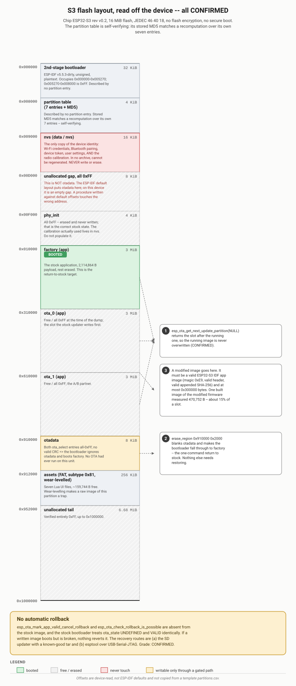

# Flash layout and the stock updater

This document covers two things that go together: the ESP32-S3's actual flash partition map as
read off a real unit, and exactly what the stock SD-card update mechanism will and will not accept
— reverse-engineered from disassembly of the vendor's own firmware image, not inferred from its
behaviour. Both matter for the same reason: if you want to install your own firmware through the
vendor's own update path, you need to know precisely where the bytes land and precisely what the
installer checks (and doesn't).

See also: [`usb-and-boot-modes.md`](usb-and-boot-modes.md) for how to reach the chip over
`esptool` in the first place, [`bootloader-analysis.md`](bootloader-analysis.md) for what the boot
chain does once a slot is selected, and [`recovery.md`](recovery.md) for restore procedures if
something goes wrong.

## 1. The partition map, read from the device

Everything below was read directly off a real unit's flash at offset `0x8000` — not assumed from
an ESP-IDF default layout and not taken from a `partitions.csv` template. The table is
self-verifying: its stored MD5 (`d4c79787c64d2e91d5d171ee89c0f8f6`) matches an independent
recomputation over its own seven entries. The app-slot contents were separately confirmed by a full
two-pass 16 MiB flash dump, with both passes byte-identical (sha256
`2de067051b225c2a84379d9366bb96c066f10777c0f350b5345b9a84cab899f4`, `cmp -l` reporting zero
differing bytes).

**Chip:** ESP32-S3 rev v0.2 · 16 MiB flash (`0x1000000`) · JEDEC ID `46 40 18` · no flash
encryption · no Secure Boot.



| # | Label | Type | Subtype | Offset | Size | End |
|---|---|---|---|---|---|---|
| — | 2nd-stage bootloader | — | — | `0x000000` | 32 KiB | `0x008000` |
| — | partition table itself | — | — | `0x008000` | 4 KiB | `0x009000` |
| 1 | `nvs` | data (1) | nvs (0x02) | `0x009000` | 16 KiB | `0x00D000` |
| — | unallocated gap, all `0xFF` | — | — | `0x00D000` | 8 KiB | `0x00F000` |
| 2 | `phy_init` | data (1) | phy (0x01) | `0x00F000` | 4 KiB | `0x010000` |
| 3 | `factory` | app (0) | factory (0x00) | `0x010000` | 3 MiB | `0x310000` |
| 4 | `ota_0` | app (0) | ota_0 (0x10) | `0x310000` | 3 MiB | `0x610000` |
| 5 | `ota_1` | app (0) | ota_1 (0x11) | `0x610000` | 3 MiB | `0x910000` |
| 6 | `otadata` | data (1) | ota (0x00) | `0x910000` | 8 KiB | `0x912000` |
| 7 | `assets` | data (1) | fat (0x81) | `0x912000` | 256 KiB | `0x952000` |
| — | unallocated tail, all `0xFF` (verified, 6.68 MiB) | — | — | `0x952000` | 6.68 MiB | `0x1000000` |

### Three offset traps a default-layout assumption walks straight into

1. **`otadata` sits at `0x910000`, not the ESP-IDF default `0xD000`.** On this device, `0xD000`–
   `0xF000` is simply an unallocated, erased gap, and `otadata` sits near the top of the app slots
   instead. Any recovery or inspection tooling written against default offsets touches the wrong
   address here. Use the offsets in this table, read from the device, not a stock `partitions.csv`.
2. **`phy_init` is all `0xFF` — erased, never written — and that is the correct stock state.** The
   radio calibration this device actually uses (`cal_mac`, `cal_version`, `cal_data`) lives in
   `nvs` instead, which is ESP-IDF's default behaviour. Do not "repair" this partition.
3. **`nvs` is the only copy of device identity.** Sixteen KiB holding Wi-Fi credentials, the
   Bluetooth keyboard pairing, a device token, user settings, and the radio calibration. It exists
   in no vendor archive and cannot be reconstructed from anything else this project holds — only
   rebuilt by hand (factory reset, re-pair, re-provision), and the calibration would then be
   recalibrated rather than restored.

`otadata` on the examined unit is 8 KiB of `0xFF` — both `ota_select` entries blank, no valid CRC —
so the bootloader falls through to `factory`, which is the only slot holding an image. Both OTA
slots are entirely erased: **no OTA update has ever run on this unit, and there is no pending
rollback.** `esp_ota_get_next_update_partition(NULL)` returns the slot *after* the running one;
because `factory` isn't itself an OTA subtype, the walk lands on `ota_0` first. The running image
is never overwritten by an update — a fact worth stating plainly, because it means an update that
goes wrong cannot destroy the one thing you'd need to fall back to. **The bootloader implements no
rollback of any kind** — see [`bootloader-analysis.md`](bootloader-analysis.md) for the full
disassembly-level treatment of why, and treat "the update boots, but is broken" as a state nothing
will revert automatically.

## 2. The stock updater, end to end

The stock update mechanism treats `/SDCARD/Updates/BYOK.tar` as a pure existence flag — nothing
downstream checks its contents, size, or signature — and deletes that tar the moment extraction
succeeds, which is also why there is no retry loop on any failure path. The firmware slot is
committed (`esp_ota_set_boot_partition`) *before* the Lua asset bundle is applied, so a tar that
ships firmware without a matching `assets.tar` still boots the new firmware — it just does so
behind a misleading "no updates were installed" log line. The co-processor is only ever touched if
a Pico-image member is present in the tar; omit it and no GPIO, UART, or co-processor flash write
happens at all.

```mermaid
flowchart TD
    %% All steps CONFIRMED by disassembly of the stock image unless marked otherwise.

    start("power on with the card inserted")
    check{"stat('/SDCARD/Updates/BYOK.tar') succeeds?"}
    normal("ordinary boot; the updater never runs")
    mode("boot mode := 2")
    escape{"DOWN button (GPIO7) held?"}
    clean1("cleanUpdateFiles(): empty /SDCARD/Updates, skipping subdirectories")
    preclean("pre-clean: delete any stale /Updates/BYOK.bin, BYOK-PICO.bin, manifest.json, assets.tar")
    extract("extractTar(/SDCARD/Updates/BYOK.tar -> /SDCARD/Updates, recursive)")
    rm_tar_fail("delete BYOK.tar and return")
    del("delete BYOK.tar immediately, before anything is installed")
    pico{"is /Updates/BYOK-PICO.bin present?"}
    picoinstall("push the image to the co-processor over the 921600 UART, after a 10 ms reset pulse on GPIO17")
    s3check{"is /Updates/BYOK.bin present?"}
    nothing("log 'no updates were installed' and return")
    ota("installFromExtracted(): firmware first, then assets")
    ota1("esp_ota_get_next_update_partition(NULL) -> the slot after the running one")
    ota2("esp_ota_begin(part, OTA_WITH_SEQUENTIAL_WRITES) - the size is never declared up front; the slot is erased incrementally as writes advance")
    ota3("loop: fread 8 KiB -> esp_ota_write")
    ota4("esp_ota_end - validates magic 0xE9, header sanity, segment walk, and the appended SHA-256. No vendor signature. No secure boot. No version gate.")
    COMMIT["esp_ota_set_boot_partition -- THE COMMIT POINT"]:::hazard
    assets{"does /Updates/assets.tar exist and apply cleanly?"}
    cleanup("delete BYOK.bin and assets.tar, set status 4, delay 100 ms, esp_restart()")
    booted("reboots into the newly written slot")
    misleading["returns -1 and the caller logs 'no updates were installed' -- BUT the boot partition has ALREADY been switched and the device will boot the new firmware anyway"]:::hazard
    shutdown_fail("caller logs 'Update failed, cleaning up Updates directory', cleans /Updates, then powers off (status 5, 100 ms delay) -- not a reboot")

    start -->|"file EXISTENCE only -- not content, not size, not a magic number, not a signature, not a manifest"| check
    check -->|no| normal
    check -->|yes| mode
    mode --> escape
    escape -->|yes| clean1
    clean1 --> shutdown_fail
    escape -->|no| preclean
    preclean --> extract
    extract -->|failure| rm_tar_fail
    rm_tar_fail --> shutdown_fail
    extract -->|success| del
    del --> pico
    pico -->|yes| picoinstall
    picoinstall --> s3check
    pico -->|no| s3check
    s3check -->|no| nothing
    nothing --> shutdown_fail
    s3check -->|yes| ota
    ota --> ota1 --> ota2 --> ota3 --> ota4 --> COMMIT
    COMMIT --> assets
    assets -->|yes| cleanup
    cleanup --> booted
    assets -->|no| misleading
    misleading --> booted

    escNote["checked ONCE, before installation begins. Not polled during the install -- once installation starts, DOWN does nothing."]:::note
    escape -.-> escNote

    picoNote["omit this member and the co-processor is never contacted at all -- no reset pulse on GPIO17, no UART transfer, no co-processor flash write. There is no recovery tooling for that processor, so omitting it is the smaller blast radius."]:::note
    pico -.-> picoNote

    delNote["this is why there is no update loop under any outcome, and why no NVS flag is needed to break one"]:::note
    del -.-> delNote

    subgraph Traps["Traps"]
        T1["installFromExtracted never returns on success -- it reboots internally. A successful install is NOT followed by a success line from the top-level installer function. Seeing 'Pico-only update completed' or 'no updates were installed' after 'Firmware update successful' means the firmware WAS committed and something later failed."]
        T2["The commit precedes the assets step. An S3-only tar half-works in the least legible way possible -- always ship assets.tar."]
        T3["manifest.json is never parsed on this path; it appears only in the pre-clean delete list. Writing one is actively harmful."]
        T4["The 'file size mismatch' check compares stat() of a file against stat() of the same file taken moments earlier -- a tautology. It constrains nothing."]
    end
    class T1,T2,T3,T4 note
    ota -.-> T1
    COMMIT -.-> T2
    preclean -.-> T3

    subgraph Requirements["What a hand-built BYOK.tar must satisfy (all CONFIRMED)"]
        R1["R1: path exactly /SDCARD/Updates/BYOK.tar, exact case"]
        R2["R2: a real tar with valid header checksums"]
        R3["R3: every member typeflag '0' (ustar REGTYPE)"]
        R4["R4: flat bare member names -- no './', no directories, at most 99 bytes, no ustar prefix split (there is no mkdir; a name with a slash fails the whole extract)"]
        R5["R5: a member named exactly BYOK.bin"]
        R6["R6: a member named exactly assets.tar, itself a valid tar of flat .lua files (one level of nesting is supported)"]
        R7["R7: BYOK.bin a valid ESP32-S3 IDF app image, at most 0x300000 bytes"]
        R8["R8: no pax/extended headers, no GNU longname entries"]
        reqNote["the co-processor member is looked up as BYOK-PICO.bin (uppercase) while the shipped member is named BYOK-Pico.bin; this works only because FAT matches case-insensitively. Do not 'fix' the case."]
    end
    class R1,R2,R3,R4,R5,R6,R7,R8,reqNote req

    classDef hazard fill:#e05252,stroke:#7a1414,stroke-width:2px,color:#fff
    classDef note fill:none,stroke:#888888,stroke-width:1px,stroke-dasharray:4 3,color:#666666
    classDef req fill:none,stroke:#5b7a99,stroke-width:1px,color:#5b7a99
```



### 2.1 How the analysis was done

This is disassembly, not string search or behavioural inference. The stock ESP32-S3 app image
(2,120,352 B, 6 segments) was disassembled with the standard ESP-IDF toolchain and cross-referenced
by chaining each log-literal string to its enclosing function, then walking every call site:

```sh
OD=~/.espressif/tools/xtensa-esp-elf/esp-14.2.0_20251107/xtensa-esp-elf/bin/xtensa-esp32s3-elf-objdump
# split the extracted app image into its ELF-style segments (magic 0xE9 header gives count/addresses),
# then disassemble the text segment at its actual load address:
$OD -D -b binary -m xtensa --adjust-vma=<segment load address> <segment>.bin
```

Two excerpts below are quoted directly from that disassembly, annotated; everything else is prose
description of what the code does, to keep this document short. The two claims below were each
independently confirmed by a byte-level opcode scan rather than trusted from a linear listing —
GCC's mixed 2-/3-byte Xtensa instruction encoding can mis-tile a listing that starts mid-instruction.

**The boot trigger — file existence, nothing else:**

```
0x0b6dc4  call8  checkForUpdate()            ; -> a10 = (stat("/Updates/BYOK.tar") == 0)
0x0b6dca  add.n  a10, a10, a10               ; boot_mode = 2 * present
0x0b6e34  bnei   a7, 2, ordinary_boot        ; not 2 -> updater never runs
0x0b6e37  movi.n a10, 7 ; callx8 gpio_get_level   ; DOWN button (GPIO7), escape hatch
0x0b6e63  call8  installUpdates()
```

**The "file size mismatch" check — both operands are the same file:**

```
; installFromExtracted(): stat("/Updates/BYOK.bin") -> st.st_size   (operand 2)
0x0b9875  l32i.n a11, a1, 16         ; a11 = st.st_size
0x0b987a  call8  updateFirmware(path, a11)
; updateFirmware(): a SECOND stat() of the exact same path        (operand 1)
0x0b7b59  l32i.n a8, a1, 16          ; a8 = st2.st_size
0x0b7b5b  beq    a8, a3, proceed     ; compares the same file against itself
```

Both operands are `stat().st_size` of `/SDCARD/Updates/BYOK.bin`, taken microseconds apart by two
different functions. It is not a tar-header size (the tar is already deleted by this point), not a
`manifest.json` field (never read on this path — see below), not a partition size, and not any
compiled-in constant. **There is no size gate here to satisfy** — a hand-built tar has nothing to
declare.

### 2.2 Answers up front

| Question | Answer |
|---|---|
| Boot trigger | `stat("/SDCARD/Updates/BYOK.tar") == 0`. Nothing else. |
| Is `manifest.json` read on the SD path? | No. It is *deleted* if present, never parsed. |
| What does "size mismatch" compare? | `stat().st_size` of `BYOK.bin` against `stat().st_size` of the same file, taken moments later. A tautology. |
| Is a firmware-only tar (no assets) accepted? | No — `assets.tar` is required if `BYOK.bin` is present, but the firmware is already committed before the assets step can fail. |
| Rollback | Absent from the image entirely. No app-rollback handshake of any kind. |
| Version comparison / downgrade refusal | None anywhere on the SD path. |
| NVS write after install | None. No settings key is touched by the updater. |
| Recommended tar | Your `BYOK.bin` + a byte-identical stock `assets.tar` + no Pico-image member. |

### 2.3 The tar parser: stock microtar, with one real gate

The extractor is an unmodified compile of the public [`rxi/microtar`](https://github.com/rxi/microtar)
library. It verifies each 512-byte header's checksum and rejects a bad one (`MTAR_EBADCHKSUM`) —
but a header failure exits the extraction loop through the *success* path, so a tar that is
truncated or corrupted exactly at a header boundary extracts everything before the damage and
reports success anyway. If that damage falls between `BYOK.bin` and `assets.tar`, the firmware is
flashed and committed and only the assets step then fails — which is the strongest argument for
verifying your tar's SHA-256 before the card ever goes into the device.

Every member must have `typeflag == '0'` (regular file) — directories, symlinks, and GNU longname
or pax extension entries are silently skipped, and there is no `mkdir` anywhere in the extractor,
so member names must be flat (no `/`, no ustar `prefix` split, ≤99 bytes). One level of `.tar`
nesting is supported and gated on the literal 4-byte suffix `.tar`: the outer archive is extracted
recursively, and any nested `.tar` member found is extracted once more, non-recursively, into the
*same* directory — which is how `assets.tar`'s own Lua members end up alongside it.

### 2.4 The OTA write and the commit point

`esp_ota_begin` is called with `OTA_WITH_SEQUENTIAL_WRITES`, not a declared size — the target slot
is erased incrementally as writes land, so the only size limit is the physical one (3 MiB per
slot). `esp_ota_end` performs IDF's standard validation: image magic `0xE9`, header sanity, a
segment walk, and the image's own appended SHA-256. There is no vendor signature check and no
Secure Boot gate. **`esp_ota_set_boot_partition` is the commit point, and it runs before the assets
step** — once it has executed, the device will boot your new firmware on the next reset regardless
of what happens to the Lua asset bundle afterward.

### 2.5 The co-processor path

A co-processor member — the board's second chip, an ESP32-PICO-MINI-02, nicknamed "Pico" on the
silkscreen but not a Raspberry Pi Pico / RP2040 (see [hardware.md](hardware.md) §2.2) — is looked
up under the literal, uppercase name
`BYOK-PICO.bin`; the vendor's own shipped member is actually named `BYOK-Pico.bin` (mixed case).
This works only because the SD volume is FAT and matches names case-insensitively — match the
vendor's naming convention rather than "fixing" the case in a hand-built tar. **Omitting this
member entirely means the co-processor is never contacted**: no GPIO handshake line is driven, no
UART transfer happens, and no co-processor flash write occurs. There is no recovery tooling for
that processor in this project, so omitting the member is the safer default unless you specifically
need to update it.

### 2.6 Requirements for a hand-built `BYOK.tar`

| # | Requirement | Why |
|---|---|---|
| R1 | Placed at exactly `/SDCARD/Updates/BYOK.tar` | the only trigger; matched by a literal `stat()` |
| R2 | A real tar with valid header checksums | `MTAR_EBADCHKSUM` rejects a bad one |
| R3 | Every member `typeflag == '0'` (ustar regular file) | anything else is silently skipped |
| R4 | Flat, bare member names — no `./`, no directories, ≤99 bytes, no ustar `prefix` split | there is no `mkdir`; a name containing `/` fails the whole extraction |
| R5 | A member named exactly `BYOK.bin` for the S3 app | extracted, then looked up by that literal name |
| R6 | A member named exactly `assets.tar`, itself a valid tar of flat `.lua` files | required whenever `BYOK.bin` is present |
| R7 | `BYOK.bin` a valid ESP32-S3 IDF app image (magic `0xE9`, correct header, valid appended SHA-256), ≤ `0x300000` bytes | enforced by `esp_ota_end` and the slot size |
| R8 | No pax/extended headers, no GNU longname entries | these typeflags are skipped as non-regular |

Explicitly **not** required: a `manifest.json` (it is deleted, never read, on this path), any size
or version declaration, a specific member order, or any NVS write by your firmware after install.

**Recommended composition:** ship exactly two members — your `BYOK.bin`, and the stock
`assets.tar` byte-for-byte as shipped by the vendor (so the assets-replacement phase is effectively
a no-op) — and omit the Pico-image member unless you specifically need to update that processor.
Produce it with a plain, boring writer (`tar`, `bsdtar`, or Python's `tarfile`), no compression, no
pax headers:

```sh
tar --format=ustar -cf BYOK.tar BYOK.bin assets.tar
```

Then verify before the card goes anywhere near the device: re-read the archive, confirm exactly the
members you intended, all `typeflag '0'`, all bare names, and record the SHA-256.

### 2.7 Risk summary

| Risk | Mechanism | Mitigation |
|---|---|---|
| A corrupt/truncated tar extracts partially and still reports success | header failure exits via the success path (§2.3) | verify the tar's SHA-256 after writing it to the card; re-read and confirm member count/names before ejecting |
| No rollback — a broken image that boots stays booted | rollback is entirely absent from the image (§2.4, and see [`bootloader-analysis.md`](bootloader-analysis.md)) | keep a pristine vendor tar ready on a second card; never install an image you haven't rehearsed |
| A firmware-only tar half-installs | commit precedes the assets step (§2.4) | always ship a matching `assets.tar` |
| Co-processor transfer interrupted mid-write | no co-processor recovery tooling exists in this project | omit the Pico-image member unless you need it, and only attempt it on external power |
| Malformed member name aborts the whole extraction | no `mkdir`; a name with `/` fails to open | use flat bare names; verify with `tar -tvf` before use |

## 3. What this document does not establish

Nothing here was tested against the factory build running on *your* unit. The factory image read
for this document was carved out of this project's own two-pass full-flash backup of the single
device it had (§1, and [`bootloader-analysis.md`](bootloader-analysis.md) §4), and that image exists
only on that one device: no second unit's factory slot was ever dumped, so no cross-unit comparison
of factory builds was possible. The conclusions above were instead cross-checked across two vendor
firmware generations and found structurally identical in every place that matters, which makes them
very likely to transfer, but "very likely" is not "verified for your exact unit." Rehearse any
update with the vendor's own unmodified tar before trusting a hand-built one.
