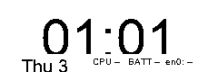
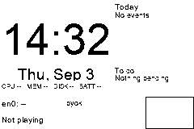
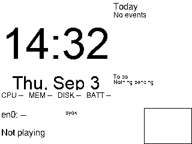
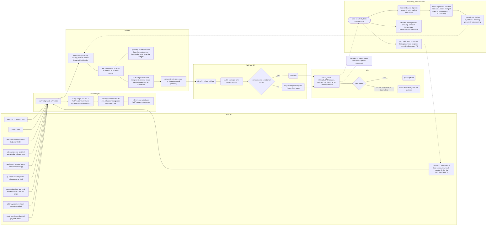

# Host tools

Status: Mode 1 (host-rendered dashboard, `byok dashboard`) is implemented and covered by a host
test suite. This document is the reference for it: the config schema, every widget and its
options, the bundled example configs and device-switchable presets, media transport, the
`byok notify` banner, the `byok display` command, and how to add a new widget. Code lives under
`host/macos/byok/dashboard/`.

## 1. What this is

`byok dashboard` renders a configurable grid of small widgets (a clock, the date, system stats,
calendar/reminders, git status, now-playing, network info, a QR code, arbitrary shell output,
static text, an image, or device-reported manuscript stats — §5's full widget list) into a single
image sized for the panel, and pushes it to the device — full-frame the first time and
periodically after, a dirty-rect diff every other cycle (see protocol.md §6.3 for the wire-level
framing). By default it also sends the bundled **presets** (§7) to the device and switches between
them live as the device reports a selection change — `--config`/`--preset` opt back into a single
fixed layout.

The renderer itself (`byok/dashboard/{config,layout,render,fonts}.py` and `widgets/`) is
**device-independent** — it only needs a width, a height, a bit depth, and a config file, and hands
back a plain image. That's what makes `byok.dashboard.preview` (a CLI that renders a config
straight to a PNG, no device involved) and the whole host test suite possible without ever opening
a serial port.

Zero required third-party dependencies beyond Pillow. PyYAML is optional — the dependency-free
fallback YAML parser has documented limits in its own module.

## 2. Quick start

```
byok dashboard --list-examples             # list the bundled example configs
byok dashboard --config clock-focus        # run one, live, against the device
byok dashboard --config work --once        # render+send a single frame, then exit
byok dashboard --list-presets              # list the bundled device-switchable presets
byok dashboard --preset media               # pin to one preset (SET_PRESETS still sent)
byok dashboard                             # no flags: presets mode, starts on "clock" (§7)

byok notify "task finished" --seconds 8     # flash an inverted banner (§9)
byok display --bulk on                      # DISPLAY_CFG bulk-update toggle (§10)
```

To preview a config as a PNG with no device at all:

```
host/macos/.venv/bin/python3 -m byok.dashboard.preview \
    --config host/macos/byok/dashboard/examples/clock-focus.yaml \
    --out preview.png --now 2026-09-03T14:32:07 --offline
```

Three previews rendered that way, at the panel's own 240×80 and at two larger canvases, are
checked in under [`img/`](img/):

| 240×80 (the real panel) | 240×160 | 320×240 |
|---|---|---|
|  |  |  |

`--offline` uses `NullProvider`s only (no shell/AppleScript/`git` subprocess calls) — deterministic,
and what every widget's own tests and the bundled examples' own test coverage exercise. Drop
`--offline` to see real data for whatever's actually running/configured on this Mac; `--repo`
overrides the `git` widget's configured repo; `--now ISO_TIMESTAMP` pins the rendered time for
reproducible screenshots.

### 2a. `BYOK_FORCE_MOCK` — refusing to open a real port

`SerialTransport.connect()` (`host/macos/byok/transport.py`) checks the `BYOK_FORCE_MOCK`
environment variable before ever resolving/opening a port: if it's set and no explicit
`serial_factory` override was supplied (i.e. this call would have opened a real port), it raises
`MockRequired` — a `TransportError` subclass, so every existing `except TransportError`/
`except (WrongDevice, NoDeviceFound, HandshakeFailed, TransportError, ...)` call site (including
`byok notify`'s own IPC-queue fallback) degrades exactly as it already does for "no device found",
rather than crashing.

This changes nothing for normal end-user CLI use — the variable is unset by default, so real
hardware opens exactly as before. It exists as a safety net for any shell that must never touch the
physical device — CI, a script, a review pass — export `BYOK_FORCE_MOCK=1` in any such shell before
running `byok` commands directly (outside `pytest`, which never opens a real port regardless — see
`tests/host/test_transport.py`'s `ForceMockTests`). This is documentation only; nothing in the repo
sets it automatically. Every test in this project's own host suite runs with this variable set, and
no `byok` invocation in this repository's own development history has ever opened the physical
serial port outside a deliberate, one-at-a-time owner-performed test.

## 3. `--config` path resolution

`--config` (`byok.dashboard.config.resolve_config_path()`) accepts, in order, first match wins:

1. **As given**, relative to the current working directory, or absolute —
   `./my-dashboard.yaml`, `/abs/path/to/config.yaml`.
2. **The same, with `.yaml` appended** if it doesn't already end in one, still cwd-relative —
   `--config my-dashboard` finds `./my-dashboard.yaml`.
3. **That name's basename, joined onto the bundled `examples/` dir** — any directory component you
   passed is dropped at this step (it only ever means "look in the bundled examples"), so `work`,
   `work.yaml`, and `examples/work.yaml` all resolve to the same bundled file regardless of your
   current directory.

No `--config` at all uses `config.default_config_path()` — the bundled `default_dashboard_240x80.yaml`,
tuned for the device's real native panel (§4.1 explains why, not `default_dashboard.yaml`, which
targets an illustrative 320×240, is the default).

`--list-examples` prints every `.yaml` basename under `host/macos/byok/dashboard/examples/` and
exits 0 — no device connection attempted, so it's safe to run with nothing plugged in.

An unresolvable `--config` value is a clean `error: ...` + exit code 2 (every attempted candidate
path named), not a traceback — same shape as an invalid/unreadable config file.

## 4. Config schema

```yaml
display:
  width: 240          # optional; --width/--height on preview.py win
  height: 80
  bpp: 1               # 1 or 2

refresh_seconds: 60    # byok dashboard's default --interval

layout:
  grid:
    cols: 12
    rows: 5

widgets:
  - type: clock
    at: [0, 0]         # [col, row], 0-indexed
    span: [12, 3]      # [width_cols, height_rows]
    options:
      format: "%H:%M:%S"
```

- **`display`** is informational/default-only for `byok dashboard` itself — the real panel geometry
  always comes from the device's own `HELLO_ACK` (protocol.md §6.1), never from the config, so the
  same config can't accidentally mis-target a different panel size. It *is* what `preview.py` uses
  when `--width`/`--height` aren't given.
- **`layout.grid`** divides the canvas into a `cols`×`rows` grid. `widgets[].at`/`.span` are grid
  cells (`[col, row]` / `[width, height]` in cells), converted to pixels as a *fraction* of the
  canvas — the same config renders sensibly at any target resolution, not just the one `display:`
  names.
- **`widgets`** is an ordered list; each entry needs `type` (a registered widget name — §5), `at`,
  `span`, and an optional `options` mapping (widget-specific, §5). Widgets are drawn in list order
  and may not overlap (nothing enforces that at load time, but later ones simply draw over earlier
  ones if they do).
- A cell not covered by any widget stays blank (background color).
- An unknown `type`, or a widget whose `render()` raises, gets a small `[error]`/`unknown: <type>`
  placeholder tile instead of crashing the whole composite — one broken widget never blanks the
  whole dashboard.

### 4.1 Sizing the default config for the real panel

`default_dashboard.yaml` is geometry-agnostic (an eight-row percentage grid) but was designed
against a 240×160 or 320×240 panel, not this device's confirmed native **240×80**. At 240×80 an
eight-row grid gives ~10px rows: the clock stays legible but everything else collapses to
unreadable slivers. `default_dashboard_240x80.yaml` is the shipped fix — a two-row grid with a
large clock and one line of short single-line tiles (date, one stat, network), sized for 80px of
total height. Render either one yourself to compare:

```sh
cd host/macos
python3 -m byok.dashboard.preview --config byok/dashboard/default_dashboard.yaml \
    --width 240 --height 80 --offline --out /tmp/dashboard-8row.png
python3 -m byok.dashboard.preview --config byok/dashboard/default_dashboard_240x80.yaml \
    --offline --out /tmp/dashboard-2row.png
```

Use `default_dashboard_240x80.yaml` (or `--width 240 --height 80` against it) for anything
targeting the real device panel; the richer eight-row layout stays available for larger panels.

## 5. Widgets

Every widget shares two implicit options on top of what's listed below:

- **`border`**: `true` draws a 1px outline around the tile.
- **`font`**: a path to a `.ttf`/`.otf` file, overriding both the top-level `fonts.path` config key
  and the built-in font search (explicit path → a few fonts that ship with every macOS install →
  a scalable default font → a fixed-size bitmap fallback — never hard-fails on a missing font).

And, on most text-rendering widgets, **`text_case`**: `"upper"` | `"as-is"`. Small rows (default:
tile height < 12px) default to `"upper"` — anti-aliased glyphs thresholded to hard 1-bit with no
dithering (the renderer's deliberate choice for text — dithering blurs edges, which helps a photo
and hurts a glyph) lose thin lowercase strokes first at small point sizes. Several widgets whose own
auto-fit font size still lands in that danger zone even *above* the 12px row-height threshold (real
16px grid rows) set `text_case: upper` explicitly in their own default config/examples rather than
relying on the boundary alone — see `default_dashboard_240x80.yaml` and `examples/work.yaml`/
`media.yaml` below. Widgets that don't take this option (`clock`, `qr`, `image`) either render
mostly non-letter content (digits/QR modules) or are the exception the option exists to override
for (arbitrary text/output whose literal casing may matter more than default legibility) — see each
widget's own option list.

Overflow handling, uniformly: horizontal single-line overflow gets ellipsized (binary-searches the
longest prefix + "…" that still fits, "" if even "…" doesn't fit); multi-line widgets (`calendar`,
`reminders`, `shell`, `text`) word-wrap and silently drop whatever doesn't fit vertically rather
than draw past the tile's bottom edge.

| widget | what it draws | provider / data source |
|---|---|---|
| `clock` | current time | none (local clock) |
| `date` | current date | none |
| `mac_stats` | CPU/mem/disk/battery, one compact line | `top`, `vm_stat`, `sysctl`, `pmset` |
| `now_playing` | ▶/⏸ + track — artist | optional `nowplaying-cli` on PATH |
| `calendar` | today's events (or just the next one) | scripted query to the calendar app |
| `reminders` | open reminders, list or count | scripted query to the reminders app |
| `git` | branch + dirty flag (+ last commit if room) | `git` (subprocess, no shell) |
| `network` | interface + local IP | `ipconfig`/`ifconfig` (no sockets, no pings) |
| `shell` | a *configured* command's stdout | your own command — see its security note |
| `text` | static/config-driven text | none |
| `image` | a scaled-to-fit image file | none |
| `qr` | a QR code encoding configured text | none (from-scratch encoder, `widgets/qr.py`) |
| `writing` | manuscript stats read from the device itself | `GET_DOCSTATS` (protocol.md §6.4b — see §11) |

### `clock`

```
format: strftime format, default "%H:%M" (or "%I:%M %p" for 12h)
title: optional small label drawn above the time
```

Auto-fits the largest font that fits the tile (full row height, not halved). Digits/colon only by
default; a format with letters (`%p`, `%a`) is unaffected by `text_case` (this widget doesn't take
the option — its content is overwhelmingly not the thin-lowercase-stroke case it protects against).

### `date`

```
format: strftime format, default "%a, %b %-d" (falls back to %#d on
        platforms without %-d, then to plain %d)
text_case: "upper" | "as-is", default per the row-height rule above --
    most formats include letters ("Thu", "Sep"), the case this default
    protects
```

### `mac_stats`

```
title: header text, default "" (no title, stats bar is compact)
fields: subset/order of ["cpu", "mem", "disk", "battery"], default all
text_case: "upper" | "as-is", default per the row-height rule above
```

Every subprocess call (CPU, memory, disk, battery) is individually timeout-guarded and
exception-caught; a failed field renders `"--"` rather than blocking the refresh cycle or crashing
the widget.

### `now_playing`

```
title: header text, default ""
text_case: "upper" | "as-is", default per the row-height rule above
```

macOS has no supported command-line "now playing" API. This widget looks for a third-party
now-playing helper on `PATH` **only if already installed** — nothing here ever installs it. Without
it (the common case, and what every offline/test render uses), falls back to `"Not playing"`.

### `calendar`

```
title: header text, default "Today" ("" for a title-less compact tile)
max_events: cap the list, default 5 -- set to 1 for a single "next event"
    line in a compact row (see examples/work.yaml)
```

Events are sorted (all-day first, then ascending by time) before `max_events` is applied — the
underlying provider walks the calendar app calendar-by-calendar, not chronologically, so without
this sort `max_events: 1` would show whichever event happened to be enumerated first, not the
actually-next one. Does **not** filter out events already in the past today — "earliest today", not
strictly "still upcoming" (a deliberate scope limit: filtering by "now" would make the compact
single-event mode's output depend on wall-clock time in a way that's easy to get subtly wrong).

Every failure mode (calendar app not running, permission denied, a slow response past the 5s
timeout, malformed output) degrades to "no events" rather than raising.

### `reminders`

```
title: header text, default "To do" ("" for a title-less compact tile)
max_items: cap the list, default 6
mode: "list" (default, one line per reminder) | "count" (a single
    "N pending" / "Nothing pending" line -- for a compact row too short
    to list items, e.g. a 16-24px grid row)
```

Same shape as `calendar`: a scripted query to the reminders app, every failure mode degrading to an
empty list rather than raising.

### `git`

```
repo: absolute path to a git repo (required for real data)
title: header text, default "Repo" ("" for a title-less compact tile)
text_case: "upper" | "as-is", default per the row-height rule above
```

Branch + a `*` suffix if the working tree is dirty; a last-commit summary line is added **only when
there's real room for two lines** (≥22px of available height after the title, empirically enough
for two legible lines at this project's font sizes) — below that, the widget collapses to a single
branch line sized to the *full* available height rather than an artificially halved one, and drops
the commit line entirely instead of showing it crushed into a few illegible pixels (see
`examples/work.yaml`'s git row, which is exactly this case: a 16px grid row with `title: ""`,
single-line-only). No `git` executable, no repo at `repo`, or any other failure renders `"not a git
repo"`/`"--"` rather than raising.

### `network`

```
interface: default "en0"
title: header text, default "" (uses interface name in-line instead)
text_case: "upper" | "as-is", default per the row-height rule above
```

Queries the interface's address for the address; falls back to reporting the interface as down when
there's no address. Never opens a socket or sends a packet.

### `shell`

```
command: a list of argv strings, OR a single string split with
         shlex.split() (still executed without a shell -- no
         pipes/redirects/expansion). Required.
timeout: seconds, default 5
title: optional header
text_case: "upper" | "as-is", default per the row-height rule above --
    set "as-is" explicitly if the command's output is case-sensitive (a
    URL, a path, JSON) and legibility at that size matters less than
    preserving it verbatim
```

**Security note**, worth repeating here: `options.command` is real, arbitrary-command execution
with your own user's privileges, every refresh cycle — not shelled through `/bin/sh` (no
pipes/redirects/expansion), but still exactly as "safe" as running that command yourself. Only put
commands *you* wrote or trust into your own config. **Never** load a dashboard config from an
untrusted source without reading `widgets:` for a `type: shell` entry first.

### `text`

```
text: the string to display (required; empty renders a blank tile)
title: optional header
size: font size in px, default derived from tile height
align: "left" | "center", default "left"
text_case: "upper" | "as-is", default per the row-height rule above --
    set "as-is" explicitly if this text's exact casing matters (a name, a
    quote) more than default legibility at that size
```

### `image`

```
path: path to an image file (required)
fit: "contain" (default, preserve aspect, letterbox) | "cover" (fill and
     crop) | "stretch"
```

A missing/unreadable file (or no `path` at all) renders a small "no image"/"image error" placeholder
rather than raising.

### `qr`

```
data: text to encode (required; falls back to a placeholder message if
      missing/too long for version 10 EC-L, i.e. > 271 bytes)
border: quiet-zone modules, default 2 (small tiles can't spare the
        standard 4)
title: optional header
```

A from-scratch, dependency-free byte-mode QR encoder (versions 1–10, EC level L). **Not** verified
by scanning a printed/rendered code with a real phone camera — if a generated code being scannable
matters to you, test it once before relying on it unattended.

The rendered code is scaled by the *smaller* of the tile's width/height, in whole-module-pixel steps
(floored to at least 1) — on this project's real 240×80 panel, a 32px-tall row caps *any* QR code at
roughly 25–30px square regardless of how much horizontal room the tile has. Keep the encoded string
short (shorter = fewer modules = each module gets more of that limited pixel budget).

### `writing`

```
title: header text, default "Writing" ("" for a title-less compact tile)
daily_goal_words: the daily-goal bar's denominator, default 500
text_case: "upper" | "as-is", default per the row-height rule above
```

Manuscript stats read from the **device itself**, not this Mac — the one widget in this package
whose data doesn't come from a Mac-side subprocess/file/scripted read. It calls `GET_DOCSTATS` →
`DOCSTATS` (protocol.md §6.4b — see §11), throttled to at most one round-trip every 30s regardless
of the dashboard's own refresh cadence, since `GET_DOCSTATS` is a synchronous request/reply over the
same link the loop uses to draw frames and polling it every render cycle would add avoidable latency
to every frame for data that plausibly hasn't changed since the last poll.

Shows total words, files, last-edit relative time (or, on a shorter row, today's word count instead
of the file count), and a daily-goal progress bar (`options.daily_goal_words`, default 500) filled
by `words_today / daily_goal_words`. With no device connected, or firmware that predates
`GET_DOCSTATS` (it NACKs `E_UNKNOWN_TYPE`, which this widget's provider catches and degrades from),
renders "-- words".

## 6. Bundled example configs

`host/macos/byok/dashboard/examples/*.yaml` — list them with `byok dashboard --list-examples`, run
one with `--config <name>`. All three target the device's real native panel (240×80, 1bpp) and
render completely with the offline/Null providers (no subprocess/scripted calls at all) — exercised
directly by the host test suite (renders without error, deterministic for a fixed timestamp, every
widget's drawn content stays inside its own tile).

Render any of them yourself for a preview:

```sh
cd host/macos
python3 -m byok.dashboard.preview --config byok/dashboard/examples/clock-focus.yaml \
    --now 2026-09-03T14:32:07 --out /tmp/clock-focus.png
```

### `clock-focus.yaml` — big clock + date + battery

Three widgets: a seconds-resolution clock fills the top 3 of 5 grid rows (48px), date and battery
share the remaining 2 rows (32px, plenty of room — left at the default `text_case` rather than
forced upper). On a desktop Mac with no battery this renders `BATT --` for the percentage while
`chg` still correctly reports AC power present; on a laptop this reads e.g. `BATT 82%`.

### `work.yaml` — clock, next event, reminders count, git, mac stats

Five widgets, one per 16px row: compact clock, the next calendar event (`calendar` with
`max_events: 1`, relying on its chronological sort — §5), an open-reminders count (`reminders` with
`mode: count`), the configured repo's branch/dirty status (`git`, `repo: "."`, override with
`--repo` or by editing the file), and CPU+memory. Every row sets `text_case: upper` explicitly (16px
rows — see §5's row-height note) and `title: ""` (a compact row can't spare a title's vertical space
on top of its own content).

### `media.yaml` — now playing + clock + QR

Three widgets: clock (top 2 rows, 32px), a now-playing line (1 row, 16px, `text_case: upper`), and a
QR code (bottom 2 rows, 32px — see §5's `qr` section for why the code itself only ends up ~25px
square regardless of the tile's full 240px width). The URL is a placeholder — edit `options.data` to
your own — deliberately kept short enough to stay at QR version 1, the smallest possible matrix,
since a longer URL only makes an already tile-constrained fit worse.

## 7. Presets

`host/macos/byok/dashboard/presets/` is a *second*, parallel set of configs to `examples/` (§6) —
same YAML schema, different purpose: `examples/*.yaml` are `byok dashboard --config <name>` demos,
one config per run, chosen once at the command line; `presets/*.yaml` are the device-switchable set
`byok dashboard` sends to the device (`SET_PRESETS`, protocol.md §6.4b — see §11) and switches
between *live*, in one running process, driven by the device's own selection (preset-changed
events). The two directories are allowed to drift independently — `presets/work.yaml` and
`examples/work.yaml` happen to show the same content today, but nothing keeps them in sync, by
design.

`presets/manifest.yaml` is the single source of order: an ordered list of `{name, display, file}`.
`display` (≤20 UTF-8 bytes, checked at load time) is what goes out on the wire via `SET_PRESETS`;
`name` is a host-side-only short key `--preset NAME` / `--list-presets` use, never sent to the
device. List order **is** wire order — a preset-changed event's index is looked up against this
exact list, so reordering `manifest.yaml` reorders both the device's own menu and what index means
what.

Four bundled presets:

| name | display | shows |
|---|---|---|
| `clock` | CLOCK | big clock + date + battery |
| `work` | WORK | clock, next event, reminders count, git, CPU/mem — same content as `examples/work.yaml` |
| `media` | MEDIA | clock + now-playing, **no QR code** (see below) |
| `writing` | WRITING | small clock + the full `writing` widget (§5) |

**`media` has no QR code — a deliberate choice, not an oversight.** A device-switchable "media"
preset is meant to be looked at and controlled via the physical buttons (§8, below), not scanned;
the row a QR code would occupy instead goes to a larger now-playing line. The `qr` widget class
itself is completely untouched (`widgets/qr.py`, still registered, still used by `examples/media.yaml`
and any config that wants it) — this is a per-preset content choice, nothing about the widget system
changed.

**Three `byok dashboard` modes**, decided by which flags are given:

1. **`--config PATH`** (unchanged from before presets existed): exactly that one config, forever.
   No `SET_PRESETS` is sent, no live switching — the original, single-config behavior.
2. **`--preset NAME`**: starts on that preset. `SET_PRESETS` is still sent (so a device with its own
   menu stays populated/legible), but this host then *ignores* preset-changed events — preset
   switching is locked right after the initial force-preset call. Use this to pin a kiosk-style
   single preset while still telling the device what its menu options are.
3. **Neither flag** (the default): starts on the manifest's first entry (`clock`), sends
   `SET_PRESETS`, and freely follows preset-changed events — the normal "the device's own
   menu/buttons drive what the panel shows" mode.

`--list-presets` prints every bundled preset's `name`/`display` and exits 0 — no device connection
attempted, same convention as `--list-examples`.

If a connected device NACKs or never replies to `SET_PRESETS` (firmware from before the preset menu
existed — §11), the CLI logs a warning and keeps running with the host-selected starting preset;
only the device's own menu (if the firmware has one) stays out of sync, not the host's own
operation.

## 8. Media transport (button control)

While the dashboard loop is running with presets enabled (modes 2 or 3 above) and the **current**
preset is `media`, the device's physical buttons control the Mac's media playback via
`dashboard/media_transport.py`:

| button | action |
|---|---|
| UP | next track |
| DOWN | previous track |
| BRIGHTNESS | play/pause |

Wired through the dashboard loop's device-event hook, which polls for `EVT_BUTTON` frames
(protocol.md §6.5) once per cycle (non-blocking) and hands each one to the handler, which no-ops
unless the active preset is `media` right now — so pressing UP/DOWN/BRIGHTNESS while any other
preset (or a `--config` custom layout) is showing does nothing.

Only a clean `PRESSED` edge acts; `RELEASED`/`AUTO_REPEAT`/`LONG_PRESS` are ignored, so holding a
button doesn't fire a burst of track changes. Sending a media command checks one media player app
first, then a second, from inside a single conditional — a no-op, not an error — if neither app is
running (this project's usual "degrade to nothing" convention, §5, applied to a button handler).
EXECUTE and WAKE are left alone: EXECUTE already has a device-side meaning once no host is connected
(protocol.md §6.4's back-button paragraph — backlight cycling), and neither button has an obvious
media action.

## 9. Notify (`byok notify`)

`byok notify TEXT [--seconds N]` flashes a short inverted banner across the top of the panel, then
restores it.

**The BYOK Link is single-consumer** (one serial port, one process at a time), and this is actually
*enforced*, not just assumed: `SerialTransport`'s default serial factory opens the port with
`exclusive=True` (a POSIX `flock` on the device node), so a second process's `Device.open()` on the
same port fails loudly (`transport.PortBusy`) instead of silently succeeding alongside the first.
Before this was enforced, two host processes could both hold the port open at once — the second's
`HELLO` would reset the device's `SEQ` session out from under the first, and the first's very next
frame would land far ahead of the device's new expectation, drawing an informational
`NACK/E_SEQ_GAP` (protocol.md §7.5/§9) that an unrelated host-side bug then turned fatal — the full
writeup, with the fix, is in troubleshooting.md.

If a `byok dashboard` loop is already running in another process (the normal long-lived case),
`byok notify` cannot also open the port itself. **`cmd_notify` is IPC-first, not
direct-connect-first**: it checks whether a loop is running — a pidfile-style lock,
`~/.cache/byok/loop.lock`, written by the dashboard loop for the duration of its run and cleared on
exit — *before* ever attempting `Device.open()`. If the lock says a loop is alive, the request goes
straight to a JSON request file (`~/.cache/byok/notify.json`) that a running loop polls for once per
render cycle; `Device.open()` is not attempted at all in this, the common, case. Only when the lock
says nothing is running does `cmd_notify` try a direct connection — and even then, a `PortBusy` (the
lock missing or stale, but the port genuinely held by something else) falls back to the same IPC
file rather than ever retrying the open. This ordering — check the lock, then IPC, with the direct
open as the last resort rather than the first attempt — is what actually avoids the
double-connection failure mode described above; the exclusive-port change is the second,
independent layer that makes the same failure impossible even if the lock is stale.

**Two drawing paths, deliberately different:**

- **Standalone** (direct connection succeeded — nothing else was running): literal
  `DRAW_RECT`(filled, dark)/`DRAW_TEXT`(inverted style)/`PARTIAL_REFRESH` device commands, held open
  for `--seconds`, then restored via `DRAW_RECT`(clear region)/`PARTIAL_REFRESH`. "Restore" here can
  only mean "back to background" — this path has no memory of whatever was on screen before the
  banner (no render pipeline is involved at all in the standalone case).
- **Loop-mediated** (a dashboard loop picks up the IPC request instead): the banner is composited
  directly onto the loop's own rendered frame each cycle while the request is active, *before* that
  cycle's normal (already dirty-rect-diffed, `PARTIAL_REFRESH`-driving) send — **not** a separate
  `DRAW_TEXT` overlay. This is deliberate, not an inconsistency: the loop tracks its own belief of
  what's currently on the device to diff each new frame against it. A `DRAW_TEXT` overlay issued
  independently of that composite would make the device's actual pixels diverge from that belief
  without the loop knowing it — the very next cycle's diff could then decide "this region didn't
  change" and skip resending it, leaving stale banner pixels on the panel forever instead of
  restoring them. Baking the banner into the composite keeps the loop's own state truthful, so a
  later cycle naturally computes "banner region changed back to real content" as a dirty rect and
  sends it via the loop's existing `PARTIAL_REFRESH` path — still `PARTIAL_REFRESH`-driven under the
  hood, just composited rather than layered.

**Restore timing, loop-mediated path only.** The loop checks the request file once per render cycle
(`refresh_seconds`), not on a separate timer — restructuring the loop's wall-clock-aligned tick
logic for sub-cycle precision was judged not worth it for a low-priority notification banner. A
banner requested with `--seconds` shorter than the running dashboard's `refresh_seconds` restores
**late**, on the next cycle after expiry, not exactly on time. Keep `--seconds` at or above whatever
`refresh_seconds` the running dashboard uses if on-time restore matters to you; the standalone path
(no loop running) always restores exactly on time, since it's the one process blocking on its own
sleep.

## 10. Display command (`byok display --bulk on|off`)

`byok display --bulk on|off` sends `DISPLAY_CFG` (protocol.md §6.4b — see §11) — `u8 flags`, bit0 =
use bulk I2C writes for panel data (one transaction per full-width page/window) when set, per-byte
transactions (vendor-parity fallback) when clear. This toggle exists so the bulk-write path's
measured refresh time can be A/B'd against the per-byte path on real hardware — running that
measurement itself needs the device connected and the resulting timing observed by hand, which is a
separate, owner-performed step from adding the command. `device.display_cfg_bulk()`'s own docstring
has the exact wire layout.

## 11. Protocol reconciliation

`SET_PRESETS`/`GET_DOCSTATS`/`DOCSTATS`/`DISPLAY_CFG` and `EVT_PRESET_CHANGED` all match
protocol.md's §6.4b/§6.5 definitions exactly — an earlier, host-only first draft of these five
messages used different type codes and payload shapes before a firmware-side definition existed;
every encode/decode helper in the host library was corrected to match the firmware-side spec
byte-for-byte once it landed, and every test file that encodes/decodes one of these messages was
updated with it. If protocol.md changes again for any of these messages, the host library's type
enum and the affected encode/decode helpers are what need re-checking next.

Also worth knowing: `STATUS`/`EVT_STATUS`'s `flags` byte (protocol.md §6.1) gained meaning for bits
4–6 (currently-selected preset index, 0–7) and bit 7 (preset menu open) — the host library decodes
these, and the dashboard loop treats an `EVT_STATUS` frame's preset-index bits as a second,
redundant path to the same selection a preset-changed event reports. A `SET_MODE` value `7`
(`MENU`, protocol.md §6.4) — opens the device's own preset menu on demand — exists in the spec but
has no dedicated `byok` subcommand of its own yet; the underlying device call already works for
anyone who wants it. `EVT_BUTTON`'s wire format (6 B) has not changed since it was first specified —
only its device-side firing conditions were refined (protocol.md §6.5: only while host-active and
the preset menu is closed).

## 12. Adding a new widget

1. Create `host/macos/byok/dashboard/widgets/my_widget.py`. Subclass `Widget` (`widgets/base.py`),
   set a docstring listing `options:` (this is the documentation source of truth — keep it
   accurate), and implement `render(self, ctx: RenderContext) -> Image.Image` returning an
   `'L'`-mode image of exactly `(ctx.width, ctx.height)`.
2. Decorate the class with `@register("my_widget")` — this is what makes `type: my_widget` in a
   config resolve to it.
3. If it needs external data, define a small `Provider` interface (see `calendar.py`/`git.py`/
   `mac_stats.py` for the pattern) with at least a `NullProvider` that returns empty/placeholder
   data with **no I/O** — this is what every widget falls back to when no real provider is wired
   up, and what keeps offline previews/tests deterministic and fast. Any real
   (subprocess/scripted/network) provider must catch its own I/O failures and degrade to a
   placeholder rather than raise — `render()` must never raise for a missing/failed external
   dependency (the per-widget exception guard in the layout compositor exists as a last resort, not
   a first line of defense — a widget that relies on it loses partial-refresh determinism on the
   cycle it fires).
4. **Never raise for a normal "no data" condition** — draw a fallback ("--", "No events", ...)
   instead, same convention as every existing widget.
5. Import the module somewhere it's guaranteed to run before rendering — the existing widgets are
   all imported by `widgets/__init__.py`, which is what actually populates the widget registry; add
   your import there.
6. Respect the shared conventions from §5: auto-fit font size to the *full* available row height
   (not an arbitrary fraction of it), apply the shared upper/as-is text-case helper on any
   letter-bearing text you draw (with a `text_case` option to override), and ellipsize any
   single-line text that might overflow horizontally at your smallest auto-fit size.
7. Add it to the widget test module: at minimum, a render with a fake/Null provider (no I/O in
   tests), a render at each of the three real row heights (16/24/32px @ 240px wide — a test in that
   module asserts every registered widget has a case, so a missing one fails loudly rather than
   silently going uncovered), and a check that a provider exception doesn't crash `render()`.
8. Document it here (§5) and, if it fits one of the three bundled examples' themes, consider adding
   it there too — render a preview (§6's command) and look at it before calling it done; an
   unreadable preview is a real regression, not a documentation nit.

---

## Appendix: dashboard data pipeline (diagram)

The same diagram, with a facts table grading and sourcing every line in it, is kept standalone at
[`diagrams/dashboard-data-pipeline.md`](diagrams/dashboard-data-pipeline.md).



## Appendix: mode and preset-menu state machine (diagram)

Standalone copy, with its own facts table:
[`diagrams/mode-and-preset-state-machine.md`](diagrams/mode-and-preset-state-machine.md).

```mermaid
stateDiagram-v2
    [*] --> HOST : boot completes, initial device-local mode is host/dashboard

    state HOST {
        [*] --> Displaying
        Displaying : host owns the display - SET_MODE HOST(1) and MIRROR(2) both land here
    }

    state "device's own screen" as IDLE_GROUP {
        CLOCK : large time plus date and battery, driven by the RTC
        NOTE : the word-wrapped text most recently set by SET_NOTE
        BLANK : panel cleared, backlight off

        CLOCK --> NOTE : UP
        NOTE --> BLANK : UP
        BLANK --> CLOCK : UP
        CLOCK --> BLANK : DOWN
        BLANK --> NOTE : DOWN
        NOTE --> CLOCK : DOWN
    }

    HOST --> IDLE_GROUP : SET_MODE 0, IDLE - enters whichever of the three was last selected
    HOST --> CLOCK : SET_MODE 4
    HOST --> NOTE : SET_MODE 5
    HOST --> BLANK : SET_MODE 6
    HOST --> IDLE_GROUP : 30 s with no frame from a connected host
    IDLE_GROUP --> HOST : any frame arrives from any host - no SET_MODE needed first

    HOST --> MENU : EXECUTE held 1 s or more
    IDLE_GROUP --> MENU : EXECUTE held 1 s or more
    [*] --> MENU : automatically for 5 s at boot - skipped if no preset is stored
    HOST --> MENU : SET_MODE 7

    state MENU {
        [*] --> Open
        Open : UP/DOWN move the highlight and wrap. EXECUTE confirms, persists the index and fires a preset-changed event. A 10 s timeout closes the menu and KEEPS the current selection.
    }

    MENU --> HOST : close, if opened from the host-owned state
    MENU --> IDLE_GROUP : close, restoring the exact idle submode that was showing

    SLEEP : SET_MODE 3 - bookkeeping only; panel/backlight not actually gated by it
    HOST --> SLEEP : SET_MODE 3
    SLEEP --> HOST : SET_MODE 1
```

Both diagrams are read alongside protocol.md §6.4/§6.4b/§6.5 and §7, which are the normative
source for every message name, byte count, and timing figure they show.
