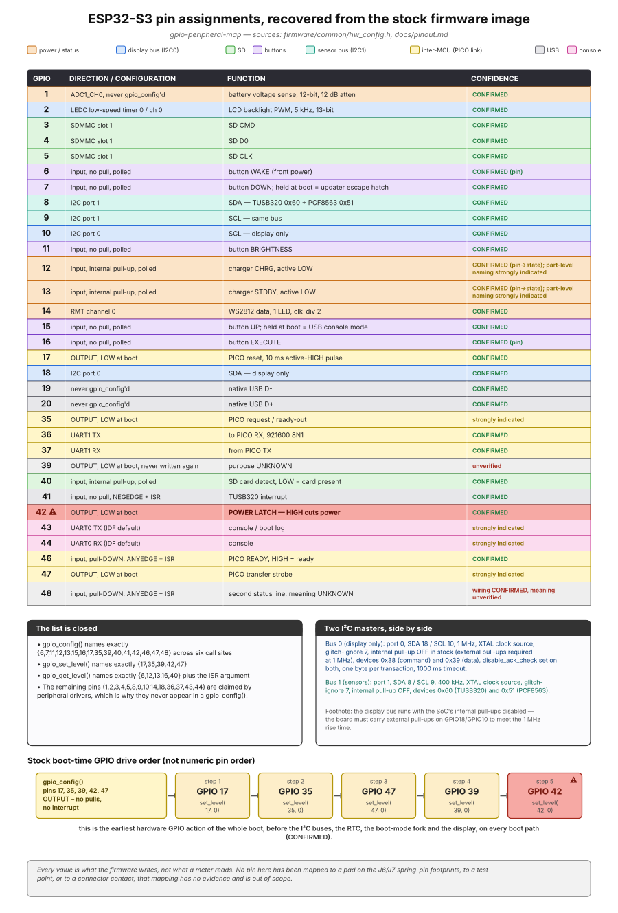

# Pinout

This is the complete GPIO and I²C map for the ESP32-S3, plus everything known about the two
unlabelled 6-pad connectors (`J6`, `J7`) that most likely carry each MCU's programming lines. The
GPIO table was recovered by disassembling the stock firmware image — it describes what the
firmware's own `gpio_config()` / `gpio_set_level()` / `gpio_get_level()` calls write into hardware
registers, not a measurement taken with an instrument on the board. Where a physical pad's function
has never been established by any method, it is recorded as UNKNOWN rather than guessed — a
plausible-looking pinout copied from a reference design is exactly the kind of mistake that damages
an irreplaceable board. Evidence labels follow [SAFETY.md](../SAFETY.md) §2.

The machine-readable form of everything in this document is
[`firmware/common/hw_config.h`](../firmware/common/hw_config.h), which carries the same values as
named constants with their own evidence citations and file offsets. Where this page and that header
ever disagree, the header is more current — regenerate this page's tables from it before trusting a
discrepancy.

---

## 1. GPIO/I²C map



*(Source, with a facts table grading and citing every pin on it:
[`diagrams/gpio-peripheral-map.md`](diagrams/gpio-peripheral-map.md).)*

The diagram above colour-bands every GPIO the stock firmware touches by the subsystem it belongs
to, and includes three supporting panels: a closure statement showing the pin lists below are
exhaustive rather than a partial survey, a side-by-side comparison of the two I²C buses, and the
exact order the firmware drives its earliest boot-time GPIO block in (which is not numeric pin
order — see §5 below).

### 1.1 Complete GPIO table

| GPIO | Direction / configuration | Function | Confidence |
|---:|---|---|---|
| 1 | ADC1_CH0 (never `gpio_config`'d) | Battery voltage sense, 12-bit, 12 dB attenuation | CONFIRMED |
| 2 | LEDC low-speed timer 0 / channel 0 | LCD backlight PWM, 5 kHz, 13-bit duty resolution | CONFIRMED |
| 3 | SDMMC slot 1 | SD **CMD** | CONFIRMED |
| 4 | SDMMC slot 1 | SD **D0** | CONFIRMED |
| 5 | SDMMC slot 1 | SD **CLK** | CONFIRMED |
| 6 | IN, no pull, polled | Button **WAKE** (front power button) | CONFIRMED |
| 7 | IN, no pull, polled | Button **DOWN**; held during an update, this is the update escape hatch | CONFIRMED |
| 8 | I²C port 1 (SDA) | Sensor bus — TUSB320 (`0x60`) + PCF8563 (`0x51`), 400 kHz | CONFIRMED |
| 9 | I²C port 1 (SCL) | Sensor bus, same as above | CONFIRMED |
| 10 | I²C port 0 (SCL) | Display bus only, 1 MHz | CONFIRMED |
| 11 | IN, no pull, polled | Button **BRIGHTNESS** | CONFIRMED |
| 12 | IN, internal pull-up, polled | Charger status line (active LOW) | CONFIRMED (pin/state) — part-level naming (TP4056-class) is STRONGLY INDICATED |
| 13 | IN, internal pull-up, polled | Charger status line (active LOW) | Same as GPIO12 |
| 14 | RMT channel 0 | WS2812 status LED data, 1 LED | CONFIRMED |
| 15 | IN, no pull, polled | Button **UP**; held at boot enters USB console mode | CONFIRMED |
| 16 | IN, no pull, polled | Button **EXECUTE** | CONFIRMED |
| 17 | OUT, driven LOW at boot | PICO reset — 10 ms active-HIGH pulse, idle LOW | CONFIRMED |
| 18 | I²C port 0 (SDA) | Display bus, same as GPIO10 | CONFIRMED |
| 19 | Never `gpio_config`'d | Native USB **D−** | CONFIRMED |
| 20 | Never `gpio_config`'d | Native USB **D+** | CONFIRMED |
| 35 | OUT, driven LOW at boot | PICO request / "ready-out" line | STRONGLY INDICATED |
| 36 | UART1 TX | To the PICO's RX, 921600 8N1 | CONFIRMED |
| 37 | UART1 RX | From the PICO's TX | CONFIRMED |
| 39 | OUT, driven LOW once at boot, never written again | UNKNOWN | Wiring CONFIRMED; purpose UNKNOWN |
| 40 | IN, internal pull-up, polled | SD card detect — LOW = card present | CONFIRMED |
| 41 | IN, no pull, NEGEDGE + ISR | TUSB320 interrupt | CONFIRMED |
| 42 | OUT, driven LOW at boot | Power latch — **driving it HIGH cuts power** | CONFIRMED |
| 43 | UART0 TX (IDF default, never re-pinned) | Console / boot log | STRONGLY INDICATED |
| 44 | UART0 RX (IDF default) | Console | STRONGLY INDICATED |
| 46 | IN, pull-down, ANYEDGE + ISR | PICO READY — HIGH = "ready to receive" | CONFIRMED |
| 47 | OUT, driven LOW at boot | PICO transfer strobe | STRONGLY INDICATED |
| 48 | IN, pull-down, ANYEDGE + ISR | A second status line; nothing in either firmware image consumes its events | Wiring CONFIRMED; meaning UNKNOWN |

This list is exhaustive, not a partial survey: across the whole stock image, exactly six
`gpio_config()` call sites name pins `{6,7,11,15,16}`, `{46,48}`, `{17,35,39,42,47}`, `{41}`,
`{12,13}` and `{40}`; exactly one `gpio_set_level()` call-site family touches `{17,35,39,42,47}`;
and `gpio_get_level()` is called only on `{6,12,13,16,40}` plus the interrupt service routine's own
argument. Every GPIO not listed above (1, 2, 3, 4, 5, 8, 9, 10, 14, 18, 36, 37, 43, 44) belongs
entirely to a peripheral driver, which is why it never appears in a `gpio_config()` call.

> **GPIO 42 is a power latch: driving it HIGH powers the device off.** It is the one pin in this
> whole table that cuts power the instant it is driven the wrong way — leave it alone in any
> firmware until a deliberate power-off path is wanted.

### 1.2 I²C buses

| Bus | Port | Pins | Speed | Devices |
|---|---|---|---|---|
| Display bus | I2C port 0 | SDA GPIO18, SCL GPIO10 | 1 MHz | `0x38` (command) and `0x39` (data) — the same physical display controller, addressed with two device handles that differ only in the low address bit |
| Sensor bus | I2C port 1 | SDA GPIO8, SCL GPIO9 | 400 kHz | `0x60` (TUSB320 USB-C CC controller), `0x51` (PCF8563 real-time clock) |

Neither bus has its internal pull-up enabled in the stock firmware (`enable_internal_pullup = 0`
on both) — both rely on external pull-up resistors actually present on the board. This matters in
particular for the display bus: at 1 MHz, the ESP32-S3's own internal pull-ups (~45 kΩ) cannot meet
the required rise time, so external pull-ups on GPIO18/GPIO10 are a hard requirement, not an
optimisation.

Every LCD byte is sent as its own one-byte I²C transaction — there is no bulk-write path anywhere
in the stock firmware; the display bus's low-level timing constraints are one of the two hard
limits on refresh speed (the other being the I²C clock itself). See
[display.md](display.md) for the panel's window-addressing and refresh-timing detail.

---

## 2. Test points

Six gold-plated through-holes, each with a boxed silkscreen label, are the only electrically-named
points on the board:

| Label | Believed to carry | Confidence |
|---|---|---|
| `GND` | System ground — the reference for any measurement here | CONFIRMED (label) |
| `VBUS` | ~5 V from the USB-C input when a cable is attached | STRONGLY INDICATED |
| `3V3` | Main logic rail, downstream of the second switching inductor | STRONGLY INDICATED |
| `5V` | A 5 V node at the board centre; whether it is a boost output or a straight VBUS pass-through is UNKNOWN | CONFIRMED (label) |
| `CHRG` | Charger status or enable node | POSSIBLE |
| `SW` | A power-converter switching node — high dv/dt, a scope point rather than a DC multimeter point, and never to be shorted to anything | STRONGLY INDICATED |

`GND` is an open plated barrel; the other five are solder-filled and domed. There is no test point
named `BOOT`, `IO0`, `GPIO0`, `EN`, `DL`, `PROG` or `FLASH` anywhere on the board.

---

## 3. `J6` / `J7` — the MCU programming footprints

Each MCU has a pad group sitting beside its own reset switch — `J6` (silkscreened `S3`) beside the
switch labelled `RESET S3`, and `J7` (silkscreened `PICO`) beside the switch labelled
`RESET PICO`. **Neither group is beside its own MCU module** — proximity to a module is not a
reliable way to identify which group belongs to which chip; the reset-switch adjacency and the
silkscreen word are the reliable signals.

### 3.1 Geometry and addressing convention

Each group is **six small bare-gold signal pads in a 2×3 array, plus three larger plated
through-holes** arranged as an orientation triangle — a widely-spaced pair at one end and a single
hole on the array's centreline at the other. None of the nine holes has ever been soldered. There
is no pin-1 indicator of any kind on any signal pad — no square pad, no chamfer, no dot, no
numeral. Array pitch is approximately 1.27 mm (0.05 in), measured against the ESP32-S3-WROOM-1's
known castellation pitch in the same frame; 2.0 mm and 2.54 mm are excluded as candidates.

Because there is no pin-1 marker, this document addresses pads by a coordinate anchored to the leg
triangle rather than by an assumed pin 1:

> Hold the board so the `BYOK` wordmark reads left-to-right along the top edge. In that
> orientation, for both groups, the leg-hole **pair is at the right end** and the **single leg hole
> is at the left end**. Rows are lettered **A** (upper) and **B** (lower); columns are numbered
> **1, 2, 3** left to right, so column 3 is nearest the leg-hole pair. A signal pad is addressed as
> `A1`…`B3`. The three legs are `LEG-L`, `LEG-R-top`, `LEG-R-bottom`.

`A1` is a coordinate, not a claim about pin 1. Re-establish orientation from the leg triangle every
time, before trusting the silkscreen — the two groups' labels are not laid out consistently with
each other (`J7` prints `J7 PICO` as one run above the array; `J6` prints `J6` above-left and its
function word `S3` between the two right-hand leg holes), which is easy to misread if you key off
the silkscreen first.

| Pad | Function | Confidence |
|---|---|---|
| `A1`, `A2`, `A3`, `B1`, `B2`, `B3` (both groups) | UNKNOWN | — |
| `LEG-L`, `LEG-R-top`, `LEG-R-bottom` (both groups) | Almost certainly mechanical alignment legs, but they are plated holes and have never been measured | UNKNOWN |

### 3.2 What is and is not known about the footprint's purpose

**STRONGLY INDICATED — this is a factory spring-pin (pogo) programming/debug jig footprint, one
per MCU.** Four facts converge on this reading: the pattern (six signal pads plus three alignment
legs) is the signature of a spring-pin jig, of exactly the kind a manufacturer uses to program a
board shipped with no programming connector fitted; there is exactly one such footprint per MCU,
each silkscreened with that MCU's own name; each sits beside that MCU's own reset switch; and six
signals is exactly the Espressif programming set (`3V3`, `GND`, `TX`, `RX`, `EN`/`RST`, `IO0`).

**What this does *not* license:** an assignment of any individual pad. There are no per-pad labels,
no pin-1 marker, and no traceable copper — six pads and six candidate signals is 720 possible
assignments, and nothing observed here narrows it. The exact jig family is POSSIBLE at best: the
pattern resembles the Tag-Connect TC2030 family, but the measured leg-pair separation
(~1.5–1.65× the array pitch) does not match the TC2030 nominal (~2.8× pitch) — **do not buy or plug
in a cable on the strength of the resemblance.**

The firmware's own GPIO usage independently corroborates the negative half of this: none of the
five button GPIOs the S3 polls (§1.1) is `GPIO0` or `GPIO46` — the S3's own strapping pins — so no
top-side button is wired to `BOOT`, and the S3's ROM download-mode strap is not reachable through
any button gesture. If `IO0` is broken out anywhere accessible without disassembling the case, it
is on one of `J6`'s six pads.

### 3.3 Identifying the pads yourself, if you have a multimeter

Nothing here has been measured — this is a plan, not a result, for a builder who wants to close the
question with an actual multimeter session. A basic digital multimeter with a continuity/diode
range is sufficient.

**Preconditions, every time:** the board fully de-powered (USB-C unplugged, battery connector `J2`
unplugged — continuity testing on a live board gives false readings and risks damage); a fine probe
tip or SMD grabber, never a standard 2 mm blunt probe — the signal pads are only about 1.27 mm apart
centre-to-centre with roughly 0.5 mm of soldermask between adjacent pad edges; continuity/diode mode
only, never a voltage or current range; and never bridging two pads or shorting any pad to `3V3`,
`5V`, `VBUS`, `VBAT`, or the `SW` node.

1. **Establish orientation** from the leg triangle (pair on the right, single on the left,
   board-upright) before anything else. If it doesn't look like that, stop — either the board isn't
   upright or this isn't the group you think it is.
2. **Verify the meter and set the ground reference.** Touch the probes together (should read ~0 Ω),
   then clip the black probe to the `GND` test point — it is an open plated barrel and will hold a
   hook clip or fine wire without soldering.
3. **Confirm the ground reference is real** by touching the red probe to the USB-C shell; it should
   show continuity. If it doesn't, stop and re-check the setup.
4. **Find the ground pad.** With the black probe still on `GND`, sweep the red probe across `A1`
   through `B3`, one pad at a time, recording each result. Exactly one pad should show continuity;
   two or more means probe slippage or a group that isn't a programming header at all; none at all
   is also worth recording. Repeat for the other group.
5. **Find the 3.3 V pad.** Move the black probe to the `3V3` test point and repeat the same sweep.
   Two of six pads are now anchored per group.
6. **Test the reset-line hypothesis.** Put one probe on a terminal of that group's own reset switch
   and sweep the other probe across the remaining unassigned pads; one pad should show continuity
   to the terminal that is *not* grounded — that is the candidate `EN`/reset line.
7. With three pads anchored, the remaining three on `J6` should be `TX`, `RX` and `IO0` if the
   programming-footprint hypothesis holds. There is no shortcut past this — identifying which one is
   `IO0` is the one measurement that actually matters if the goal is reaching the S3's ROM download
   mode without USB-Serial-JTAG (see [usb-and-boot-modes.md](usb-and-boot-modes.md) for why that
   route usually isn't necessary in the first place).

Record every result, including null ones, and write any pad function that becomes known back into
§3.1's table with its confidence label and the measurement that established it. A table entry that
reads anything other than UNKNOWN without such a citation is a fabrication risk on an irreplaceable
board — don't add one.

---

## 4. Buttons: GPIO to physical switch

| Logical name | GPIO | Physical switch | Confidence |
|---|---|---|---|
| `up` | 15 | `SW4` | CONFIRMED |
| `down` | 7 | `SW5` | CONFIRMED |
| `execute` | 16 | `SW3` | CONFIRMED |
| `brightness` | 11 | `SW2` | CONFIRMED |
| `wake` | 6 | `SW1` — the front power button, not one of the four back switches | CONFIRMED |

All five button GPIOs are configured `INPUT`, active-LOW, with **no internal pull-up and no
internal pull-down** — the board supplies external pull-ups on every button line. A resistance
sweep against `3V3` on any button net should read a few tens of kΩ with the button open.

Holding `WAKE` and `EXECUTE` together for **ten seconds** at startup is the stock firmware's
factory-reset gesture: it erases NVS (Wi-Fi credentials, Bluetooth pairing, and calibration data)
with no confirmation step. See
[diagrams/power-gestures-and-hazards.md](diagrams/power-gestures-and-hazards.md) for the complete
gesture map, including the two power-off failure modes this project found and fixed.

---

## 5. Boot-time GPIO drive order

One `gpio_config()` call configures GPIOs **17, 35, 39, 42, 47** together as outputs, with no pulls
and no interrupt. Immediately afterward — back to back, with no delay between any of them — the
stock firmware drives all five LOW, in this order:

```
17 -> 35 -> 47 -> 39 -> 42        (not numeric pin order)
```

This whole five-pin block is the earliest hardware GPIO action of the entire boot, on every boot
path without exception — it runs before either I²C bus, the RTC, the boot-mode fork, and display
initialisation. The replacement firmware in this project reproduces the same order for GPIOs 35, 39
and 47 (17 and 42 are handled by their own dedicated, evidence-matched code elsewhere in the boot
path — the PICO-reset line and the power latch respectively), because matching the stock timing
here costs nothing and rules out an entire class of "does drive order matter" questions before they
come up. See [firmware.md](firmware.md) for where this fits in the replacement firmware's own boot
sequence, and [architecture.md](architecture.md) §9 for the diagram of that sequence as a whole.

---

## 6. Honest limits

Every value in §1 and §4 is what the vendor's compiled code writes into a hardware register, not
what a meter reads on the board — it is only as reliable as the assumption that the compiled code
executes the wiring correctly, which is a safe assumption but not a certain one. Nothing in §3
(`J6`/`J7`) has been resolved past "this is almost certainly a programming footprint, pad identity
unknown." If you replicate this project and eventually run the procedure in §3.3, please consider
contributing the result back — see [../CONTRIBUTING.md](../CONTRIBUTING.md).
