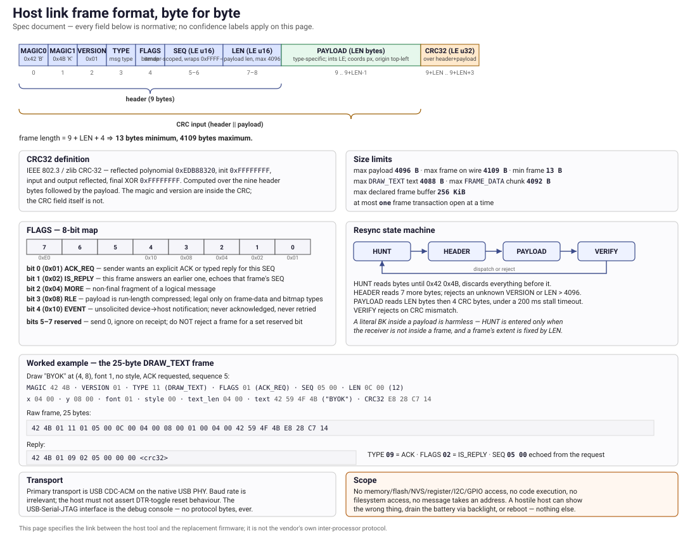
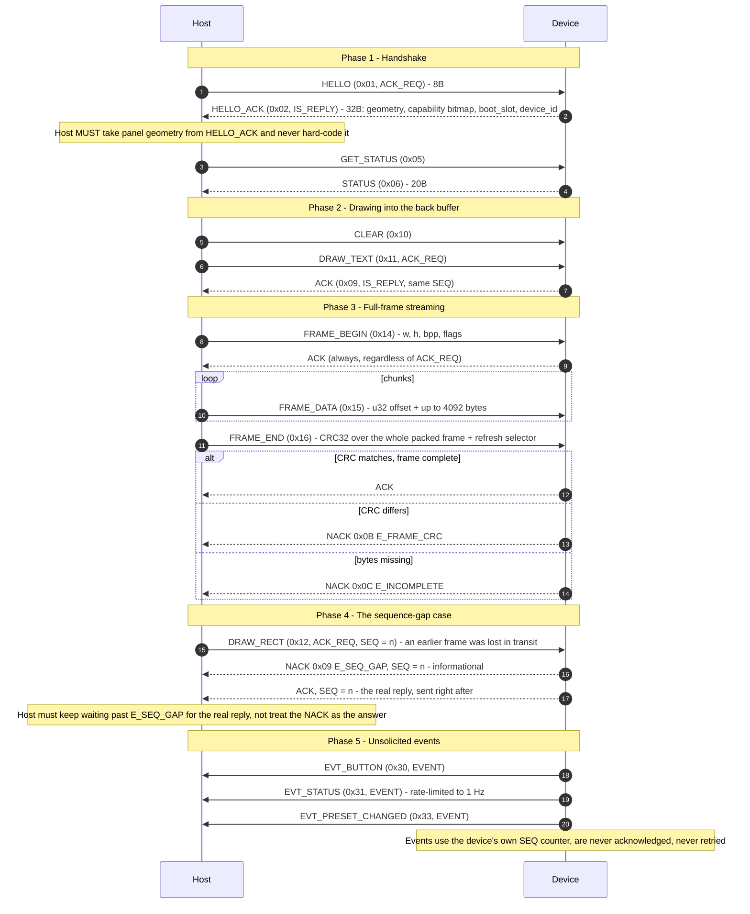

# BYOK Link Protocol — v1

**Status:** Implemented — the frame format, session handshake, drawing/framebuffer path and most
of §6's message set are live in both the firmware and the host library (see §13's version
history for exactly which messages shipped in which firmware release). A few v1.1 additions are
device-side only as of this writing (no host sender yet) — those are called out individually
below.

This is **our** protocol, spoken between a macOS host and our own ESP32-S3 firmware. It is not the
vendor's. The vendor's inter-MCU link (`>CMD|…<` / `>EVT|KEYP|…<` ASCII over UART) is a separate
thing entirely, documented in firmware.md's inter-MCU-link section, and is untouched by this
document. The design rationale behind three choices this protocol assumes throughout — S3-only
hardware, USB CDC-ACM as the first transport, and a host-renders architecture (the panel is
I²C-bound, so the Mac composes frames and the device just paints them) — lives in
architecture.md.

---

## 1. Scope, and what this protocol deliberately cannot do

**It can:** draw on the display, read status, set backlight and contrast, report button presses,
reboot, and switch the boot slot back to stock firmware.

**It cannot, by design and by omission — there is no message type for any of it:**

- **No memory read. No memory write.** No message takes an address.
- **No flash read, no flash write, no partition write, no NVS access.** The single exception is
  `BOOT_ORIGINAL`, which calls `esp_ota_set_boot_partition` on a partition the *firmware* selects;
  the host cannot name a partition, an offset, or a slot.
- **No raw register access**, no I²C passthrough, no GPIO poke, no arbitrary peripheral control.
- **No code execution**, no file upload, no filesystem access, no SD access.

A host that is compromised, confused, or hostile can make the screen show the wrong thing, drain
the battery with the backlight, or reboot the device. It cannot reach flash, cannot exfiltrate NVS
(which holds Wi-Fi credentials, the Bluetooth pairing and the device token), and cannot brick the
board. **Any future message type that would widen this boundary needs a written decision record
before it is implemented.** The firmware rejects unknown types with `NACK/E_UNKNOWN_TYPE`; it
never guesses.

---

## 2. Transport

| | |
|---|---|
| Primary | **USB CDC-ACM** (TinyUSB on the S3's native USB PHY). macOS node: `/dev/cu.usbmodem*` |
| Later | **TCP** over Wi-Fi, device listening on port **7373**, identical framing |
| Never | USB-Serial-JTAG — that is the debug console and log, and carries no protocol bytes |

The framing is transport-agnostic and self-synchronising: it assumes an ordered byte stream that
may be truncated at any point, may begin mid-frame (host attaches to a device already running), and
preserves no message boundaries of its own. Baud rate is irrelevant on CDC; the host should open
the port with any legal setting and **must not** assert DTR-toggle reset behaviour.

---

## 3. Frame format



*(Source and the accompanying facts table: [`diagrams/link-frame-format.md`](diagrams/link-frame-format.md).)*

```
+--------+--------+--------+--------+--------+--------+--------+--------+--------+
| MAGIC0 | MAGIC1 |VERSION |  TYPE  | FLAGS  |     SEQ (LE)    |     LEN (LE)    |
|  'B'   |  'K'   |  0x01  |        |        |   u16 le        |   u16 le        |
| 0x42   | 0x4B   |        |        |        |                 |                 |
+--------+--------+--------+--------+--------+--------+--------+--------+--------+
|                          PAYLOAD  (LEN bytes, 0 <= LEN <= 4096)                |
+--------------------------------------------------------------------------------+
|                          CRC32 (LE, u32) over HEADER || PAYLOAD                 |
+--------------------------------------------------------------------------------+
```

**One-line form:** `MAGIC('B','K') | VERSION(1) | TYPE(1) | FLAGS(1) | SEQ(2 LE) | LEN(2 LE) | PAYLOAD(LEN <= 4096) | CRC32(4 LE over header+payload, IEEE 802.3 reflected poly 0xEDB88320)`

| Field | Offset | Size | Notes |
|---|---|---|---|
| `MAGIC` | 0 | 2 | `0x42 0x4B` — ASCII `BK`. Constant. The resync anchor. |
| `VERSION` | 2 | 1 | `0x01` for this document. A receiver that sees any other value replies `NACK/E_BAD_VERSION` and discards the frame. |
| `TYPE` | 3 | 1 | Message type, §5. |
| `FLAGS` | 4 | 1 | Bitmap, §4. Reserved bits **must** be sent `0` and **must** be ignored on receipt. |
| `SEQ` | 5 | 2 | Little-endian `u16`. Wraps `0xFFFF → 0x0000`. Sender-scoped: host and device keep independent counters. |
| `LEN` | 7 | 2 | Little-endian `u16`, payload length. **Hard maximum 4096.** A frame declaring more is a protocol violation: reply `NACK/E_BAD_LENGTH` and resync. |
| `PAYLOAD` | 9 | `LEN` | Type-specific, §6. All multi-byte integers little-endian. All coordinates in pixels, origin top-left, x right, y down. |
| `CRC32` | 9+`LEN` | 4 | Little-endian `u32`. |

Header is **9 bytes**; a frame is `9 + LEN + 4` bytes, so **13 bytes minimum, 4109 bytes maximum**.

### 3.1 CRC32 — exact definition

IEEE 802.3 / zlib CRC-32: reflected polynomial `0xEDB88320`, initial value `0xFFFFFFFF`, input and
output reflected, final XOR `0xFFFFFFFF`. **Computed over the 9 header bytes followed by the
payload bytes** — the magic and version are inside the CRC, the CRC field itself is not. This is
byte-for-byte what Python's `zlib.crc32(header + payload) & 0xFFFFFFFF` returns, which is how the
test vectors in §12 were generated and how the host library must compute it.

On the device, use ESP-IDF's ROM function `esp_crc32_le(0xFFFFFFFF, buf, len) ^ 0xFFFFFFFF`
(`esp_rom_crc.h`) — verify it against §12 in a unit test rather than trusting the mapping.

---

## 4. FLAGS

| Bit | Mask | Name | Meaning |
|---|---|---|---|
| 0 | `0x01` | `ACK_REQ` | Sender wants an explicit `ACK` (or a typed reply) for this `SEQ`. |
| 1 | `0x02` | `IS_REPLY` | This frame answers an earlier frame; its `SEQ` **echoes the request's `SEQ`**, it does not come from the sender's own counter. |
| 2 | `0x04` | `MORE` | This frame is a non-final fragment of a logical message (used by `FRAME_DATA`). |
| 3 | `0x08` | `RLE` | Payload pixel data is RLE-compressed (§7.3). May be set only on `FRAME_DATA` and `DRAW_BITMAP`. |
| 4 | `0x10` | `EVENT` | Unsolicited device→host notification. Never acknowledged, never retried. |
| 5–7 | `0xE0` | reserved | Send `0`; ignore on receipt. Do **not** reject a frame for a set reserved bit — that is how v1 receivers stay compatible with a v1.x sender. |

---

## 5. Message types

For how these messages fit together across one whole connection — handshake, drawing, frame
streaming and its CRC-checked close, the sequence-gap edge case, and the unsolicited event
stream — see the sequence diagram in
[`diagrams/link-session-sequence.md`](diagrams/link-session-sequence.md). The byte-level
layout of an individual frame, with a worked example and the resync state machine, is in
[`diagrams/link-frame-format.md`](diagrams/link-frame-format.md).

Direction: **H→D** host to device, **D→H** device to host.

| Type | Name | Dir | Payload | Reply |
|---|---|---|---|---|
| `0x01` | `HELLO` | H→D | 8 B | `HELLO_ACK` |
| `0x02` | `HELLO_ACK` | D→H | 32 B | — |
| `0x03` | `GET_INFO` | H→D | 0 | `INFO` |
| `0x04` | `INFO` | D→H | 64 B | — |
| `0x05` | `GET_STATUS` | H→D | 0 | `STATUS` |
| `0x06` | `STATUS` | D→H | 20 B | — |
| `0x07` | `PING` | H→D or D→H | 0 or 4 | `PONG` |
| `0x08` | `PONG` | reply | 0 or 4 | — |
| `0x09` | `ACK` | either | 0 | — |
| `0x0A` | `NACK` | either | 4 | — |
| `0x10` | `CLEAR` | H→D | 1 | `ACK` if requested |
| `0x11` | `DRAW_TEXT` | H→D | 8 + n | `ACK` if requested |
| `0x12` | `DRAW_RECT` | H→D | 10 | `ACK` if requested |
| `0x13` | `DRAW_BITMAP` | H→D | 10 + n | `ACK` if requested |
| `0x14` | `FRAME_BEGIN` | H→D | 8 | `ACK` (always) |
| `0x15` | `FRAME_DATA` | H→D | 4 + n | `ACK` only if `ACK_REQ` |
| `0x16` | `FRAME_END` | H→D | 5 | `ACK` or `NACK` (always) |
| `0x17` | `PARTIAL_REFRESH` | H→D | 8 | `ACK` if requested |
| `0x18` | `FULL_REFRESH` | H→D | 1 | `ACK` if requested |
| `0x20` | `SET_MODE` | H→D | 2 | `ACK` (always) |
| `0x21` | `SET_BACKLIGHT` | H→D | 3 | `ACK` if requested |
| `0x22` | `SET_CONTRAST` | H→D | 1 | `ACK` if requested |
| `0x23` | `GET_BATTERY` | H→D | 0 | `BATTERY` |
| `0x24` | `BATTERY` | D→H | 8 | — |
| `0x25` | `REBOOT` | H→D | 2 | `ACK` then reset |
| `0x26` | `BOOT_ORIGINAL` | H→D | 4 | `ACK`/`NACK` then reset |
| `0x27` | `SET_TIME` | H→D | 8 | `ACK` if requested |
| `0x28` | `SET_NOTE` | H→D | 0–200 | `ACK` if requested |
| `0x29` | `SET_PRESETS` | H→D | 1 + n·20 | `ACK` if requested |
| `0x2A` | `GET_DOCSTATS` | H→D | 0 | `DOCSTATS` |
| `0x2B` | `DOCSTATS` | D→H | 20 | — |
| `0x2C` | `DISPLAY_CFG` | H→D | 1 | `ACK` if requested |
| `0x30` | `EVT_BUTTON` | D→H | 6 | — |
| `0x31` | `EVT_STATUS` | D→H | 20 | — |
| `0x32` | `EVT_LOG` | D→H | 2 + n | — |
| `0x33` | `EVT_PRESET_CHANGED` | D→H | 1 | — |

`0x00`, and every code not listed, are **reserved**. A receiver answers an unknown type with
`NACK/E_UNKNOWN_TYPE` and continues; it does not close the link.

---

## 6. Payload layouts

All integers little-endian. `u8`/`u16`/`u32`/`i16` as noted. Strings are UTF-8, **not**
NUL-terminated, length carried explicitly.

### 6.1 Session

**`HELLO` (H→D, 8 B)**

| Off | Type | Field |
|---|---|---|
| 0 | u8 | `proto_ver_min` — lowest version the host speaks (`0x01`) |
| 1 | u8 | `proto_ver_max` — highest (`0x01`) |
| 2 | u16 | `host_max_payload` — largest payload the host will accept (≤ 4096) |
| 4 | u32 | `host_caps` — host capability bitmap (§6.6) |

**`HELLO_ACK` (D→H, 32 B)** — the device's self-description. **The host must take geometry from
here and never hard-code it.**

| Off | Type | Field |
|---|---|---|
| 0 | u8 | `proto_ver` — version the device will speak (`0x01`) |
| 1 | u8 | `fw_major` |
| 2 | u8 | `fw_minor` |
| 3 | u8 | `fw_patch` |
| 4 | u16 | `display_w` — pixels |
| 6 | u16 | `display_h` — pixels |
| 8 | u8 | `display_bpp_native` — `1` or `2` |
| 9 | u8 | `display_bpp_max` — highest bpp accepted on the wire (device may down-convert) |
| 10 | u16 | `dev_max_payload` — ≤ 4096 |
| 12 | u32 | `caps` — device capability bitmap (§6.6) |
| 16 | u8 | `boot_slot` — `0` factory, `1` ota_0, `2` ota_1, `0xFF` unknown |
| 17 | u8 | `is_our_firmware` — `1` always, in ours; the field exists so a future stock-side shim could answer `0` |
| 18 | u16 | `fonts` — number of built-in fonts, valid `font_id` range `0 … fonts-1` |
| 20 | u32 | `uptime_ms` |
| 24 | u8[8] | `device_id` — 8 bytes derived from the eFuse MAC. **Read-only, and not the MAC itself:** the first 8 bytes of `SHA-256(MAC)`, so it is stable and unique without publishing the hardware address |

**`GET_INFO` (H→D, 0 B)** → **`INFO` (D→H, 64 B)**

| Off | Type | Field |
|---|---|---|
| 0 | char[16] | `fw_version` — UTF-8, NUL-padded |
| 16 | char[16] | `idf_version` — NUL-padded |
| 32 | char[16] | `build_date` — `YYYY-MM-DDThh:mm`, NUL-padded |
| 48 | u32 | `flash_size` bytes |
| 52 | u32 | `psram_size` bytes |
| 56 | u32 | `cpu_hz` |
| 60 | u32 | `caps` (same bitmap as `HELLO_ACK`) |

**`GET_STATUS` (H→D, 0 B)** → **`STATUS` (D→H, 20 B)**; the identical 20-byte layout is used by
`EVT_STATUS`.

| Off | Type | Field |
|---|---|---|
| 0 | u16 | `battery_mv` — millivolts |
| 2 | u8 | `battery_pct` — 0–100, `0xFF` unknown |
| 3 | u8 | `charging` — `0` no, `1` charging, `2` on external power / full, `0xFF` unknown |
| 4 | u8 | `mode` — §6.4 |
| 5 | u8 | `backlight` — 0–255 |
| 6 | u8 | `contrast` — 0–255 |
| 7 | u8 | `flags` — bit0 host-connected, bit1 SD present, bit2 USB attached, bit3 display sleeping, bits4-6 currently selected preset index (0–7, §6.4b), bit7 preset menu currently open |
| 8 | u32 | `uptime_ms` |
| 12 | u32 | `free_heap` bytes |
| 16 | u32 | `min_free_heap` bytes since boot |

**`PING` / `PONG`** — payload is either empty or a 4-byte opaque `u32` cookie the responder echoes
verbatim. Use the cookie for RTT measurement.

**`ACK` (0 B)** — `IS_REPLY` set, `SEQ` echoing the acknowledged frame.

**`NACK` (4 B)** — `IS_REPLY` set, `SEQ` echoing the offending frame (or `0xFFFF` if the frame was
too corrupt to have a usable `SEQ`).

| Off | Type | Field |
|---|---|---|
| 0 | u8 | `code` — §9 |
| 1 | u8 | `detail` — type-specific; `0` if none |
| 2 | u16 | `seq_echo` — the offending sequence number, repeated in the payload so it survives a header the receiver could not trust |

### 6.2 Drawing

Coordinates: origin top-left, `x` increases right, `y` increases down, all in pixels. Any command
whose rectangle falls wholly outside the panel is answered `NACK/E_OUT_OF_RANGE`; one that
overlaps is **clipped**, not rejected.

**`CLEAR` (1 B)** — `u8 value`: `0` = all pixels off (light), `1` = all pixels on (dark). Clears
the device's back buffer; does **not** refresh the panel unless `flags & ACK_REQ` is combined with
a following refresh — see §7.1.

**`DRAW_TEXT` (8 + n B)**

| Off | Type | Field |
|---|---|---|
| 0 | u16 | `x` |
| 2 | u16 | `y` — the text **baseline-top**, i.e. the top-left of the first glyph cell |
| 4 | u8 | `font_id` — `0 … fonts-1` from `HELLO_ACK` |
| 5 | u8 | `style` — bit0 inverted, bit1 wrap at panel edge, bit2 clip instead of wrap; others reserved |
| 6 | u16 | `text_len` — bytes of UTF-8 that follow (≤ 4088) |
| 8 | u8[n] | `text` — UTF-8. Glyphs outside the built-in font render as `U+FFFD` or a filled box; the device never fails a frame over an unmappable codepoint |

Only the starting `x`/`y` is range-checked against the panel (`NACK/E_OUT_OF_RANGE` otherwise); the
string's total width is not, since it depends on `style`. With neither bit1 (`wrap`) nor bit2
(`clip`) set, a run of text that would extend past the right edge simply has its off-panel columns
dropped per-pixel rather than NACKed — this is a defined behaviour, not a validation gap.

**`DRAW_RECT` (10 B)**

| Off | Type | Field |
|---|---|---|
| 0 | u16 | `x` |
| 2 | u16 | `y` |
| 4 | u16 | `w` |
| 6 | u16 | `h` |
| 8 | u8 | `op` — `0` outline, `1` filled, `2` invert region, `3` clear region |
| 9 | u8 | `value` — pixel value used by `op` 0/1: `0` light, `1` dark (2 bpp: `0`–`3`) |

**`DRAW_BITMAP` (10 + n B)** — a one-shot blit into the back buffer, for images small enough to fit
one frame. Anything larger uses the `FRAME_*` sequence.

| Off | Type | Field |
|---|---|---|
| 0 | u16 | `x` |
| 2 | u16 | `y` |
| 4 | u16 | `w` |
| 6 | u16 | `h` |
| 8 | u8 | `bpp` — `1` or `2` |
| 9 | u8 | `op` — `0` copy, `1` OR, `2` AND, `3` XOR |
| 10 | u8[n] | packed pixels, §7.2. `n` must equal `ceil(w * bpp / 8) * h` exactly, or `RLE` must be set |

### 6.3 Framebuffer streaming

**`FRAME_BEGIN` (8 B)** — opens a frame transaction. Only one may be open; a second while one is
open is `NACK/E_STATE`.

| Off | Type | Field |
|---|---|---|
| 0 | u16 | `w` |
| 2 | u16 | `h` |
| 4 | u8 | `bpp` — `1` or `2` |
| 5 | u8 | `flags` — bit0 partial frame (a sub-rectangle, coordinates in the following two fields), bit1 the device should clear the back buffer first |
| 6 | u16 | `origin_x` — meaningful only when bit0 is set; `origin_y` is carried in `FRAME_END`'s reserved field for v1 compatibility — **see note** |

> **v1 note.** In v1 a partial frame is expressed as `FRAME_BEGIN(w,h,bpp,flags|0x01, origin_x)`
> immediately preceded by `PARTIAL_REFRESH(x, y, w, h)`, whose `y` supplies the origin. This
> is awkward, and it exists because `FRAME_BEGIN` was fixed at 8 bytes. **v2 will widen
> `FRAME_BEGIN` to 12 bytes with explicit `origin_x`/`origin_y`.** Implementations must not
> invent a 10-byte variant. Full-frame streaming (`flags` bit0 clear) is unaffected.

**`FRAME_DATA` (4 + n B)** — carries the pixel stream in offset-addressed chunks. Chunks may arrive
in any order and may be retransmitted; a chunk that overlaps a previous one overwrites it.

| Off | Type | Field |
|---|---|---|
| 0 | u32 | `offset` — byte offset into the packed frame buffer |
| 4 | u8[n] | chunk bytes, `n = LEN - 4`, `n ≤ 4092`. `RLE` flag may be set (§7.3) |

**`FRAME_END` (5 B)** — closes and presents.

| Off | Type | Field |
|---|---|---|
| 0 | u32 | `frame_crc32` — CRC32 (same parameters as §3.1) over the **entire uncompressed packed frame**, exactly the bytes `FRAME_BEGIN` declared |
| 4 | u8 | `refresh` — `0` none (buffer only), `1` partial refresh of the changed region, `2` full refresh, `3` device chooses |

The device replies `ACK` if the reassembled frame's CRC matches and the frame was complete;
`NACK/E_FRAME_CRC` if the CRC differs; `NACK/E_INCOMPLETE` (with `detail` = number of missing
4 KiB-aligned regions, saturating at 255) if bytes are missing. **On any NACK the frame is
discarded and the panel is not updated** — a half-written screen is worse than a stale one.

**`PARTIAL_REFRESH` (8 B)** — `u16 x, y, w, h`. Push the named rectangle of the back buffer to the
panel. The device may enlarge the rectangle to the controller's addressing granularity (column
pages / row bands) and must do so silently.

**`FULL_REFRESH` (1 B)** — `u8 flags`: bit0 force a controller-level full re-initialisation
(the "unstick a confused panel" escape). Expect it to be slow; the host should not use it per
frame.

### 6.4 Device control

**`SET_MODE` (2 B)** — `u8 mode`, `u8 flags`.

| `mode` | Name | Meaning |
|---|---|---|
| `0` | `IDLE` | Device shows its own idle screen (whichever of CLOCK/NOTE/BLANK was last selected); host frames ignored |
| `1` | `HOST` | Host owns the display (Mode 1: dashboard / text) |
| `2` | `MIRROR` | Host owns the display and is streaming frames continuously (Mode 2) |
| `3` | `SLEEP` | Panel off, backlight off, link stays up |
| `4` | `IDLE_CLOCK` | Force the idle screen to `CLOCK` now, and select it for future `IDLE`/idle-timeout entries |
| `5` | `IDLE_NOTE` | Force the idle screen to the stored `SET_NOTE` text now, and select it likewise |
| `6` | `IDLE_BLANK` | Force the idle screen to blank (panel cleared, backlight off) now, and select it likewise |
| `7` | `MENU` | Open the preset menu now (§6.4b) — equivalent to holding EXECUTE ≥ 1 s. No-op if no preset is loaded. |

`flags` bit0: persist the mode across reboot (stored in our own NVS namespace — **not** the
vendor's; see §10). Still accepted and otherwise ignored for `mode` 0–3 (no NVS write happens for
the link-level mode itself). For `mode` 4/5/6, the **idle submode selection** this call makes is
*always* persisted when the persistence gate (`§10`) is on — independent of this flag bit, which
this firmware does not read for 4/5/6 at all; a persist-once-only control for the idle submode was
judged not worth a second code path given §10's write is already gated off by default.

**Device-side `IDLE` behaviour:** setting `mode = 0` (`IDLE`) switches the device into its own
**selected idle submode** — one of `CLOCK` (large `HH:MM` + date + battery, driven by an on-board
RTC read via `SET_TIME`'s own §6.4 entry above), `STATIC_NOTE` (the word-wrapped text most recently
set by `SET_NOTE`, §6.4a below), or `BLANK` (panel cleared, backlight off — only reachable via the
back buttons or `mode` 6). The selection is made by the owner, device-side only, via the **UP/DOWN
back buttons** while no host is connected (`UP`/`DOWN` cycle `CLOCK → STATIC_NOTE → BLANK →
CLOCK`/reverse) or via an explicit `mode` 4/5/6 as above; earlier firmware treated `IDLE` as `CLOCK`
unconditionally, which remains the default selection on a device that has never had its idle
submode changed. `HOST` (`1`) and `MIRROR` (`2`) both switch back to the host-owned display path
this protocol otherwise assumes throughout §6.2/§6.3. The device *also* enters its selected idle
submode on its own after a configurable idle timeout (default 30 s) of receiving no frame at all
from a connected host — including "no host has connected since boot" — and switches straight back
to `HOST` the instant any frame arrives (from any of `CLOCK`/`STATIC_NOTE`/`BLANK`), without the
host having to send `SET_MODE` itself first. `SLEEP` (`3`) remains pure bookkeeping — the
panel/backlight are not actually gated by it (unrelated to `BLANK`, which is a selectable idle
*submode*, not this link-level `SLEEP` value).

**Idle-submode back-button control:** while no host is connected (i.e. the device is already
showing one of its own idle screens), four physical buttons act on the idle submode/backlight,
independent of any host command — `UP`/`DOWN` (GPIO15/GPIO7) cycle the idle submode `CLOCK →
STATIC_NOTE → BLANK → CLOCK` (`UP`) or the reverse (`DOWN`); `EXECUTE` (GPIO16, runtime, separate
from its own boot-time `BOOT_ORIGINAL`-hold check) and `BRIGHTNESS` (GPIO11) both cycle the
backlight forward through the vendor's own five stock levels (`0/4/20/50/100%`, the same table the
vendor's `BRIGHTNESS` handler cycles — this is our own re-implementation against our own persisted
index, never the vendor's own backlight NVS key). All four buttons are inert while a host owns the
display (`HOST`/`MIRROR`) — reserved for `EVT_BUTTON` (§6.5). The selected idle submode and
backlight index are persisted the same way `SET_MODE` 4/5/6 above are (§10, gated).

### 6.4a `SET_NOTE`

**`SET_NOTE` (H→D, 0–200 B)** — replaces the device's stored STATIC NOTE text: the raw
UTF-8/ASCII bytes of the note, no fixed-field header (unlike `DRAW_TEXT`, there is no `x`/`y`/
`font_id` — the device owns the whole layout). A payload over 200 bytes is `NACK/E_BAD_LENGTH`
(`detail` = 200); the device does not truncate.

Takes effect immediately: the in-RAM copy is replaced, and if `STATIC_NOTE` is the current idle
submode the panel re-renders live (no need to leave and re-enter the mode). Persisted under our own
NVS namespace when armed (§10). The device word-wraps the text itself using **its own actual
panel/font geometry** — display width / glyph width = 240/8 = **30 columns**, display height /
glyph height = 80/8 = **10 rows** — greedy word-wrap (breaking at the last space inside a line's
column budget; a single token longer than 30 columns hard-breaks at the column edge rather than
refusing to render it) plus one extra convenience beyond a strict word-wrap: a literal `\n`
(`0x0A`) byte in the note forces a line break at that point. Text beyond 10 rows is silently
dropped (logged device-side), matching `DRAW_TEXT`'s own "never fails a frame" posture. Font
coverage is the same placeholder table every other text path in this firmware uses (space,
`A`–`Z`, `0`–`9`, and a handful of punctuation — **no lowercase**); anything else renders as the
font's existing filled-box fallback glyph, exactly `DRAW_TEXT`'s documented behaviour (§6.2) —
`SET_NOTE` does not uppercase or otherwise rewrite the text it's given.

**`SET_BACKLIGHT` (3 B)** — `u8 level` (0–255, `0` = off), `u16 fade_ms` (0 = immediate,
max 5000).

**`SET_CONTRAST` (1 B)** — `u8 value` (0–255). Range is clamped to the panel driver's safe window;
the device does not expose raw controller values.

**`SET_TIME` (8 B)** — sets the device's real-time clock (a PCF8563 on the display I²C bus), which
powers `CLOCK` mode's on-glass time. **Device-side only as of this writing** — no host in this tree
sends it yet; documented here so a future host implementation has a stable wire format to target
without a further device-side change. Not required for `CLOCK` mode to work today: the RTC already
keeps correct time across power-off on its own and the stock firmware sets it from the network, so
the device only needs to *read* it — this command exists for a future host-driven re-sync /
initial-set path.

| Off | Type | Field |
|---|---|---|
| 0 | u16 | `year` — full year (e.g. `2026`), not 2-digit; device accepts `2000`–`2199` |
| 2 | u8 | `month` — `1`–`12` |
| 3 | u8 | `day` — `1`–`31` (not cross-checked against `month`/leap-year on the device) |
| 4 | u8 | `weekday` — `0`–`6`, opaque: the device round-trips this value without assigning it a Sunday-is-`0` or Monday-is-`0` meaning of its own |
| 5 | u8 | `hour` — `0`–`23` |
| 6 | u8 | `minute` — `0`–`59` |
| 7 | u8 | `second` — `0`–`59` |

Each field is range-checked independently; `NACK/E_BAD_PARAM.detail` is that field's byte offset
above (`0` for `year`, since it has no natural single-byte offset of its own to report a sub-field
of). `NACK/E_UNSUPPORTED` if the device has no working RTC (capability bit 12, §6.6, is `0` in that
case — a host should check it before ever sending this).

**`GET_BATTERY` (0 B)** → **`BATTERY` (D→H, 8 B)**

| Off | Type | Field |
|---|---|---|
| 0 | u16 | `mv` |
| 2 | u8 | `pct` (`0xFF` unknown) |
| 3 | u8 | `charging` (same encoding as `STATUS`) |
| 4 | i16 | `current_ma` — signed, positive = charging, `0x8000` unknown |
| 6 | u16 | `reserved` — 0 |

**`REBOOT` (2 B)** — `u16 magic` = `0x5245` (`'RE'`). Any other value is `NACK/E_BAD_PARAM`.
Replies `ACK`, flushes the CDC endpoint, waits 100 ms, then `esp_restart()`. Reboots into whatever
`otadata` currently selects — i.e. back into **our** firmware.

**`BOOT_ORIGINAL` (4 B)** — `u32 magic` = `0x424B5354` (ASCII `BKST`). Any other value is
`NACK/E_BAD_PARAM`.

The device: finds the single app partition holding the **stock** image — a partition that is (a)
`factory` or `ota_0` (never `ota_1`, this project's own slot) **and** (b) has a valid
`esp_app_desc_t` whose project name is the vendor's known name (an allowlist match, not merely
"not ours" — our own project name is different, so it can never self-select) — calls
`esp_ota_set_boot_partition()`, replies `ACK` (or `NACK/E_NOT_FOUND` if no such partition
exists, `NACK/E_NOT_PERMITTED` if more than one does), then reboots. **The host names nothing** — no
slot, no offset, no partition label. The same action is available without a host by holding
**EXECUTE (GPIO16) for 3 s at boot**.

### 6.4b Preset menu / doc stats / display config

**`SET_PRESETS` (H→D, 1 + n·20 B)** — replaces the device's stored preset-menu name list.

| Off | Type | Field |
|---|---|---|
| 0 | u8 | `count` — number of presets that follow, `0`–`8` (`NACK/E_BAD_PARAM` if higher) |
| 1 | char[20]×`count` | `names` — one 20-byte NUL-padded name per preset, in menu order |

`LEN` must equal exactly `1 + count*20` — a short or long trailing name is `NACK/E_BAD_LENGTH`
(unlike `SET_NOTE`'s free-form text, a misaligned name here would silently corrupt every name after
it). Cached in the persistence namespace (§10) when armed — the menu therefore works **before any
host connects**, using whatever list a previous session persisted. Takes effect immediately: the
in-RAM list is replaced, and if the menu is currently open it re-renders live.

**Menu behaviour.** A menu screen (each preset name on its own row, the current highlight row drawn
inverted) is shown:

  - **at boot**, for 5 s, immediately after the boot self-test — **skipped entirely if no preset is
    stored**;
  - whenever **EXECUTE (GPIO16) is held ≥ 1 s** while the device is host-active (`HOST`/`MIRROR`) or
    already showing one of its own idle screens — a hold shorter than 1 s is a normal short press
    instead (§6.5's `EVT_BUTTON`, or the pre-existing idle-submode/backlight action, depending on
    which applies);
  - via **`SET_MODE`** value `7` (`MENU`, §6.4).

While open: **UP/DOWN** move the highlight (wrapping); **EXECUTE** confirms the highlighted row as
the new selection, closes the menu, persists the index and emits `EVT_PRESET_CHANGED` (§6.5); a
**10 s** timeout with no confirmation closes the menu and **keeps the current selection** (no
persistence write, no event). Whichever mode was active before the menu opened (host-owned display,
or a specific idle submode) resumes on close. While the menu is open, drawing/refresh commands
(`CLEAR`/`DRAW_*`/`FRAME_*`/`PARTIAL_REFRESH`/`FULL_REFRESH`) are still validated and `ACK`/`NACK`ed
exactly as documented elsewhere in §6.2/§6.3, but the device does not apply them to the panel — the
same "device shows its own screen; host frames ignored" posture `SET_MODE`'s `IDLE` value already
has (§6.4) — so a host that keeps drawing cannot visually clobber the menu.

**`GET_DOCSTATS` (H→D, 0 B)** → **`DOCSTATS` (D→H, 20 B)**

| Off | Type | Field |
|---|---|---|
| 0 | u32 | `files` — matched `*.txt` files under `/SDCARD/Projects` (recursive), capped at 200 |
| 4 | u32 | `words` — total whitespace-separated words, counted over at most the first 64 KiB of each file |
| 8 | u32 | `bytes` — total real size (not capped by the 64 KiB read limit) of the matched files |
| 12 | u32 | `newest_epoch` — newest file mtime across the matched files, unix epoch (UTC), `0` if none |
| 16 | u32 | `words_today` — `words` restricted to files whose mtime falls on the same calendar date as the
  device's current RTC date; `0` if the RTC is not ready/set (§6.4's `SET_TIME`, capability bit 12) |

Answered from a background scan's most recent snapshot — this request never itself touches the SD
card or blocks on I/O. The device scans once at boot and at most once per 10 minutes thereafter,
only while idle (no host actively drawing) — never mid-frame. Read-only: the device never writes,
creates, renames or deletes anything on the card while scanning.

**`DISPLAY_CFG` (H→D, 1 B)** — `u8 flags`: bit0 = use bulk I2C writes for panel data (one
transaction per full-width page/window) when set, per-byte transactions (vendor-parity fallback)
when clear; bits 1–7 reserved (send `0`). Takes effect on the panel's next refresh. Lets a host A/B
the bulk path's measured refresh time against the per-byte path on real hardware; the device logs
the measured duration either way (device-side log only — neither `GET_INFO` nor `STATUS` has a
reserved field to carry it).

### 6.5 Device→host events

Events set `FLAGS.EVENT`, use the device's own `SEQ` counter, are never acknowledged and are never
retried. A host that misses one misses it.

**`EVT_BUTTON` (6 B)** — fires for `UP`/`DOWN`/`BRIGHTNESS`/`EXECUTE` **only** while the device is
host-active (`SET_MODE` `HOST`/`MIRROR`) **and** the preset menu (§6.4b) is closed — while the menu
is open, all four buttons drive the menu instead (§6.4b) and no `EVT_BUTTON` is sent; while the
device is showing an idle screen (`CLOCK`/`STATIC_NOTE`/`BLANK`) and the menu is closed, the buttons
keep their local meaning (idle-submode/backlight cycling, §6.4) instead of emitting an event.
`EXECUTE` additionally distinguishes a short press (`state` `1`) from a long one (`state` `3`,
≥ 1 s, held) — a long `EXECUTE` press opens the preset menu instead of being reported as an event.
`state` `2` (auto-repeat) is not currently emitted.

| Off | Type | Field |
|---|---|---|
| 0 | u8 | `button` — `1` up (GPIO15), `2` down (GPIO7), `3` execute (GPIO16), `4` brightness (GPIO11), `5` wake (GPIO6, not currently emitted here — owned by the power-management path) |
| 1 | u8 | `state` — `0` released, `1` pressed, `2` auto-repeat, `3` long-press (≥ 1 s) |
| 2 | u32 | `t_ms` — device uptime at the edge |

**`EVT_STATUS` (20 B)** — identical layout to `STATUS` (§6.1). Emitted on battery band changes,
charger attach/detach, SD insert/remove and mode changes; rate-limited to **at most 1 Hz**.

**`EVT_LOG` (2 + n B)** — `u8 level` (`0` error, `1` warn, `2` info), `u8 len`, `u8[n]` UTF-8. For
host-visible diagnostics only; the authoritative log stays on USB-Serial-JTAG. Rate-limited to
**10 per second**, dropped silently beyond that.

**`EVT_PRESET_CHANGED` (1 B)** — `u8 index`, the newly-confirmed preset index (§6.4b). Fired once
per completed menu selection (an explicit `EXECUTE` confirm, including a re-confirm of the
already-selected row) — **never** on a 10 s timeout, which keeps the current selection without
firing this event.

### 6.6 Capability bitmap

| Bit | Mask | Meaning |
|---|---|---|
| 0 | `0x00000001` | 1 bpp accepted |
| 1 | `0x00000002` | 2 bpp accepted natively (not down-converted) |
| 2 | `0x00000004` | RLE payloads accepted |
| 3 | `0x00000008` | partial refresh supported |
| 4 | `0x00000010` | backlight controllable |
| 5 | `0x00000020` | contrast controllable |
| 6 | `0x00000040` | battery readable |
| 7 | `0x00000080` | button events emitted |
| 8 | `0x00000100` | `BOOT_ORIGINAL` available (a stock image was found in another slot) |
| 9 | `0x00000200` | built-in fonts present |
| 10 | `0x00000400` | Wi-Fi transport available |
| 11 | `0x00000800` | secondary-MCU link active (the vendor's own inter-MCU Bluetooth-keyboard link passthrough alive) |
| 12 | `0x00001000` | RTC present + `CLOCK` mode implemented — a host should check this before offering a `SET_TIME`/clock-related UI control |
| 13–31 | | reserved, must be 0 |

A host **must** check bit 1 before sending 2 bpp and bit 8 before offering "return to original" in
its UI.

---

## 7. Semantics

### 7.1 Buffering and refresh

Drawing commands mutate a **back buffer**; nothing appears on the panel until a refresh happens.
Refresh is triggered by `PARTIAL_REFRESH`, `FULL_REFRESH`, or `FRAME_END` with `refresh != 0`. This
separation exists because the panel is I²C-bound: the host must be able to compose several draws
and pay for one bus transfer.

### 7.2 Pixel packing

- **1 bpp:** 8 pixels per byte, **MSB = leftmost**. Each row padded to a whole byte. Rows in order,
  top to bottom. `1` = pixel on (dark on FSTN).
- **2 bpp:** 4 pixels per byte, **most-significant pair = leftmost**. Values `0` (darkest) to `3`
  (lightest). Row padding and order as above.
- Stride is always `ceil(w * bpp / 8)`. There is no alignment requirement beyond the byte.

### 7.3 RLE (optional, `FLAGS.RLE`)

A byte-oriented scheme, deliberately trivial:

- `0x00 … 0x7F` — a **literal run**: `n+1` (1–128) literal bytes follow.
- `0x80 … 0xFF` — a **repeat run**: the next single byte repeats `n-0x80+2` (2–129) times.

A device that does not set capability bit 2 must `NACK/E_UNSUPPORTED` any frame with `RLE` set. The
host must be able to send uncompressed; RLE is an optimisation, never a requirement. Decoded length
must match what the header implies, or `NACK/E_BAD_LENGTH`.

### 7.4 Acknowledgement

- A frame with `ACK_REQ` gets exactly one reply: `ACK`, `NACK`, or the typed response for that
  request (`HELLO`→`HELLO_ACK`, `GET_STATUS`→`STATUS`, …). A typed response **counts as** the ACK.
- Replies carry `IS_REPLY` and echo the request's `SEQ`.
- `FRAME_BEGIN`, `FRAME_END`, `SET_MODE`, `REBOOT` and `BOOT_ORIGINAL` are **always** acknowledged
  regardless of `ACK_REQ` — they are state transitions and the host must know they took.
- `FRAME_DATA` is normally unacknowledged (that is the point of the streaming path); the host may
  set `ACK_REQ` on the last chunk of a burst to pace itself.
- Events are never acknowledged.

### 7.5 Sequence numbers

- Host and device each own an independent `u16` counter, incremented per originated frame, wrapping
  through zero. Replies do not consume a counter value.
- **Duplicates are ignored.** A receiver keeps the last 8 sequence numbers it has processed from
  each peer; a frame whose `SEQ` is in that window and whose type is idempotent
  (`PING`, `GET_*`, `SET_*`, `CLEAR`, drawing) is **silently dropped without re-executing it**, and
  the previous reply is re-sent if `ACK_REQ` was set. A duplicate `FRAME_DATA` is *not* dropped —
  chunk retransmission is legitimate and offset-addressed.
- **Gaps are reported, not repaired.** If an incoming `SEQ` is more than 1 past the last seen, the
  receiver sends `NACK/E_SEQ_GAP` with `detail` = the number of missing frames (saturating at 255)
  and then **processes the frame normally**. There is no retransmission machinery in v1; the gap
  report exists so the host can log it, count it, and decide whether to re-send a whole frame. A
  gap is not an error condition for the link.

  > **Host behaviour note.** `E_SEQ_GAP` is a reply carrying the request's own `SEQ` — the same
  > shape as the real `ACK`/typed reply that follows it — so a host implementation that treats
  > "first reply matching this `SEQ`" as the answer will hand the caller the informational NACK
  > instead of the real reply, and any caller that then raises on a NACK (reasonably, for every
  > *other* NACK code) raises on a condition the protocol itself defines as harmless. **The host
  > must not treat `E_SEQ_GAP` as this request's reply**: on seeing it, log/count it as this
  > section already says, then **keep waiting**, within the same request's timeout budget (§7.6),
  > for the real `ACK`/typed reply the device sends right after — exactly as "processes the frame
  > normally" above already promises it will. The host library's own transport layer implements
  > this (recognizes `E_SEQ_GAP` specifically, continues its wait loop instead of returning); this
  > is a normative statement of what any host implementation needs to do, not a detail specific to
  > one implementation. troubleshooting.md has the full writeup of a real double-connection bug
  > this exact gap in earlier host code caused, and the fix.
- A host that reconnects starts again from any `SEQ`; a device that sees a wild jump treats it as a
  new session, clears its duplicate window, and does not complain.

### 7.6 Timeouts

| Party | Situation | Timeout | Action |
|---|---|---|---|
| Host | awaiting a reply to `ACK_REQ` | **250 ms** | retry the frame once with the same `SEQ`; after 2 retries, declare the link dead and re-`HELLO` |
| Host | awaiting `HELLO_ACK` | **1000 ms** | retry 3×, then report "device not responding" |
| Host | link idle | **5 s** | send `PING`; no `PONG` in 250 ms → treat as above |
| Device | frame transaction open with no `FRAME_DATA` or `FRAME_END` | **3000 ms** | abort the transaction, free the buffer, emit `EVT_LOG` (warn); a later `FRAME_END` gets `NACK/E_STATE` |
| Device | no host traffic at all | **30 s** | leave `HOST`/`MIRROR` mode, return to `IDLE`, show the device's own screen |
| Device | mid-frame byte-level stall (header read, payload incomplete) | **200 ms** | discard the partial frame, resync (§7.7). **No NACK** — the sender may simply have been unplugged |

### 7.7 Resync

The receiver is a state machine that never trusts the stream:

1. **HUNT** — read bytes until `0x42 0x4B` is seen. Discard everything before it.
2. **HEADER** — read 7 more bytes. If `VERSION` is unknown → `NACK/E_BAD_VERSION`, back to HUNT
   starting *after* the magic just consumed. If `LEN > 4096` → `NACK/E_BAD_LENGTH`, back to HUNT.
3. **PAYLOAD** — read `LEN` bytes, then 4 CRC bytes, subject to the 200 ms stall timeout.
4. **VERIFY** — CRC mismatch → `NACK/E_BAD_CRC` (with `seq_echo` from the header, best-effort), back
   to HUNT. Match → dispatch.
5. After any dispatch or rejection, return to HUNT.

**`BK` inside a payload is not a problem**: HUNT is entered only when the receiver is not inside a
frame, and a frame's extent is fixed by `LEN`. A false magic can only be latched onto after a
corruption, and the CRC then rejects it. Both sides must count `resync_events`; a rising count is
the first symptom of a transport bug and belongs in `EVT_LOG`.

### 7.8 Session walkthrough (diagram)

The sequence below traces one link session end to end in the order the sections above lay it out —
handshake, drawing into the back buffer, full-frame streaming with its CRC-checked close, the
sequence-gap case from §7.5, and the unsolicited event stream:



---

## 8. Size limits

| Limit | Value | Why |
|---|---|---|
| Max payload | **4096 B** | fits comfortably in S3 RAM alongside TinyUSB; keeps a single frame under a typical 4 KiB allocation |
| Max frame on the wire | **4109 B** | 9 + 4096 + 4 |
| Min frame | **13 B** | 9 + 0 + 4 |
| Max `DRAW_TEXT` text | **4088 B** of UTF-8 | 4096 − 8 |
| Max `FRAME_DATA` chunk | **4092 B** | 4096 − 4 |
| Max declared frame size | **256 KiB** | `FRAME_BEGIN` `w*h*bpp/8` beyond this → `NACK/E_OUT_OF_RANGE`; far above any plausible panel and a hard stop against a hostile allocation |
| Max concurrent frame transactions | **1** | |
| Event rate | `EVT_STATUS` ≤ 1 Hz, `EVT_LOG` ≤ 10 Hz, `EVT_BUTTON` unlimited (hardware-bounded) | |

---

## 9. Error codes (`NACK.code`)

| Code | Name | Meaning |
|---|---|---|
| `0x01` | `E_BAD_CRC` | CRC32 mismatch |
| `0x02` | `E_BAD_VERSION` | unsupported `VERSION`; `detail` = highest version supported |
| `0x03` | `E_UNKNOWN_TYPE` | unrecognised `TYPE`; `detail` = the type |
| `0x04` | `E_BAD_LENGTH` | `LEN` out of range, or wrong for this type; `detail` = expected length if fixed |
| `0x05` | `E_BAD_PARAM` | a field is out of its legal range; `detail` = byte offset of the field |
| `0x06` | `E_OUT_OF_RANGE` | geometry entirely off-panel, or frame larger than the cap |
| `0x07` | `E_BUSY` | a frame transaction is open, or the display is mid-refresh |
| `0x08` | `E_NO_MEM` | allocation failed; `detail` = KiB requested, saturating |
| `0x09` | `E_SEQ_GAP` | informational; `detail` = frames missed. **Not this request's reply** — see §7.5's host-behavior note: the host must keep waiting for the real `ACK`/typed reply that follows it, not return this NACK to the caller. |
| `0x0A` | `E_STATE` | command illegal in the current state (e.g. `FRAME_DATA` with no open frame) |
| `0x0B` | `E_FRAME_CRC` | `FRAME_END` CRC did not match the reassembled frame |
| `0x0C` | `E_INCOMPLETE` | frame had holes; `detail` = missing regions, saturating at 255 |
| `0x0D` | `E_UNSUPPORTED` | capability not present (2 bpp, RLE, …); `detail` = the capability bit |
| `0x0E` | `E_NOT_FOUND` | `BOOT_ORIGINAL` found no stock image |
| `0x0F` | `E_NOT_PERMITTED` | refused on safety grounds (ambiguous slot, mode forbids it) |
| `0x10` | `E_TIMEOUT` | the peer's own transaction timed out |
| `0x11` | `E_INTERNAL` | a device-side failure with no better code; always accompanied by `EVT_LOG` |

---

## 10. Persistence

Anything our firmware stores (idle-submode selection, backlight level, `SET_NOTE` text) goes in
**our own NVS namespace**, a name distinct from any of the vendor's own namespaces (which together
hold the Wi-Fi credentials, the Bluetooth pairing, the device token and the radio calibration, and
are, from our firmware, **read-never, write-never**). Our namespace is a distinct namespace inside
the *same physical* `nvs` partition (0x9000, 16 KiB) as the vendor's, since that is the only
NVS-type partition this device's flash has — the partition table forbids adding a
partition-table entry for a dedicated store, so namespace isolation (a boundary NVS itself
enforces: opening our own namespace cannot see or touch keys under any other namespace) is the
only mechanism available, not a design preference. Losing the `nvs` partition means a factory
reset, a re-pair and a re-provision for the *vendor's* data — recovery.md covers why that
partition is irreplaceable and how it's protected.

**Gated, component-default off — build-armed as of the current release.** Writing to our namespace
requires a Kconfig option (component default **n**, unchanged) — with it off, every persisting
feature below instead lives in RAM only for that boot, fully usable, just not remembered across a
reboot; no NVS API is called at all in that state. This project's own write-safety rule — a
verified backup and a tested recovery path, both required before any device write to flash-backed
storage (see architecture.md) — has, so far, only been satisfied for the OTA app-partition write
path (recovery.md's SD-updater rehearsal); nobody has rehearsed writing to, or restoring, this
device's `nvs` partition, our namespace or otherwise. **The current release overrides this gate to
`y` in the shipped build configuration** — a build from this tree is therefore armed by default;
CHANGELOG.md's entry for that release is explicit that the *owner* must confirm they accept the
still-unrehearsed NVS-recovery gap before installing it — this document merely records that the
build itself is armed. The NVS-writing component never erases the whole NVS flash region under any
condition, armed or not.

Keys under our namespace (all well within NVS's 15-byte key-name limit): the `SET_NOTE` text
(string, ≤ 200 bytes), the idle-submode selection (`u8`, `CLOCK`/`STATIC_NOTE`/`BLANK`), the
backlight index (`u8`, an index 0–4 into the five stock backlight percentages, §6.4's own
back-button paragraph), the preset name list (blob, fixed 161 bytes — 1 count byte + 8×20 name
bytes, unused slots zero-filled — the `SET_PRESETS` list, §6.4b), and the persisted selected preset
index (`u8`, §6.4b).

---

## 11. Worked example — one `DRAW_TEXT` frame, byte for byte

Draw `BYOK` at (4, 8) in font 0x01, no style bits, requesting an ACK, sequence 5.

```
Field      Bytes                    Meaning
---------  -----------------------  ----------------------------------------
MAGIC      42 4B                    'B','K'
VERSION    01                       v1
TYPE       11                       DRAW_TEXT
FLAGS      01                       ACK_REQ
SEQ        05 00                    5  (u16 LE)
LEN        0C 00                    12 (u16 LE) = 8 header-ish + 4 text bytes
  x        04 00                    4
  y        08 00                    8
  font_id  01                       font 1
  style    00                       none
  text_len 04 00                    4
  text     42 59 4F 4B              "BYOK"
CRC32      E8 28 C7 14              0x14C728E8 (u32 LE)
```

Complete frame, 25 bytes:

```
42 4B 01 11 01 05 00 0C 00 04 00 08 00 01 00 04 00 42 59 4F 4B E8 28 C7 14
```

The CRC input is the 9 header bytes `42 4B 01 11 01 05 00 0C 00` followed by the 12 payload bytes —
21 bytes in total. `zlib.crc32(bytes.fromhex('424B01110105000C000400080001000400')+b'BYOK')`
returns `0x14C728E8`.

The device replies:

```
42 4B 01 09 02 05 00 00 00 <crc32>
             ^  ^  ^
             |  |  +-- SEQ 5, echoed from the request
             |  +----- FLAGS = IS_REPLY (0x02)
             +-------- TYPE = ACK (0x09)
```

---

## 12. Test vectors

Generated with CPython 3 `zlib.crc32` over `header || payload`. **These are normative**: the
acceptance criterion for any implementation is that both the host library and the firmware
reproduce every CRC below.

| # | Message | TYPE | FLAGS | SEQ | LEN | Payload (hex) | **CRC32** | Full frame (hex) |
|---|---|---|---|---|---|---|---|---|
| 1 | `PING` | `0x07` | `0x00` | 1 | 0 | *(none)* | **`0x6154BDFD`** | `42 4B 01 07 00 01 00 00 00 FD BD 54 61` |
| 2 | `HELLO` | `0x01` | `0x01` | 2 | 8 | `01 01 00 10 0F 00 00 00` | **`0x60E06847`** | `42 4B 01 01 01 02 00 08 00 01 01 00 10 0F 00 00 00 47 68 E0 60` |
| 3 | `CLEAR` | `0x10` | `0x00` | 3 | 1 | `00` | **`0xC814AE86`** | `42 4B 01 10 00 03 00 01 00 00 86 AE 14 C8` |
| 4 | `SET_BACKLIGHT` | `0x21` | `0x01` | 4 | 3 | `80 F4 01` | **`0xB10BDD87`** | `42 4B 01 21 01 04 00 03 00 80 F4 01 87 DD 0B B1` |
| 5 | `DRAW_TEXT` | `0x11` | `0x01` | 5 | 12 | `04 00 08 00 01 00 04 00 42 59 4F 4B` | **`0x14C728E8`** | `42 4B 01 11 01 05 00 0C 00 04 00 08 00 01 00 04 00 42 59 4F 4B E8 28 C7 14` |

Decoded payloads: **#2** `proto_ver_min=1, proto_ver_max=1, host_max_payload=4096, host_caps=0x0000000F`;
**#3** clear to light; **#4** backlight level 128, fade 500 ms; **#5** the §11 example.

Reference generator (host-only, no device contact):

```python
import zlib, struct
MAGIC, VER = b'BK', 1
def build(msg_type, flags, seq, payload=b''):
    hdr = MAGIC + bytes([VER, msg_type, flags]) + struct.pack('<HH', seq, len(payload))
    body = hdr + payload
    return body + struct.pack('<I', zlib.crc32(body) & 0xFFFFFFFF)
```

A sixth check, useful for the frame path: `zlib.crc32(b'\xAA' * 16)` = **`0xC79B40E0`** — the CRC of
one 16-byte checkerboard row, a self-test pattern used during early bring-up.

---

## 13. Version history

| Version | Change |
|---|---|
| 1 | Initial specification. |
| 1.1 | Additive, non-breaking (per the compatibility rule below — no `VERSION` bump). New `SET_TIME` (`0x27`, §6.4) and capability bit 12 (§6.6). New device-side behaviour for `SET_MODE`'s existing `mode = 0` (`IDLE`) value (§6.4) and an idle-timeout auto-`CLOCK` transition — both firmware-only changes to what the device *does*, not to the wire format itself; `SET_TIME`'s payload is documented but has **no host sender yet**. |
| 1.1 | Still additive/non-breaking (same rule, still no `VERSION` bump). New `SET_NOTE` (`0x28`, §6.4a) and three new `SET_MODE` values, `4`/`5`/`6` (`IDLE_CLOCK`/`IDLE_NOTE`/`IDLE_BLANK`, §6.4) — a new legal value for an existing field is additive the same way a new type or capability bit is (a v1.0-only host simply never sends them). New device-internal idle mode (not itself a wire value) and new device-side back-button behaviour (`UP`/`DOWN`/`EXECUTE`/`BRIGHTNESS`, §6.4). §10 (Persistence) names the namespace this firmware actually writes to, gated off by default. `SET_NOTE` has **no host sender yet**, same "documented, device-side only" posture as `SET_TIME` above. |
| 1.2 | Additive/non-breaking (same rule, still no `VERSION` bump). New `SET_PRESETS`/`GET_DOCSTATS`/`DOCSTATS`/`DISPLAY_CFG` (`0x29`-`0x2C`, §6.4b), a new `SET_MODE` value `7` (`MENU`, §6.4), a new event `EVT_PRESET_CHANGED` (`0x33`, §6.5), and **`EVT_BUTTON` (`0x30`) actually emitted for the first time** — specified since v1.0/v1.1 but not sent by earlier firmware (see §6.5's own note on exactly when it fires and when it doesn't). `STATUS`/`EVT_STATUS`'s `flags` byte (§6.1) gains meaning for its previously-reserved bits 4–7 (selected preset index, menu-open flag) — reserved-bit semantics were already receiver-must-ignore per §4, so this is additive the same way a new capability bit is. §10 (Persistence) gains two new keys (the preset list, the selected preset index) and notes that the persistence gate is build-armed as of this release. |

**Compatibility rule.** `VERSION` increments only on a **breaking** frame-layout change. New
message types, new capability bits and new flag bits are additive within v1: a v1 receiver must
`NACK/E_UNKNOWN_TYPE` a type it does not know and **ignore** reserved flag bits, rather than
dropping the link. Any change to the frame header, the CRC definition, or an existing payload
layout requires v2 and a new decision record.

---

## 14. Stock inter-MCU protocol — observed (evidence only, not ours)

This is **not** a change to the protocol specified above — it is a pointer to runtime evidence for
the vendor's own S3↔secondary-MCU link, whose static-analysis writeup lives in firmware.md's
inter-MCU-link and Bluetooth sections. A read-only debug-console capture of the stock firmware pair
booting in USB console mode (curated under `captures/serial/`; full annotation in architecture.md's
capture-analysis section) recorded, for the first time, actual **runtime** log lines from the S3
side of that link rather than only strings pulled from the binary:

- A "starting" line, followed by a "ready to receive" line, followed by a version-info line naming
  the secondary MCU's firmware version, followed by a second "ready to receive" line, all within
  140 ms.
- The version-info line is new evidence that **the S3 queries and logs the secondary MCU's firmware
  version at boot** — most plausibly the human-readable rendering of a version-query response
  already known (statically) to exist in the secondary MCU's vocabulary. This refines an earlier
  "no version handshake between the two MCUs" finding (flash-layout-and-updater.md) to "version is
  queried and logged, but not compared or enforced" — graded **STRONGLY INDICATED**.
- The "ready to receive" line firing twice, bracketing the version exchange, is consistent with a
  handshake line named in the secondary MCU's own firmware image (firmware.md) re-arming per
  request/response cycle, though the exact wire opcode was not captured (no logic-analyser/UART
  byte capture was taken — that remains an open experiment, architecture.md).

This section is evidence-only and does not add, remove, or modify any message type in **our** own
protocol (§1–§13 above).
