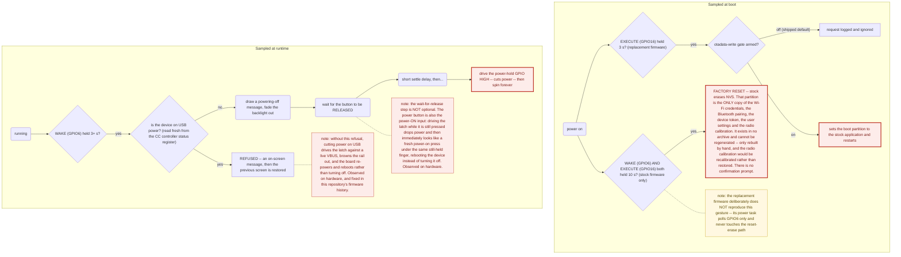

# Recovery

This document covers restoring the device to a known-good state: the smallest-sufficient-restore
decision, the actual `esptool` procedures, the button-gesture hazards worth knowing about before
you touch anything, and a warm-reset defect in USB that looks like a much scarier hardware fault
than it is.

See also: [`flash-layout-and-updater.md`](flash-layout-and-updater.md) for the partition map these
procedures operate on and for the SD-card update path, [`usb-and-boot-modes.md`](usb-and-boot-modes.md)
for how to reach the chip over `esptool`, and [`bootloader-analysis.md`](bootloader-analysis.md)
for why nothing here is undone automatically if it goes wrong.

## 1. Before you touch anything

**Take a full flash backup first.** A two-pass `read_flash 0x0 0x1000000` dump, compared
byte-for-byte between passes, is the only way to be confident you have a real backup rather than a
transfer error. Verify the partition table's self-contained MD5 against a recomputation as a second
independent check (see [`flash-layout-and-updater.md`](flash-layout-and-updater.md) §1). None of
what follows should be attempted without one.

**The bootloader on this device implements no rollback of any kind.** If a bad image boots — as
opposed to failing to boot at all — nothing reverts it automatically. See
[`bootloader-analysis.md`](bootloader-analysis.md) for the disassembly-level treatment of exactly
why. That makes "verified backup, and a tested recovery path" the precondition for any write to
this device, not a formality.

**`<PORT>` is deliberately not written down anywhere below.** Supply your own serial node
(`/dev/cu.usbmodem…` on macOS) at the moment of use; no procedure here should ever hard-code one.

## 2. Choose the smallest restore that fixes the fault

Diagnose before writing. The blast radius differs by an order of magnitude between these options.

| Symptom | Smallest sufficient restore |
|---|---|
| App misbehaves; ROM/bootloader banner still appears on serial | restore the app slot only (§4.1) |
| Lua UI missing / FAT mount failure on the assets partition | restore `assets` only (§4.4) |
| Device boots a slot you flashed and you want stock back | erase `otadata` (§3) — do **not** write anything |
| No boot at all, no ROM banner past the bootloader | restore bootloader + partition table (§4.2), then re-check |
| Wi-Fi/BT/token/settings lost after an NVS accident | restore `nvs` (§4.5), **last resort** |
| Unknown, multiple, or a botched multi-region write | full-flash restore (§4 intro) |

## 3. `otadata` erase — the one-command return to `factory`

The lowest-risk lever in this whole document, and the one you should reach for first whenever the
symptom is simply "I want the original firmware back." Because the running-vs-selected slot
mechanism uses `otadata` to record which OTA slot is active, and because an all-erased `otadata` is
this device's own stock state (no OTA has ever run on a fresh unit), erasing it reproduces exactly
that stock state rather than requiring you to reconstruct anything:

```sh
esptool --port <PORT> --chip esp32s3 --before no_reset --after no_reset \
    erase_region 0x910000 0x2000
```

This is **not** a `write_flash` — there is no image to get wrong, no offset that can collide with
`nvs` or the bootloader, and the result is byte-for-byte the device's original state. With
`otadata` blank, the bootloader falls through to `factory` automatically; `factory` and both OTA
slots are otherwise left completely untouched. Read back the region afterward and confirm it is
entirely `0xFF` before rebooting (§5).

The replacement firmware in this repository exposes an equivalent gesture at the button level:
holding EXECUTE for 3 seconds requests a boot into the stock partition by the same mechanism
(writing `otadata`), gated behind a build-time configuration flag that ships **off** by default —
see the hazard diagram in §7 for where this sits relative to the destructive stock combo below.

## 4. Full and per-partition restore

Offsets throughout are the ones read directly off the device (see
[`flash-layout-and-updater.md`](flash-layout-and-updater.md) §1) — not ESP-IDF defaults. In
particular, `otadata` is at `0x910000`, **not** the default `0xD000`. Substitute your own backup
directory for `$D` below; run at most one write per session, and read back and compare (§5) before
rebooting.

```sh
D="<your backup directory>"
E="esptool --port <PORT> --chip esp32s3 --before no_reset --after no_reset"
```

**Full-flash restore** — the only form that restores the device exactly as backed up, including
NVS. Also the highest-risk: it rewrites the bootloader, so a failure partway through leaves nothing
bootable.

```sh
$E write_flash --flash_mode dio --flash_freq 80m --flash_size 16MB \
    0x0 "$D/esp32-s3-full-16MB.bin"
```

Pass `--flash_mode/--flash_freq/--flash_size` explicitly — without them, `esptool` rewrites bytes
2–3 of the image header to match what it auto-detects, which silently changes the bootloader and
would make a later readback comparison fail for a reason that isn't a real fault. Use the values
read off your own device (`dio`, `80m`, `16MB` on the unit this project examined).

### 4.1 The application (the common case, and the safest per-partition write)

```sh
$E write_flash --flash_mode dio --flash_freq 80m --flash_size 16MB 0x010000 "$D/factory.bin"
```

Writes 3 MiB into the `factory` slot. Leaves the boot chain, NVS, and assets untouched. Because
`otadata` blank means the bootloader defaults to `factory`, the device boots this slot
automatically with no further write needed.

### 4.2 The boot chain (only if the device does not boot at all)

```sh
$E write_flash --flash_mode dio --flash_freq 80m --flash_size 16MB 0x000000 "$D/bootloader.bin"
$E write_flash 0x008000 "$D/partition-table.bin"
```

Do the bootloader first, read back and compare, and only then write the table. The table is 4 KiB
and carries its own MD5 — a successful write can be verified without trusting the write operation
itself.

### 4.3 Force a boot back to `factory` (no data written)

This is exactly §3 above, restated here for completeness of the per-partition list — prefer it over
writing an `otadata.bin` image: same result, with no image to get wrong.

### 4.4 The Lua UI filesystem

```sh
$E write_flash 0x912000 "$D/assets.bin"
```

**Write the whole 256 KiB image, never a bare FAT volume.** The partition is an ESP-IDF
wear-levelling container: the FAT volume itself is offset by one 4 KiB sector, and the
wear-levelling configuration/state live in the top three sectors. A derived, unwrapped FAT image is
useful for inspection only — flashing it directly to `0x912000` produces a volume the device cannot
mount.

### 4.5 `nvs` — last resort

```sh
$E write_flash 0x009000 "$D/nvs.bin"
```

This is never part of a routine restore. It rewrites the Wi-Fi credentials, Bluetooth pairing,
device token, user settings, **and** the radio calibration to whatever snapshot your backup holds.
If the device has been re-provisioned since that backup was taken, this silently undoes that.
Consider a factory reset and re-pair instead (§7) — it costs the calibration, which gets
recalibrated rather than restored, but touches nothing else.

### 4.6 `phy_init`

```sh
$E erase_region 0x00F000 0x1000
```

The stock state is all-`0xFF`. Do not populate this partition — the calibration this device
actually uses lives in `nvs`, not here.

**Never restore from a backup into the OTA slots or the unallocated tail.** `ota_0`/`ota_1` are 3
MiB of `0xFF` each on a fresh unit — writing them back is a multi-minute no-op; if an OTA slot needs
clearing, `erase_region` it directly. The unallocated tail (`0x952000`–`0x1000000`) is likewise
erased flash and is reproduced exactly by erasing, not writing.

## 5. Verify before you reboot

**Read back and compare while the device is still in download mode.** A write that reported success
is not a write that landed.

```sh
# whole-flash comparison, after a full restore:
$E read_flash 0x0 0x1000000 "$D/verify-readback.bin"
cmp "$D/verify-readback.bin" "$D/esp32-s3-full-16MB.bin"        # must be silent

# region comparison, after any per-partition write -- example for the app slot:
$E read_flash 0x010000 0x300000 "$D/verify-factory.bin"
shasum -a 256 "$D/verify-factory.bin" "$D/factory.bin"          # must match
```

Structural re-checks that don't depend on trusting the write itself: `esptool image_info` on the
read-back app image should report a valid checksum and validation hash; the partition table's own
embedded MD5 should recompute correctly over its seven entries; the `assets` FAT image should
mount and show the expected file count.

**If any comparison fails, do not reboot.** Stay in download mode and re-write. A device sitting in
download mode with a bad image is recoverable; a device that has been reset into a bad image may
not re-enumerate — see §6 for exactly why.

Once every comparison passes: leave download mode without writing anything else (unplug and
replug the USB-C cable, which cold-boots this device, or issue a bare `--after hard_reset chip_id`
as a deliberate, separate step), then watch the boot log and do a functional check on the device
itself — the editor UI appears, the backlight responds, the microSD is recognized, Disk Mode still
enumerates with the expected contents, and fonts still load if your device keeps them on the SD
card rather than in the firmware image.

## 6. What a hardware reset does not reset, and why a warm reset can wedge USB

The device's own reset button is a hardware EN/`CHIP_PU` reset — a full chip-level reset in
ESP32-S3 terms, distinct from the CPU-level reset a software `esp_restart()` produces. On stock
firmware, pressing this button with a USB cable connected reliably brings USB-Serial-JTAG back.
Under some firmware builds, it has instead produced **nothing enumerating on either USB personality
for a full minute** — no USB-Serial-JTAG in the first seconds, no CDC-ACM later — while the display
comes up blank and only shows a backlight.

The most likely explanation, corroborated by an identical, independently-reported and
upstream-acknowledged failure on other ESP32-S3 boards under macOS specifically: **the host never
sees a clean detach.** In host-mode stock firmware, the D+ pull-up disappears cleanly at the PHY
hand-over (see [`usb-and-boot-modes.md`](usb-and-boot-modes.md) §1), minutes or hours before anyone
presses the reset button — by the time the button is pressed, there is no device object bound to
that port at all, and the reset produces one clean, isolated attach event that the operating
system has nothing to reconcile. In device-mode firmware, by contrast, there is a live, enumerated,
often actively-open serial device on the port at the instant of reset; the USB-Serial-JTAG
peripheral reattaches within roughly 100–200 ms as a *different* device (different VID/PID,
different descriptors) before the host has finished tearing down the first one. That
disconnect/reconnect race, with an open serial client on the terminating device, is a known macOS
USB host-stack pattern that leaves a port not re-enumerating until a physical unplug/replug — and
it equally explains why nothing appears later either: by the time the second personality would
normally show up, the port is already wedged.

This is why **the operational rule after any download-mode or serial session on this project is to
exit by fully unplugging USB and power-cycling with the front power button — not by using the
hardware reset button alone.** A full power cycle removes and reapplies power to the USB
transceiver's analog front end entirely, which a same-port device swap cannot reproduce.

Separately from the reset-button question, there is a **confirmed, unconditional software-reset
defect** worth knowing if you're modifying this firmware: on this chip, `esp_restart()` is only a
CPU-level reset, and it does not reset the RTC sub-system that holds the internal USB PHY
routing bit, nor the USB peripherals themselves — ESP-IDF's own reset-cleanup code deliberately
leaves both alone so that USB-Serial-JTAG logging survives through the first-stage bootloader on a
crash-reboot. The practical consequence: any software reboot taken after a USB-OTG device-mode link
has come up (the SD updater's own post-install reboot, for instance) will otherwise come back with
the internal PHY still routed to USB-OTG and USB-Serial-JTAG pointed at a PHY it can no longer
reach — no console, no `esptool` recovery, until a physical power cycle. The replacement firmware
in this repository fixes this specific case by explicitly handing the PHY back to
USB-Serial-JTAG as the very first thing it does on every boot, and again immediately before any
software-triggered restart — see [`usb-and-boot-modes.md`](usb-and-boot-modes.md) §1 for where this
sits in the boot sequence. It does not, and cannot, fix a genuine hardware EN reset landing during
an active USB session, because by definition no firmware code runs during that reset — if that
turns out to be the cause on your unit, the only mitigations are operational: power-cycle rather
than reset, or put a plain USB hub between the host and the device (reported upstream to make this
exact class of macOS failure disappear entirely).

The display shows a related but separate symptom after a warm reset: the panel controller has no
reset pin and is not power-cycled by a chip reset, and neither this firmware nor the vendor's ever
sends the panel a genuine system-reset command — the panel's init sequence is simply written over
whatever state the previous run left (contrast, scroll position, inverse-display flag). This is a
display-driver issue, not evidence of a deeper hardware fault, and it is stock behaviour too, not a
regression introduced by this project.

## 7. Button-gesture hazards

Five buttons feed two different code paths depending on when they're read: a handful of gestures
are sampled once, in the first seconds after power applies; everything else is polled continuously
once the system is running. One boot-time gesture is unrecoverable in a way that matters directly
to a recovery session, and one runtime gesture has a hardware-observed history of doing the
opposite of what it's supposed to.



**The destructive one:** on stock firmware, holding WAKE and EXECUTE together for 10 seconds
triggers a factory reset that erases NVS with **no confirmation step** — the same irreplaceable
partition called out in §1 and in
[`flash-layout-and-updater.md`](flash-layout-and-updater.md) §1. This is exactly why the
replacement firmware in this repository never reads that combination at all: its power task polls
only the WAKE line, and the NVS-erase code path is simply absent.

**The one that used to reboot instead of powering off:** holding the power button on this device
drives a GPIO power-latch line. Two distinct hardware-observed failures came from getting the
timing of that wrong: driving the latch while the button is still physically held reads as a fresh
power-on press under the same finger, rebooting the device instead of turning it off; and cutting
power while a USB cable is attached browns out the rail (rather than fully removing power) and the
board re-establishes power and reboots on its own, sometimes many seconds later. Both failure modes
are now guarded against in this project's firmware history — a wait for button release before
cutting power, and a fresh (not cached) USB-attach check that refuses the power-off on USB power
rather than cutting it — but if you are modifying this firmware yourself, treat both guards as
load-bearing rather than incidental, and be aware that the underlying power latch is driven low
unconditionally as the very first hardware action of boot, before any button is ever read.

## 8. What no procedure here can recover

- **A co-processor bricked mid-transfer.** No download-mode route to that chip has been identified
  in this project, and there is no confirmed reset strap line from the main SoC to it — recovering
  one requires either adding a wire or reaching its own programming pads directly.
- **The microSD card as a block-level image**, if you've only ever taken a file-level copy of it.
- **eFuse state**, unless you've run a read-only efuse summary while in download mode.
- **Anything written to the device after your last verified backup was taken** — a flash backup is
  a snapshot, and NVS in particular drifts every time the device is actually used.
