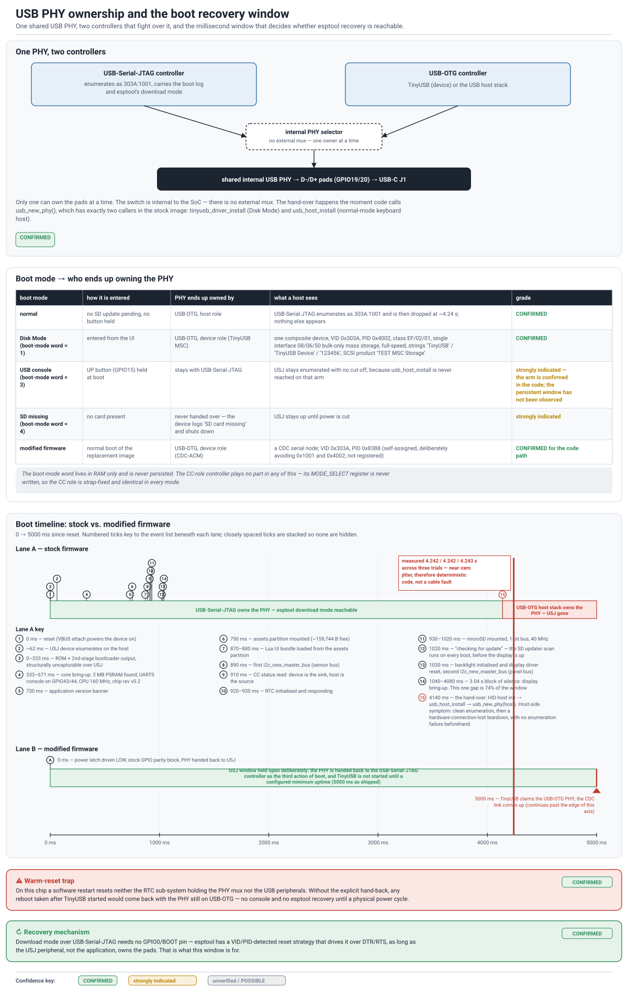

# USB and boot modes

The ESP32-S3 at the heart of this device has two independent USB controllers —
USB-Serial-JTAG (USJ) and USB-OTG — sharing one internal full-speed/low-speed PHY and one
physical USB-C port, with no external mux between them. Whichever controller last calls
`usb_new_phy()` owns the pads until the next call. That single fact governs everything in this
document: which VID/PID appears when, how long you have to catch the chip in ROM download mode,
and why a warm reset can leave USB looking dead until you power-cycle.

See also: [`flash-layout-and-updater.md`](flash-layout-and-updater.md) for what you can do once
you're in download mode, [`recovery.md`](recovery.md) for the operational consequences of a wedged
port, and [`architecture.md`](architecture.md) for the full boot-log timeline this document only
summarizes.

## 1. The PHY hand-over and the recovery window

On stock firmware, the boot sequence claims USB-OTG in **host** mode via `usb_host_install()`.
That call hands the internal PHY away from USJ, and it happens automatically partway through every
normal boot — measured at **4.14 s** into boot on the unit I examined, with the actual pad
tear-down clustering at 4.242–4.243 s across three trials. Once that hand-over completes,
USB-Serial-JTAG (`303A:1001`) drops off the bus and does not come back until the next reset.

Three other stock boot arms never make that call at all, and so never lose the USJ link:

- **Disk Mode** — entered from the on-device settings menu. `tinyusb_driver_install()` claims the
  PHY in **device** mode instead, and presents mass storage rather than a host connection (details
  in §3).
- **USB console mode** — entered by holding the button wired to GPIO15 at boot. `usb_host_install()`
  is never reached on this arm, so the USJ link persists indefinitely. (Strongly indicated, not
  directly observed end-to-end: the boot-mode fork is read from source, not from a capture that ran
  the console open for its full duration.)
- **Missing microSD card** — the firmware detects this before the boot-mode fork, logs a shutdown
  message, and never reaches the USB-OTG claim either.

The replacement firmware in this repository turns the accidental stock window into a deliberate
one. It restores the PHY to USB-Serial-JTAG as the **third action** of `app_main()` — immediately
after the power-latch GPIO and before anything else — and then holds off starting its own
USB-OTG **device**-mode CDC-ACM link (the descriptor byok-mod actually talks to a host over) until
a configured minimum uptime, shipped at `CONFIG_BYOK_USB_CDC_MIN_UPTIME_MS = 5000` ms. The reason
for the restore-on-boot step is a separate, confirmed defect: on this chip, `esp_restart()` is only
a CPU-level reset. It resets neither the RTC sub-system that holds the PHY mux bit
(`RTC_CNTL_USB_CONF_REG`) nor the USB peripherals themselves — ESP-IDF's own
`esp_system_reset_modules_on_exit()` deliberately omits `SYSTEM_USB_RST` and
`SYSTEM_USB_DEVICE_RST` so that USB-Serial-JTAG can keep logging through the first-stage
bootloader. Without an explicit hand-back, any software reboot taken after the CDC link has come up
— including the SD updater's own post-install `esp_restart()` — would permanently strand USB with
no console and no `esptool` recovery path until a physical power cycle. See
[`recovery.md`](recovery.md) for what a *hardware* reset (the S1 button) does and does not clear,
which is a related but distinct question from the software-reset case this fix addresses.



*(Source and facts table:
[`diagrams/usb-phy-modes-and-recovery-window.md`](diagrams/usb-phy-modes-and-recovery-window.md).)*

## 2. Device classes and identifiers, by mode

| Mode | Controller | VID:PID | Class / Sub / Proto | Speed | Notes |
|---|---|---|---|---|---|
| Normal boot, first ~4.14 s | USB-Serial-JTAG | `303A:1001` | CDC-ACM (debug/console) | Full-speed | Present on every boot arm until USB-OTG claims the PHY, or indefinitely on the console/missing-card arms |
| Disk Mode (stock) | USB-OTG, device | `303A:4002` | `EF/02/01` (composite, IAD), one `08/06/50` interface | Full-speed, 12 Mbps | Bulk-only-transport USB Mass Storage. Strings observed as generic TinyUSB stack defaults ("TinyUSB" / "TinyUSB Device" / serial `123456`); SCSI product string "TEST MSC Storage" — these read as development placeholders, not final branding |
| Normal mode (replacement firmware), after the uptime gate | USB-OTG, device | `303A:83B8` | CDC-ACM | Full-speed | Self-assigned PID chosen to avoid colliding with the stock USJ PID (`1001`) or stock Disk-Mode PID (`4002`); it is not a USB-IF-registered PID |
| Normal mode (stock) | USB-OTG, host | — | — | — | The chip is a USB **host** in this mode and presents no device of its own to whatever it's plugged into |

The Disk-Mode volume itself enumerates as a single FAT16 partition (MBR, ~126 MB) with SCSI vendor
string "TinyUSB" and product string "TEST MSC Storage" — again, textbook TinyUSB stack defaults
rather than a customized product identity. On the host side this presents no CDC/HID/vendor/DFU
interface alongside the mass-storage one; the whole configuration is exactly the one interface.

The one thing that never changes across any boot mode: the board's CC-role controller
(TUSB320-class) has its `MODE_SELECT` register left unwritten in every mode observed, so its role
is strap-fixed rather than firmware-selected.

## 3. Recovering over `esptool` with no BOOT/GPIO0 pin involved

USB-Serial-JTAG on this chip supports a fully automatic reset-into-download-mode sequence over
DTR/RTS control-line toggling — no physical BOOT (GPIO0) pull-down and no button press required, as
long as USJ (not the application) currently owns the PHY. `esptool`'s reset-strategy layer detects
a USJ-class port by VID:PID and drives this sequence by default:

> **Attribution.** The listing below is `usb_jtag_bootloader_reset()`, reproduced unmodified from
> Espressif's `esptool` (`esptool/reset.py`), licensed GPL-2.0-or-later. It is quoted here for
> interoperability reference, not redistributed as part of this project's own code; see
> <https://github.com/espressif/esptool/blob/master/esptool/reset.py>.

```python
def usb_jtag_bootloader_reset(port, settle_delay=0.1):
    set_rts(port, PIN_HIGH); set_dtr(port, PIN_HIGH)   # idle
    time.sleep(settle_delay)
    set_dtr(port, PIN_LOW);  set_rts(port, PIN_HIGH)    # set IO0
    time.sleep(settle_delay)
    set_rts(port, PIN_LOW);  set_dtr(port, PIN_HIGH)    # reset
    set_rts(port, PIN_LOW)                              # RTS re-write for Windows
    time.sleep(settle_delay)
    set_dtr(port, PIN_HIGH); set_rts(port, PIN_HIGH)     # chip out of reset
```

This is hardware/ROM-driven: the USJ peripheral itself watches CDC `SET_CONTROL_LINE_STATE`
control transfers on the bus and asserts an internal reset when it sees this exact pattern. It
works "for real, live" as long as the peripheral is enumerated and owns the pads — which is exactly
the reason the PHY hand-over timing in §1 matters. If the reset sequence lands **before** the
application's PHY hand-over, the chip drops straight into the ROM bootloader and stays there under
`esptool`'s control. If it lands **after**, USJ is no longer wired to anything and the sequence
silently does nothing — this is a documented, binary before/after failure mode upstream, not a
narrow timing race, and the pulse train itself completes in well under half a second.

Because the internal PHY-to-USJ routing depends on the one-time-programmable `USB_PHY_SEL` efuse
staying unburned (factory default), this mechanism is **strongly indicated** rather than
unconditionally guaranteed on every unit — burning that fuse, or `DIS_USB_SERIAL_JTAG`,
`DIS_DOWNLOAD_MODE`, or `DIS_USB_SERIAL_JTAG_DOWNLOAD_MODE`, would each independently disable it.
None of these fuses were read on the unit I examined (that would itself require a working
download-mode connection); none is expected to be burned on a consumer device that ships with an
open SD-card update path (see [`flash-layout-and-updater.md`](flash-layout-and-updater.md)).

**Read-only commands, no BOOT pin, no writes:**

```sh
esptool --port /dev/cu.usbmodemXXXX chip_id
esptool --port /dev/cu.usbmodemXXXX flash_id
esptool --port /dev/cu.usbmodemXXXX read_flash 0x0 0x1000000 dump.bin   # 16 MiB
```

`--before default-reset` (the default) auto-detects a USJ-class port and uses the sequence above;
`--before usb-reset` forces it explicitly if autodetection misbehaves. `--after no-reset` leaves
the chip in the ROM bootloader so you can chain further read-only commands without re-triggering
the reset dance; `--after hard-reset` (the default) returns to the application afterward. If
download mode was entered manually rather than automatically, a plain hard reset may leave the
chip stuck in download mode rather than returning to the app — `--after watchdog-reset` is the
documented fix for that specific case, chip/revision-dependent.

### Throughput caveat

`read_flash` over USB-Serial-JTAG on the ESP32-S3 (and ESP32-C3) is affected by a known,
still-open upstream performance defect in the flasher stub's USB-CDC transmit path: reported
throughput as low as ~8–11 KB/s, versus ~300 KB/s on an unaffected chip (ESP32-C6) using the same
mechanism. A full 16 MiB dump can therefore take 20–35 minutes at the affected rate rather than the
under-a-minute figure the unaffected rate would give. Time a small `read_flash 0x0 0x100000
test.bin` (1 MiB) first to see the actual throughput on your installed `esptool`/stub version
before committing to an unattended full dump.

## 4. What this means for a recovery session

Putting §1–§3 together: the practical recovery window on stock firmware is the first ~4 seconds
after power-on (or indefinitely, if you can reach console mode or boot with no SD card present).
On the replacement firmware, the window is open for the whole boot by construction — the PHY is
handed back to USJ before anything else runs, every time. Either way, `esptool`'s own
auto-detection needs no board-specific flags beyond `--port`; see
[`flash-layout-and-updater.md`](flash-layout-and-updater.md) for the partition-level layout you'll
be reading or writing once you're connected, and [`recovery.md`](recovery.md) for the operational
rule this project follows after any download-mode session (exit by unplugging and doing a full
power cycle — a hardware reset alone can leave USB in a state that looks dead until you do).
